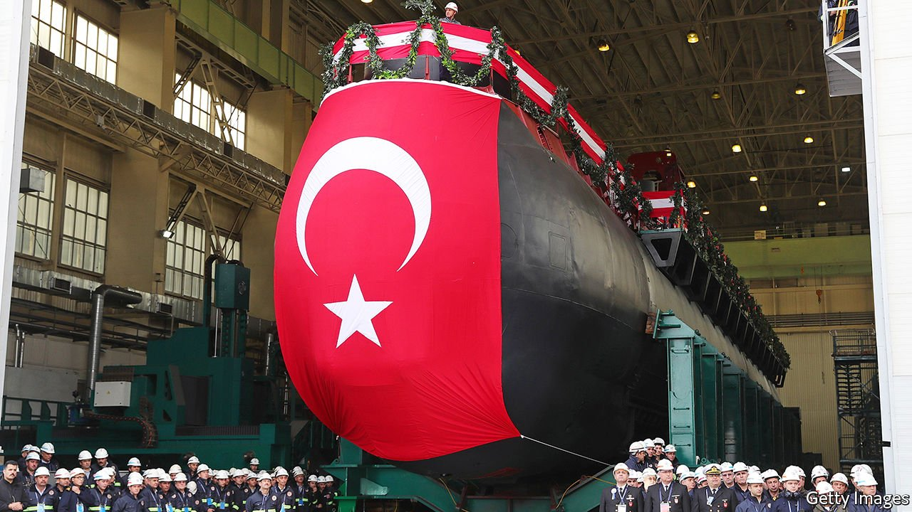
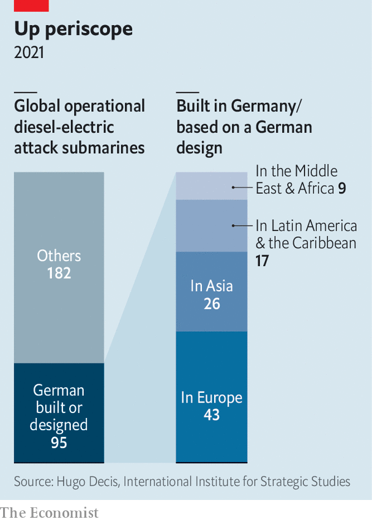

###### Shifting the balance

# German submarines are giving Turkey an edge over Greece 

##### That may make the eastern Mediterranean less stable 

 

> Jul 3rd 2021 

ON THE SOUTHERN shore of the Gulf of Izmit, at the Golcuk shipyard, Turkey’s naval future is slowly taking shape. The first of six German-designed submarines lies in the water, after being floated out from its dock in March. The Piri Reis will join the fleet next year; five other Reis-class subs will follow in successive years. It is a triumph for Turkey’s navy—and a headache for Greece.

Over the past year Turkey and Greece, despite both being members of NATO, have sparred in the Mediterranean. Their warships collided last summer after Turkey sent a survey vessel into disputed waters. Greece responded by rallying allies in Europe and the Middle East, bought a slew of French warplanes and, in December, announced a doubling of defence spending to €5.5bn ($6.6bn). That, though, is still less than half the Turkish level. Turkey’s navy is bigger and newer. And the Anadolu, a Spanish-designed light aircraft-carrier, is in the final stages of construction.


The new submarines would compound the problem. The Reis-class is a version of Germany’s Type 214, which is operated by the navies of Portugal, South Korea and Greece itself. An important feature is air-independent propulsion (AIP), which allows subs to go without the air supply that a diesel engine would usually require. A traditional diesel-electric sub can stay under water for two or three days. Those with AIP can do so for three weeks, says Johannes Peters of the Institute for Security Policy Kiel, and with “almost zero noise emissions” compared with noisier nuclear-powered subs, whose reactors cannot be turned off. That is perfect for the shallow waters around Greco-Turkish flashpoints.

 


The addition of six cutting-edge boats is a plus for NATO. The alliance’s southern flank is heating up: on June 23rd Russian ships fired shots towards a British destroyer in Crimean waters. Two days later Russia began air and sea exercises in the Mediterranean, sparring with a British aircraft-carrier strike group in the region. Then an American nuclear-armed submarine showed up in Gibraltar. At the same time, the subs “will reshape the naval balance between Greece and Turkey”, says Emmanuel Karagiannis of King’s College London.

A two-edged sword

The subs could be used for intelligence-gathering in disputed waters, including snooping around undersea cables that Greece plans to build to reach Cyprus, Egypt and Israel. The subs may be armed with medium-range anti-ship missiles which could “largely neutralise Greek anti-submarine warfare capabilities”, adds Mr Karagiannis, although much depends on how well Turkey can integrate its indigenous weapons into the German design.

Although Greece did not oppose the sub deal when it was agreed in 2009, last year’s jousting changed things. “We’re not saying, ‘You shouldn’t sell them to Turkey,’” says a Greek official. “What we are saying now is, ‘You should not sell them to this Turkey.’” Greece wants Germany to halt the sale and says that the subs could be sold to another country. It points to the example of America, which barred Turkey from buying F-35 jets two years ago after it bought a Russian air-defence system. Yet these pleas have fallen on deaf ears.

Several EU countries limited arms exports to Turkey in 2019, following its offensive in Syria. But after last year’s kerfuffle in the Mediterranean, Germany, Italy, Spain and others blocked a Greek push for a full arms embargo. Then on June 13th Germany’s ruling parties rejected a motion backed by socialist and Green parties to stop weapons sales to Turkey.

Germany’s resistance to scuttling the submarine deal is unsurprising. It is thought to be worth $3.5bn, a hefty sum compared with total German arms exports of $14bn over the past decade. The country commands the world market for submarines, in particular, having sold more than 120 of them to 17 navies since the 1960s. The latest potential customer is Australia, which is toying with the idea of buying German Type 214s to fill the gap until newer French subs arrive in the 2030s.

Yet pecuniary motives are not the whole story. Turkey’s relationship with the EU and its place in NATO have become deeply divisive issues within both institutions. France, Greece and Cyprus are eager to push back at what they see as Turkey’s aggressive and expansionist behaviour. By contrast, Germany—like Italy, Poland and Spain—wants to prevent the relationship from collapsing in acrimony.

In part, that is to keep migration in check. Angela Merkel, Germany’s chancellor, is “obsessed” with the issue, complains the Greek official. “She’s allowing Turkey to blackmail Europe,” he adds. After an EU summit on June 24th, Mrs Merkel said that the bloc had agreed to provide €3bn for migrants in Turkey to follow on from a €6bn package approved in 2016. Although the number of illegal crossings from the eastern Mediterranean is down by half compared to last year, there remain over 3m refugees in Turkey.

Wider considerations are at play. Some are strategic. Germany sees Turkey as a bulwark on NATO’s southern flank, where Russia is reasserting itself. Others are domestic. Germany has the largest Turkish diaspora anywhere in the world, with around 3m people of Turkish origin. “Germany’s relationship with Turkey is not only a matter of foreign policy, but also a domestic issue,” says Sinem Adar of the Centre for Applied Turkey Studies in Berlin.

It helps Germany’s case that the Mediterranean is calm for now. So far this year NATO has convened six rounds of talks between the Greek and Turkish armed forces, leading to the creation of a military hotline for use in crises. Negotiations between the two countries over drilling rights and related issues resumed earlier this year, though progress is slow. Kyriakos Mitsotakis, Greece’s prime minister, met Recep Tayyip Erdogan, Turkey’s president, on the sidelines of a NATO summit on June 14th.

Even so, just over a week later Turkey announced military exercises in the Aegean after accusing Greece of breaking an old understanding to avoid such exercises in the summer months. Next year the drills may involve the Piri Reis, watching silently from the deep. ■

