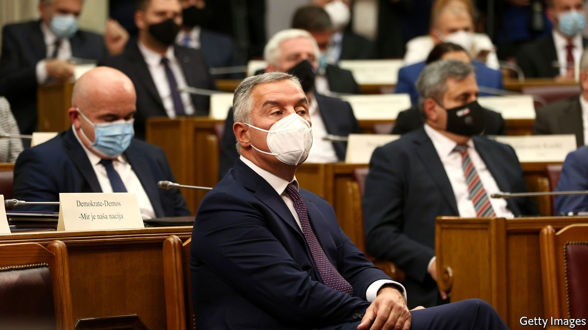
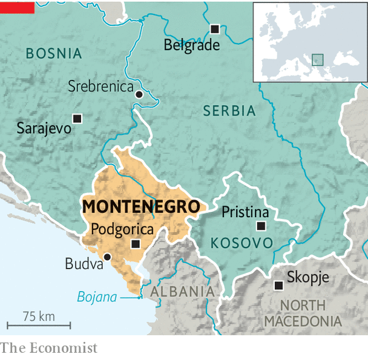

###### Darkness shrouds the mountain

# Montenegro’s government totters 

##### But the alternatives may be worse 

 

> Jul 3rd 2021 

GUESTS IN A beachside restaurant where the Bojana river flows lazily into the sea belt out old Yugoslav pop songs while children gambol in the sand. It is just the image that Montenegro’s tourist industry wants to promote, as it struggles to recover from the wave of covid-19 that whacked the country last year. But away from holiday haunts the picture is very different. The government is tottering. Old feuds are ripping Montenegro apart.

In March the minister of justice expressed doubt that the massacre at Srebrenica in neighbouring Bosnia in 1995, when 8,000 Muslim men and boys were killed by Serbs, was an act of genocide. Parliament sacked him on June 17th and made it illegal to deny that the crime was genocide. Outraged, the largest party backing the government withdrew its support, leaving it in jeopardy. Srebrenica is a litmus test in Montenegro: if you say it was not genocide, you are considered “pro-Serb”. Many Montenegrins consider themselves Serbs; even those who hold that there is a separate Montenegrin ethnicity admit close cultural and historical ties.


Well before the uproar, the government was shaky. In elections in August a clutch of disparate opposition parties managed to deprive the ruling party since the 1990s, the DPS, of its majority. The margin of victory was so slim that it took until December for a new government to be cobbled together, composed of technocrats and committed to maintaining the DPS’s pro-Western foreign policy. The new prime minister was Zdravko Krivokapic, a hitherto obscure professor proposed by the Serbian Orthodox Church, to which most Montenegrins nominally belong.

 


But Slaven Radunovic, the leader of the populist Democratic Front (DF) in parliament, wants a more pro-Serbian policy. He has withdrawn his party’s support of the government, and would like Montenegro to leave NATO and to cancel its recognition of next-door Kosovo, which split away from Serbia in 2008. What happened at Srebrenica, he says, was a terrible crime—but not genocide.

The DF’s opponents call it a cat’s paw of “Serbian World”, an ideology promoted by nationalist Serbs who want their brethren in Bosnia, Kosovo and Montenegro to look to Serbia for leadership. Nonsense, scoffs Mr Radunovic. Such ideas are spread around “to scare people”.

Alarm bells are ringing at NATO headquarters, however. Montenegro is a member of the alliance. Pro-Serbian and therefore pro-Russian officials have already been put into important jobs, with access to sensitive intelligence. Russia was behind a failed coup in Montenegro in 2016 which seemed to draw support from DF, although it denied involvement. The plotters sought in vain to stop the country from joining NATO. Savo Kentera, the head of the Atlantic Council of Montenegro, a pro-Western think-tank, says Russian officials are probably thrilled at the prospect of friendly sources within the alliance.

Last year’s election broke a psychological barrier. It had been widely believed that change by the ballot box was impossible. The leader of the DPS, Milo Djukanovic, is still president. His party is still the largest in parliament and his loyalists are still embedded in all the country’s institutions. But the opposition’s victory has now thrown all assumptions about the country’s future direction into doubt.

Many Montenegrins wanted a change of government because they believed that people in power were deeply corrupt and in cahoots with organised crime. But Dritan Abazovic, the deputy prime minister, worries that civic-minded parties like his may now be “crushed” between the two main political blocs: pro-Western crooks and pro-Serbian ultra-nationalists. ■

