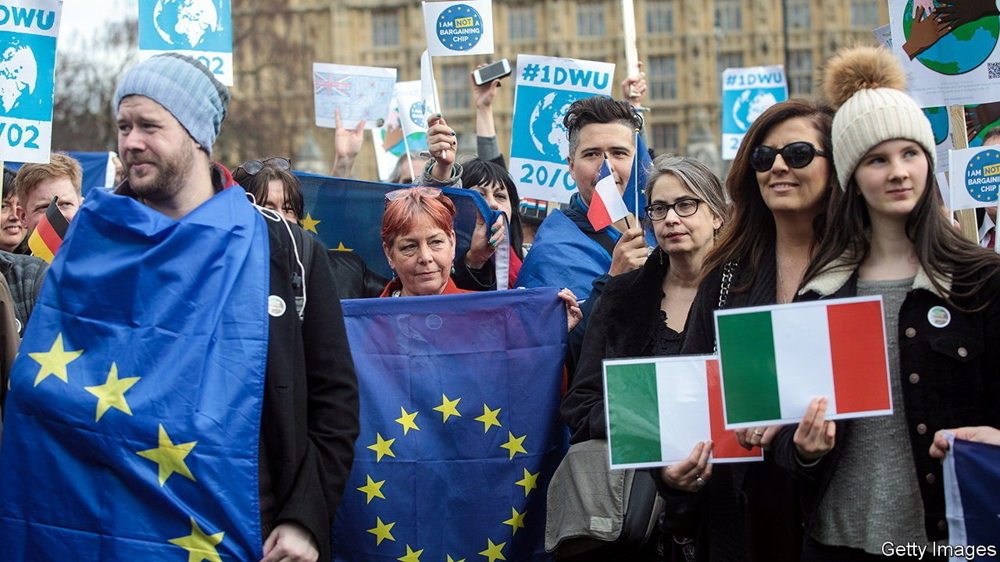
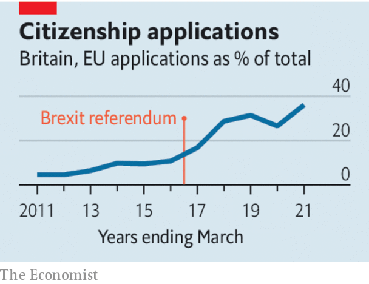

###### A vote of confidence

# Britain should encourage Europeans keen to settle to become citizens 

##### They are young, well-equipped to work—and keen to do so 

 

> Jul 3rd 2021 

THE DEADLINE of June 30th saw a last-minute flurry, but no mad rush. Applications by  in post-Brexit Britain had been coming in for two years: over 5m of them, many more than expected. Campaigners warned that some of those who are eligible may have missed the deadline, or failed to apply on behalf of their children. They fear a replay, decades hence, of the Windrush scandal, which saw Caribbean arrivals since 1948 discover much later that their status had never been regularised.

Such worries deserve due consideration. Yet they obscure a much cheerier story: the settlement scheme has been a resounding vote of confidence in Britain’s future.


The 5m figure dwarfs other groups of immigrant stock. According to the census of 2011, it is larger than the sum of Britain’s black population together with those of Indian or Pakistani descent. That is testament to Britain’s long popularity with EU citizens enjoying their freedom of movement, who were drawn by its high-quality universities, flexible labour market and convenient language. The fact that so many have decided to stay offers a rare opportunity. To make the most of it, Britain now needs to smooth their path to citizenship.

 


That would be just. It was, after all, only after most had arrived that the Brexit vote pulled the welcome mat from under them. It would also be enlightened self-interest. An accommodating approach towards Europeans will encourage the same attitude towards Britons who want to settle elsewhere in the bloc, and build trust in future talks on such tricky matters as trade and the status of Northern Ireland.

Moreover, these newly settled Europeans have many qualities that are appealing in potential citizens. They are young: just 2% are over 65, compared with 19% of natives. Those who came to study and decided to stay are well-equipped for the local job market. Far from being a burden on the National Health Service, as alleged during the Brexit campaign, many are health-care workers who help prop it up. They use public services on average less than the locals do, and are more likely to be net contributors to the public purse. Many of those from ex-communist eastern Europe are bootstrap capitalists, keen on hard work and grateful to Britain for admitting them straight after their countries joined, unlike nearly every other country in the bloc.

To reap this windfall, Britain’s government needs to be flexible and generous. Already, there is a trickle of stories about applications for settled status failing because of minor administrative errors, or of citizenship denied because of a little-known requirement for some EU migrants to arrange private health insurance. Rather than nit-picking, the Home Office should take a sympathetic approach. It should also slash the application fee for adult citizenship, which at £1,330 ($1,840), is out of line with other countries and prohibitive for people on ordinary salaries or with large families.

With settled status, the 5m will be able to study, work and pay taxes. But as citizens, they and their children would play a fuller part in Britain’s civic life by voting, standing for election and putting down roots. Over time, they would change their adopted country for the better. After a drawn-out divorce that left many European migrants feeling bruised and belittled, Britain is fortunate that so many want to stay. They are a prize to be seized, not an obstacle to be negotiated.

For more coverage of matters relating to Brexit, visit our 

