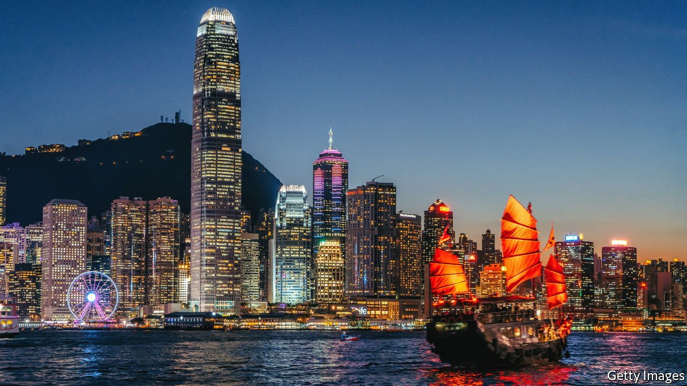

###### Code red

# Hong Kong’s regulator rightly resists the bad habits of mainland finance 

##### A new code of conduct would help preserve best practices in share and bond sales 

 

> Jul 1st 2021 

IN HONG KONG these days few dare challenge China. Communist Party functionaries have told the city’s judges to advance China’s interests or hang up their robes. Rights of assembly to protest against such infringements have been suppressed. Yet, even as Beijing bulldozes Hong Kong’s liberal traditions, its kings of capitalism are thriving. Investment banks have cashed in as Chinese companies have turned the city into one of the world’s top destinations for initial public offerings (IPOs). Companies have raised $88bn in share sales in Hong Kong this year alone, second only to America, thanks to several large Chinese IPOs. Over the past decade Chinese property and tech groups have kept Asia’s US-dollar debt market booming.

Look more closely, however, and Hong Kong’s financial centre is changing, too. Global banks say that practices from mainland China are seeping into the city. These include a shift in the way IPOs and bonds are underwritten. Where banks’ roles were once clearly defined early in the process, now a handful of institutions, many of them mainland-Chinese, fight for top spots in transactions. Many are accused of inflating their orders for the securities in order to impress clients. This has reduced the transparency of the process and disrupted price discovery.


It may sound like a technicality, but bankers fear that Hong Kong’s standing as a global financial centre will suffer. Moreover, the situation mirrors the city’s greater dilemma. A cosmopolitan society with globally recognised norms is rapidly losing ground to a Chinese way of life.

Hong Kongers have struggled to counter incursions from an authoritarian system. By contrast, the , the city’s independent market regulator, may have found a way to resist the bad habits of mainland banks. It has proposed a new code that would set out the best practices for underwriting shares and bonds, such as declaring the roles of banks and their fees early in the process. It would discourage the spread of intentionally misleading information on the demand for the securities. These safeguards, if the SFC is powerful enough to enact and enforce them, would stand as a rare form of protection against mainland influence.

Regulating mainland-Chinese companies from Hong Kong is not easy. The SFC has worked hard to uphold its reputation as an independent regulator. Yet at times it has appeared to come under pressure. In 2014 it took action against a short-seller for publishing a negative research report about a powerful property developer from the mainland. It also fined Moody’s, a credit-rating agency, for a report that listed concerns about a number of mainland groups. Critics said the cases unfairly favoured mainland companies and that they had a chilling effect on research that was critical of them.

The regulator has, to its credit, tried to crack down on the worst offenders. The SFC has recently sought to prosecute mainland companies that lied in their prospectuses. It has also gone after their banks. In 2018 it stripped one global investment bank of its sponsor licence and launched an investigation into 15 underwriters, most of them Western banks, that had done substandard due-diligence work on IPOs.

Trust in Hong Kong is built around its many independent regulators. The Monetary Authority, for instance, backs the integrity of the Hong Kong dollar. It has carefully monitored local banks’ exposure to mainland companies as China’s economic growth has cooled. The Companies Registry has upheld a number of auditing requirements for locally registered companies—though it recently reduced public access to information on companies’ beneficial owners, a move that was seen as a step backwards for corporate transparency in the city.

The proposed code is a test of whether the regulator can uphold and improve standards in politically fraught times. Many international lenders, investment bankers and fund managers support the measures. Not all mainland institutions will resist. The country’s largest investment banks, such as Citic Securities and CICC, have tended to adopt global best practices as they have done more business overseas. The China Securities Regulatory Commission is also keen to clean up its own system.

If the SFC can add best practices to its code, the city’s status as a financial hub will stand a better chance of surviving. Ordinary Hong Kongers have less hope of preserving their way of life. ■

