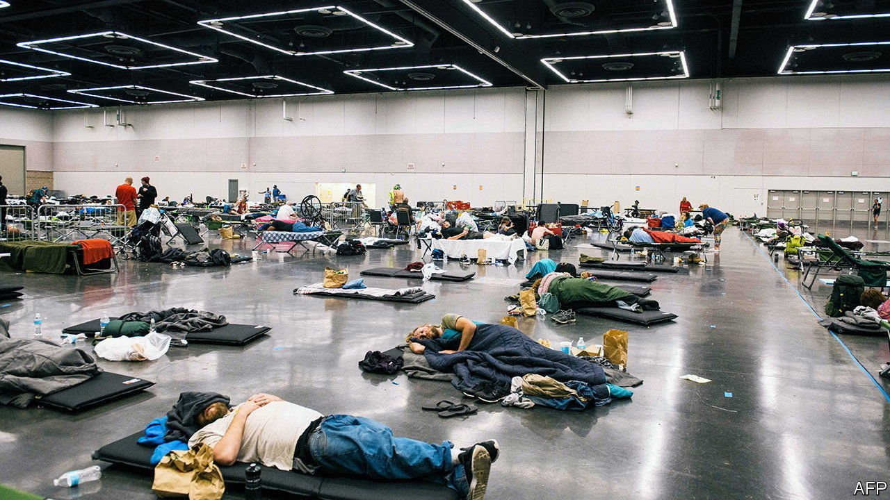
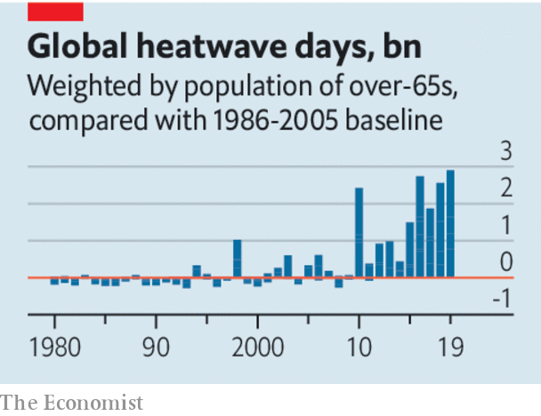

###### Mercury rising

# The danger posed by heatwaves deserves to be taken more seriously 

##### They will become more frequent and deadly in the years to come. What can be done? 

 

> Jul 3rd 2021 

WHAT IS MOST shocking about the heatwave affecting the Pacific Northwest is not merely that it has hit a usually temperate area, nor that so many long-standing temperature records are being broken. It is that those records are being broken by such large margins. In Portland, Oregon, thermometers reached an unprecedented 46.6°C (116°F)—making it one of several cities in the region where previous records have been beaten by a full 5°C (9°F). Meanwhile, heatwaves are also raging in central Europe and even in Siberia.

Heatwaves may generate headlines, but less attention is paid to them than they deserve. In 2018 roughly 300,000 people over the age of 65 died as a result of extreme heat, mainly in India and China, a 54% increase since 2000, according to a report in the Lancet, a medical journal. Unlike storms and floods, heat does not lead to dramatic before-and-after pictures or widespread damage to property. It is a silent killer, its victims often apparent only in retrospect, as statisticians tot up excess deaths and hospital admissions. (The fact that as many as 70,000 people died as a result of a heatwave in Europe in 2003, for example, became apparent only in 2008.) Heat also kills by exacerbating conditions such as heart problems, so not all the deaths it causes may be directly attributed to it.


Climate change will make heatwaves more common and more extreme. Even if greenhouse-gas emissions are cut to net-zero by the middle of this century, temperatures will go on rising for decades. So other measures are needed to protect people against extreme heat.

 


Governments can set up early-warning systems to alert health workers, shut down schools and suspend outdoor activities. They can provide the public with forecasts of imminent heatwaves, explanations of the dangers and detailed advice on what to do. Digital channels, including social media, can help distribute such information widely, and not just in tech hotspots like the Pacific Northwest. In 2017 nearly half the population of Dhaka, Bangladesh’s capital, were warned of an imminent heatwave via Facebook.

Improved infrastructure can also help. This includes providing shaded areas, water parks and “misting stations” to help people cool down, and access to air-conditioned “cooling centres” where they can find shelter and sleep if necessary. Such amenities depend, in turn, on a more fundamental form of infrastructure: reliable access to water and electricity, supplies of which may need to be carefully managed.

Last comes planning. Building codes should ensure that new homes and offices can cope with extreme heat. Existing buildings can be adapted by painting walls and roofs white, or adding sheets of white material, to reduce heat build-up in urban areas. Planting trees provides shade and cools the air, and also improves it—leading to a vogue for miniature “” planted in urban areas.

The world is, understandably, focused on a different health crisis right now. But heatwaves, along with obesity, dementia and antibiotic resistance, pose an entirely foreseeable threat in the decades to come—as we explain in “What If?”, our annual collection of future scenarios. The timing and severity of the coronavirus pandemic could not have been foreseen. These other far more predictable and preventable crises are different. There is no excuse for failing to take them more seriously.

For more coverage of climate change, register for The Climate Issue, our fortnightly , or visit our 

