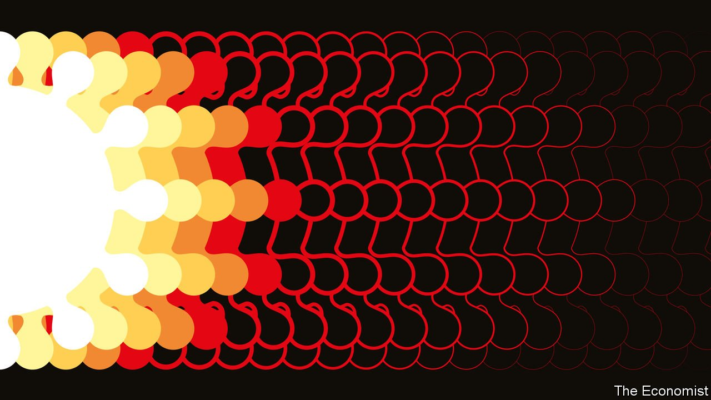

###### After the disease

# The long goodbye to covid-19 

##### The pandemic is still far from over, but glimpses of its legacy are emerging 

 

> Jul 3rd 2021 

WHEN WILL it end? For a year and a half, covid-19 has gripped one country after another. Just when you think the virus is beaten, a new variant comes storming back, more infectious than the last. And yet, as the number of vaccinations passes 3bn, glimpses of post-covid life are emerging. Already, two things are clear: that the last phase of the pandemic will be drawn-out and painful; and that covid-19 will leave behind a different world.

This week The Economist publishes a , which reflects both these realities. Taking the pre-pandemic average as 100, it tracks such things as flights, traffic and retailing across 50 countries comprising 76% of Earth’s population. Today it stands at 66, almost double the level in April 2020.


Yet the ravages of covid-19 are still apparent in many countries. Consider our index’s worst performer, Malaysia, which is suffering a wave of infections six times more deadly than the surge in January and scores just 27. The main reason for this is that vaccination remains incomplete.

In , just 2.4% of the population aged over 12 has had a single dose. Even in America, where vaccines are plentiful, only around 30% of Mississippians and Alabamans are fully protected. Although the world is set to produce around 11bn doses of vaccine this year, it will be months before all those jabs find arms, and longer if rich countries hog doses on the off-chance that they may need them.

The lack of vaccination is aggravated by new variants. Delta, first spotted in India, is two to three times more infectious than the . Cases spread so fast that hospitals can rapidly run out of beds and medical staff (and sometimes oxygen), even in places where 30% of people have had jabs. Today’s variants are spreading even among the vaccinated. No mutation has yet put a dent in the vaccines’ ability to prevent almost all severe disease and death. But the next one might.

None of this alters the fact that the pandemic will eventually abate, even though the virus itself is likely to survive. For those fortunate enough to have been fully vaccinated and to have access to new treatments, covid-19 is already fast becoming a non-lethal disease. In Britain, where Delta is dominant, the fatality rate if you become infected is now about 0.1%, similar to seasonal flu: a danger, but a manageable one. If a variant required a reformulated vaccine, it would not take long to create.

However, as vaccines and treatments become more plentiful in rich countries, so will anger at seeing people in poor ones die for want of supplies. That will cause friction between rich countries and the rest. Travel bans will keep the two worlds apart.

Eventually flights will resume, but other changes in behaviour will last. Some will be profound. Take America, where the booming economy surged past its pre-pandemic level back in March, but which still scores only 73 on our index—partly because big cities are quieter, and more people work from home.

So far it looks as if the legacy of covid-19 will follow the pattern set by past pandemics. Nicholas Christakis of Yale University identifies three shifts: the collective threat prompts a growth in state power; the overturning of everyday life leads to a search for meaning; and the closeness of death which brings caution while the disease rages, spurs audacity when it has passed. Each will mark society in its own way.

When people in rich countries retreated into their houses during lockdowns, the state barricaded itself in with them. During the pandemic governments have been the main channel for information, the setters of rules, a source of cash and, ultimately, providers of vaccines. Very roughly, rich-country governments paid out 90 cents for every dollar of lost output. Slightly to their own amazement, politicians who restricted civil liberties found that most of their citizens applauded.

There is a vigorous academic debate about . But the big-government legacy of the pandemic is already on display. Just look at the spending plans of the Biden administration. Whatever the problem—inequality, sluggish economic growth, the security of supply chains—a bigger, more activist government seems to be the preferred solution.

There is also evidence of a renewed search for meaning. This is reinforcing the shift towards identity politics on both the right and the left, but it goes deeper than that. Roughly one in five people in Italy and the Netherlands told Pew, a pollster, that the pandemic had made their countries more religious. In Spain and Canada about two in five said family ties had become stronger.

Leisure has been affected, too. People say they have had 15% more time on their hands. In Britain young women spent 50% longer with their nose in a book. Literary agents have been swamped with first novels. Some of this will fade: media firms fear an “”. But some changes will stick.

For example, people may decide they want to escape pre-pandemic drudgery at work, and tight labour markets may help them. In Britain applications to medical school were up by 21% in 2020. In America business creation has been its highest since records began in 2004. One in three Americans who can work from home wants to do so five days a week, according to surveys. Some .

Those who don’t die roll the dice

It is still unclear whether the appetite for risk is about to rebound. In principle, if you survive a life-threatening disease, you may count yourself as one of the lucky ones and the devil may care. In the years after the Spanish flu a century ago, a hunger for excitement burst onto the scene in every sphere, from sexual licence to the arts to the craze for speed. This time the new frontiers could range from space travel to genetic engineering, artificial intelligence and enhanced reality.

Even before the coronavirus came along, the digital revolution, climate change and China’s rise seemed to be bringing the post-second-world-war, Western-led order to an end. The pandemic will hasten the transformation. ■

Dig deeper

All our stories relating to the pandemic and the vaccines can be found on our . You can also listen to , our podcast on the race between injections and infections, and find trackers showing ,  and the virus’s spread across  and .

