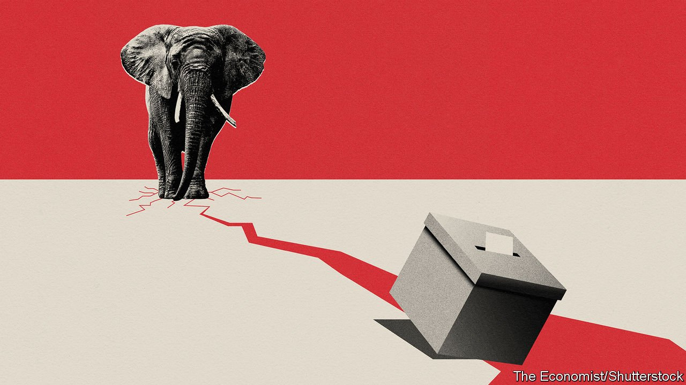

###### Elections

# The real risk to America’s democracy 

##### Partisan election administration is a greater worry than voter suppression 

 

> Jul 3rd 2021 

HAVING CAMPAIGNED for the presidency on a promise to rejuvenate democracy around the world, Joe Biden finds himself in a battle to defend it at home. In June, 200 prominent American scholars of democracy signed a letter warning that changes to state laws are “transforming several states into political systems that no longer meet the minimum conditions for free and fair elections”. Another longtime student of American democracy, the Republican leader in the Senate, Mitch McConnell, said in January that if an election could be overturned by fact-free allegations from the losing side, “Our democracy would enter a death spiral.” Yet that is just what his party is facilitating.

For Democrats the threat to elections is about who can cast votes. They decry changes to laws on identification, postal ballots and so on, which they call “the new Jim Crow”. Although there is no excuse for restricting such things as Sunday voting, which is popular with African-American churches, their fears are overblown. Under the old Jim Crow, only 2% of African-Americans were registered to vote in some southern states. By contrast, political scientists are unsure whether today’s schemes will affect turnout at all.


Instead the real threat comes after votes have been cast. In , for example, the legislature wants to limit the independence of the chief elections officer; a state representative introduced a law letting the legislature overturn the results of a presidential election, and then started campaigning to oversee elections herself. In Georgia the state legislature can now replace the leadership of county election boards. Texas is considering a bill that makes it easier to prosecute election officials. Across the country, the officials who administer elections in states where Republicans hold sway have been attacked for upholding the election results. Many are at risk of being replaced.

These might seem like distant, bureaucratic changes. In fact they raise the chances of a contested election that the courts cannot sort out. They weaken America’s voting system in ways that will outlast the hysteria over the 2020 result.

The inspiration behind this is Donald Trump, who continues to use every chance he has to insist that the election was stolen. Though it is hard to know how seriously to take him, Mr Trump is already holding campaign rallies for 2024 (to win the White House for the third time in a row, naturally).

Claiming to be winning while actually losing might seem a joke. Yet most Republican voters take it literally. Two in three think that Mr Biden did not win November’s election and just short of half think the result should have been overturned. That leaves Trump-sceptics among the Republican elite in a familiar dilemma. Caught between their primary voters and loyalty to the constitution, most have concluded that, unless the Capitol is under siege, the best course of action is simply to stay silent.

Yet the threats from Mr Trump and the threat to the constitution operate on different time-scales. Mr Trump may or may not run again. By contrast, the changes to state election machinery being made by Republican legislators will be in place in 2024 and beyond for a candidate of either party to exploit. To understand why this is so troubling, consider three fail-safe mechanisms built into American elections.

The first is the principle that the loser concedes. Mr Trump ditched that one in 2020. The second is the integrity of local election officials, no matter what their partisan allegiances. Despite coming under great pressure to do otherwise last year, they stood firm. As a reward, their powers have been stripped away or new felonies created that may be used to browbeat them. Many Republican officials who certified the election results have been censured by their local party committees and have also received death threats. Brad Raffensperger, Georgia’s Republican secretary of state, was notable in 2020 for his willingness to stand up to Mr Trump when he was directly asked to “find” the votes needed to overturn the results. Georgia’s state legislature has responded by taking away some of his authority.

That leaves the third fail-safe—the courts. These too performed well under stress, and they probably would do so the next time round. Yet to put the primary responsibility for making elections legitimate onto the judicial branch in election after election risks overloading it and, ultimately, breaking it. How long would it be before a Supreme Court decision were ignored?

Catastrophising about democracy in America has been common on parts of the right: remember “the Flight 93 Election” in 2016, which called on patriots to storm the cockpit to deny Hillary Clinton the presidency? It has since spread to the left and centre, too. Talk of democracy in peril raises the spectre of a country under an autocrat of the type renounced on the Fourth of July 1776. The greater risk is that the chaos following the 2020 election becomes normal. By recent standards 2020 was not that close. Imagine a contest so tight that no national consensus could settle on who was ahead. America would be, to quote Mr McConnell again, on “a poisonous path where only the winners of an election actually accept the result”.

My party, right or wrong

Republican Party elites are in a bind of their own making. Under pressure from Mr Trump and his allies, state legislatures are making changes that will weaken American democracy. The solution is for leaders to uphold the norm that election administrators are above party. However, they have indulged the lie of a stolen election to such an extent that affirming the fraud has become an essential qualification for administering the next vote.

The silent non-Trump faction of the Republican Party may hope that all this will blow over and that those sounding the alarm about democracy are exaggerating. They may believe they can play a greater role in safeguarding America so long as they stay on good terms with their base. Yet that logic has proved faulty since Mr Trump’s inauguration in 2016. Meanwhile, the composition of their party is changing around them. It would be safer for the constitution, and more in keeping with the flag-waving spirit of the Fourth of July, for Republicans to speak out now before speaking out becomes even harder. ■

