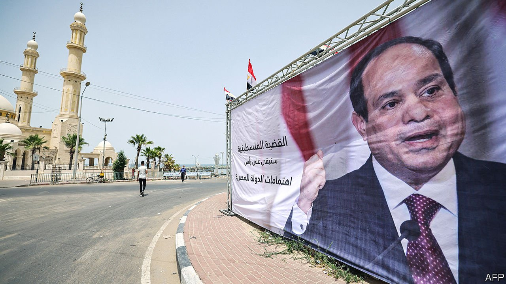
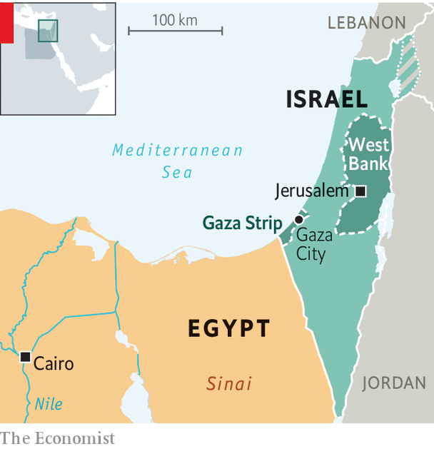

###### Sisi sees an opportunity

# Egypt’s dictator is aiding Gaza and boosting his image 

##### Abdel-Fattah al-Sisi is keen to impress Joe Biden 

 

> Jul 1st 2021 

AT FIRST SIGHT one might have thought Abdel-Fattah al-Sisi was running for president of Palestine. Dozens of billboards (one is pictured) appeared overnight in Gaza this May, each bearing the face of the Egyptian president and an emphatic quote. “The Palestinian cause is the central issue for Egypt,” read one. Main roads were lined with Egyptian flags. A crowd of young men stood outside a seaside hotel to cheer the arrival of Abbas Kamel, Mr Sisi’s intelligence chief, whose motorcade sped into Gaza on a sweltering summer morning. “You’d think it was Abdel Nasser come to liberate Palestine,” quipped an elderly bystander.

The scene would have been unthinkable a few years ago. Along with Israel, Egypt has maintained a blockade on Gaza since 2007, when Hamas, a militant Islamist group, took power. Relations deteriorated further in 2013, when Mr Sisi overthrew an elected government led by the Muslim Brotherhood. His military-backed government saw Hamas as an outgrowth of the Brotherhood and was keen to strangle it. It flooded hundreds of tunnels that ran between Egypt and Gaza, cutting off a conduit for goods (and weapons) into the territory.


But Mr Sisi’s tone has changed since the brief war between Israel and Hamas that killed more than 250 Palestinians and 13 people in Israel. Egypt brokered the ceasefire that ended the fighting on May 21st. It has pledged $500m for reconstruction in Gaza and sent convoys of aid. All of this is helpful for Palestinians—but it is more helpful still for Mr Sisi’s reputation. “Sisi was the biggest winner in the war,” says Omar Shaaban, a political analyst in Gaza.

 


For a start, it gave him a needed diplomatic boost. Mr Sisi had been friendly with America’s former president, Donald Trump, who referred to the Egyptian ruler as “my favourite dictator”. Mr Trump’s successor, Joe Biden, has been less effusive. Many Democrats and some Republicans are critical of Mr Sisi’s ruthless authoritarianism. Since he took power in 2013 police have swept up tens of thousands of Egyptians, including a number with American citizenship (one, Mustafa Kassem, died in prison last year after a sham trial).

Mr Biden did not speak to Mr Sisi during his first four months in the White House. The conflict in Gaza changed that: Mr Sisi received two presidential phone calls in one week, then a visit from America’s secretary of state. According to the official summaries, Mr Biden made only passing reference to human rights.

At home, too, Mr Sisi used the war to his benefit. Egypt dispatched more than 120 trucks carrying aid shortly after the ceasefire. State media described the convoy as a “gift” from the president, whose face was emblazoned on some of the containers. Much of the aid was financed by the Tahya Misr fund, which was set up to pay for Mr Sisi’s pet projects. On June 9th Egyptian state television broadcast its morning show from Gaza, the two presenters smiling incongruously in front of a ruined building festooned with Egyptian flags. They spoke effusively of Egypt’s efforts—described again as a personal initiative by the president.

Hamas has changed its tune as well. The group cut ties with the Muslim Brotherhood in 2017, declaring itself a strictly local movement, partly in an effort to placate Egypt. Hamas officials now talk of their commitment to Egypt’s security, which reflects another change. After Mr Sisi’s coup they allowed jihadists fighting the Egyptian government on the Sinai peninsula to slip into Gaza for medical treatment and use it as a haven. Understandably, that enraged the government. The policy was quietly halted a few years ago.

If the current bonhomie between Egypt and Hamas feels a bit forced, it is also a necessity. Egypt plays a unique role in the region. Qatar, which has given Gaza more than $1bn in aid since 2012, has influence over Hamas. The United Arab Emirates announced diplomatic ties with Israel last year. But only Egypt is both influential in Gaza and trusted by Israel’s security establishment. So it was better placed than any other country to negotiate the truce between Hamas and Israel.

Sustaining the ceasefire in Gaza, though, will be difficult. After four rounds of conflict and 14 years of blockade, conditions in the territory are dire. Without a serious effort to ease the blockade and rebuild, another war seems inevitable. Mr Kamel’s trip to Gaza, the highest-level visit by an Egyptian official since the coup, was meant to sort out that problem. Since then he has hosted Israeli officials and Hamas leaders in Cairo for follow-up talks.

But progress is scant. Israel is loth to allow reconstruction in Gaza until Hamas releases two Israeli civilians held prisoner and the bodies of two Israeli soldiers killed during the previous war, in 2014. Hamas is open to a deal, but it wants to swap its prisoners for Palestinians held in Israeli jails, not for reconstruction aid. Mr Sisi got what he wanted from the war. Many Palestinians are sceptical that they will. ■

