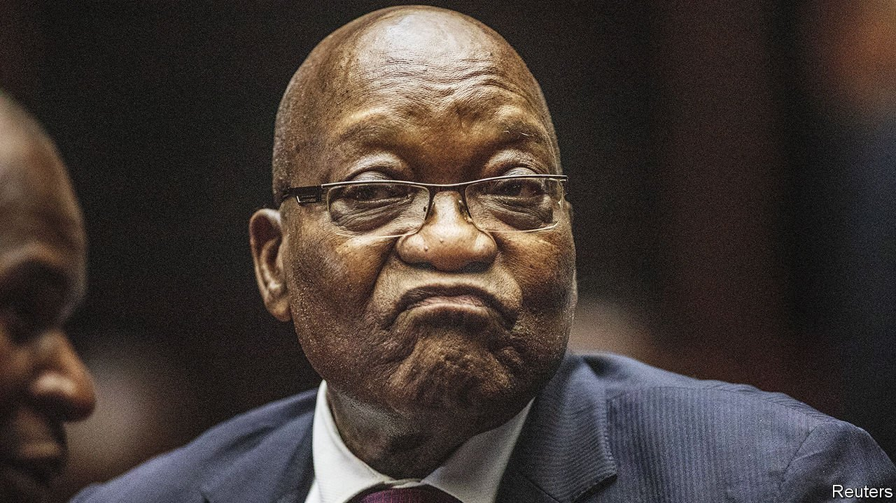

###### Another kind of capture

# The meaning of Jacob Zuma’s 15-month prison sentence 

##### In punishing the ex-president, South Africa’s Constitutional Court proves its mettle 

 

> Jul 1st 2021 

IN 1995, A YEAR after his election to the presidency had brought an end to white rule, Nelson Mandela spoke to the assembled judges at the opening of South Africa’s Constitutional Court. “We expect you to stand on guard not only against direct assault on the principles of the constitution,” he said, “but against insidious corrosion.”

Since then no one has done more to corrode the institutional pillars of post-apartheid South Africa than Jacob Zuma. In the 2000s he was accused of taking bribes from a French arms company while deputy president; he spoke of how the ruling African National Congress (ANC) was “more important” than the constitution. After he became president in 2009 his reign was associated with the wholesale looting of public funds and the demolition of the parts of the state meant to stop graft.


Since Cyril Ramaphosa replaced him in 2018, Mr Zuma and his allies have undermined the new president’s attempts to clean up their vandalism. The former president has treated with disdain a commission into the “state capture” that took place when he was in office. Mr Zuma repeatedly ignored summons to appear before the inquiry, refusing to turn up even after the Constitutional Court ordered him to do so.

Mr Zuma’s absence from the inquiry has proved his undoing. In light of his relentless recalcitrance and his incessant outlandish accusations against the judiciary, the chair of the inquiry, Raymond Zondo, asked the Constitutional Court to intervene again. On June 29th it delivered a verdict that was profound in its argument and devastating in its effect. “I am mindful that, having no constituency, no purse and no sword,” said the acting chief justice, Sisi Khampepe, “the judiciary must rely on moral authority to fulfil its functions.” She went on to sentence Mr Zuma to 15 months in prison for his “egregious” and “aggravated” contempt of court and his “scurrilous, unfounded attacks” on judges.

The former president has until July 4th to hand himself in. (No appeals are allowed against verdicts made by South Africa’s highest court.) If he does not, the police have a further three days to imprison him. On June 30th a statement by Mr Zuma's foundation described the ruling as "judicially emotional". It did not say if he would turn himself in.


One consequence of the sentence is that Mr Zuma will travel to his next court appearance from prison. On July 19th the long-delayed trial into the arms deal will resume, with the former president facing a potentially lengthier sentence. (Both Mr Zuma and Thales, the French firm, deny any wrongdoing.) Prosecutions related to his time as president may follow. At 79 Mr Zuma is suddenly facing the possibility of spending the rest of his life behind bars. He may end up as a sort of inverted Mandela, famous for going from the presidency to prison, rather than the reverse.

The court’s decision will also have political ramifications. Mr Ramaphosa has not lived up to his promise—uttered in his first “state of the nation” address to Parliament—to give South Africa a “new dawn”. His handling of a grim third wave of covid-19 has been characteristically laboured. But in recent months he has forced through important, if belated, economic measures, such as removing red tape for businesses that want to generate their own renewable energy and finding private buyers for a majority stake in the debt-ridden state-owned airline. The ANC’s suspension in May of Ace Magashule, its secretary-general and an ally of Mr Zuma, has strengthened the president’s hand against their faction ahead of local elections and a party conference later this year. Though Mr Ramaphosa has little to do with Mr Zuma’s imprisonment, it will underline that his grip on the party is tightening. That should make it easier for him to govern. Though some acolytes of Messrs Zuma and Magashule may protest against their idols’ defenestration, most will not want to annoy the ANC’s bigwigs and risk losing the jobs that the party doles out to loyalists.

Yet perhaps the biggest consequence of the Constitutional Court’s decision is for South Africa as a whole. Under apartheid the rule of law was applied cruelly or selectively, according to the colour of people’s skin. The transition to democracy brought with it an inspiring, liberal constitution, as well as new courts and legal institutions to defend it. That architecture was rightly admired across Africa and in many other parts of the world. The Zuma era threatened to tear it down. The Constitutional Court has delivered not only a pivotal legal verdict, but also a reminder to the rainbow nation of its founding ideals. ■

A version of this article was published online on June 29th 2021

