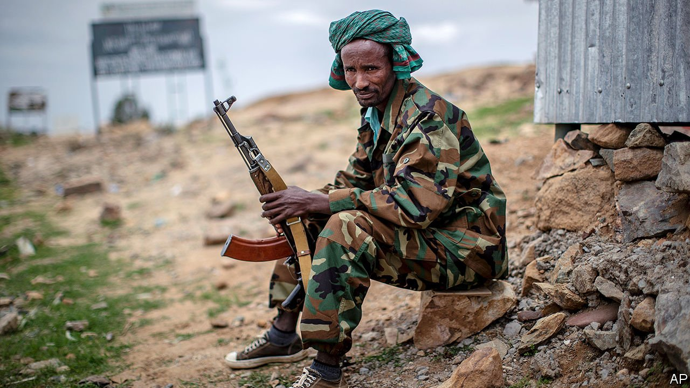

###### Defeat in the mountains

# Tigrayan forces have routed the Ethiopian army 

##### Their victory may reshape Ethiopia—and the region 

 

> Jul 1st 2021 

ONCE THE history of Ethiopia’s latest civil war is written, the battles of June could well be recounted as one of the great rebel victories of recent years. For it will explain how a group of insurgents in the mountains of Ethiopia’s northern region of Tigray routed two of Africa’s largest armies, Ethiopia’s and Eritrea’s, to reclaim Mekelle, their capital.

At sunset on June 28th—seven months to the day after Abiy Ahmed, Ethiopia’s prime minister, declared victory over the ruling party in Tigray as his troops occupied Mekelle—Tigrayans came onto the streets to celebrate the flight of federal troops. Officials appointed by Abiy’s government to run the region were whisked out of town as if from a crime scene. “There are celebrations in every house in Mekelle,” said Haile Kiros, a teacher in the city, before phone lines were cut.


The recapture of Mekelle marks a turning-point in an atrocity-filled war that Abiy had thought would last just a few weeks. It has not only scuppered Abiy’s attempt to bring Tigray to heel by force of arms, but also threatens to break up the factious ethnic federation that makes up Africa’s second-most populous country.

The fighting in Tigray started in November amid a struggle for power between Abiy and the Tigrayan People’s Liberation Front (TPLF), the region’s ruling party. The TPLF had controlled the central government for almost 30 years until it was ousted by the protests in 2018 that ushered Abiy to power. At first the TPLF seized control of much of the army’s heavy weaponry by attacking federal bases in the region. But the pendulum soon swung in Abiy’s favour. Federal forces, backed by air power and soldiers from neighbouring Eritrea, swiftly captured the big towns and cities.

Yet the fighting degenerated into a grinding guerrilla war as fighters of the self-styled Tigrayan Defence Force (TDF) took to the hills, much as their grandfathers had in a successful insurgency in the 1980s against the Derg—a communist dictatorship—and as their fathers had in a conventional war against Eritrea from 1998 to 2000. Some Tigrayans were provoked into taking up arms by murders and rapes, many committed by Eritrean forces whom UN officials also accuse of attempting to starve Tigray into submission.

Then in mid-June the TDF’s fighters came back down from the hills under the command of Tsadkan Gebretensae, a veteran Ethiopian army chief who had been at the helm during the war with Eritrea, to launch “Operation Alula”, named after a 19th-century general. At first few observers believed the TDF when it claimed to have defeated several Ethiopian and Eritrean divisions and taken thousands of prisoners in a succession of battles on the roads to Mekelle. The Ethiopian government insisted it was in full control of the region and was mopping up sporadic resistance. But the truth was exposed when, as quickly as they had arrived, Ethiopian troops left, pausing only to dismantle telecommunications equipment and raid a UN office.

With Ethiopian and Eritrean troops scrambling towards the exit, the federal government announced a unilateral ceasefire on June 28th, ostensibly on humanitarian grounds. More probably it was an effort to mask the defeat of its forces and allow them time to retreat (just days earlier Ethiopia’s deputy prime minister had told Western ambassadors for the first time that his government wanted a ceasefire and peace talks).

However, the TDF is in no mood to halt its offensive. Its spokesman called the government’s ceasefire a “sick joke” and said that the TDF would continue pursuing “enemy” forces. Some Tigrayan leaders have threatened to fight on northwards, towards Asmara, Eritrea’s capital, and westwards, towards the border with Sudan, intending to expel occupying Amhara militias. As The Economist went to press, the TDF appeared to be in control of most of Tigray, including the towns of Axum, Shire and Adwa.

The priority for all parties ought to be ensuring that aid agencies are able to get access to Tigray, where up to a million people are at risk of starvation because they have been unable to plant crops and because Eritrean and Ethiopian forces have not allowed in sufficient supplies of food (see map). Yet Will Davison of the International Crisis Group, a think-tank based in Brussels, sees signs that officials in Abiy’s government plan to continue to blockade Tigray, allowing in some aid but little else. If so, the TDF may seek to break the blockade by fighting for access to the Sudanese border or trying to topple the government in Eritrea.

 


Abiy, happily, has much to gain by lifting the blockade and starting talks, beyond ensuring the well-being of Tigrayan civilians. For a start it would help to repair his relationship with Western governments, whose support he needs to rebuild and get Ethiopia’s battered economy back onto its previous path of rapid growth. In addition to the military bill, Abiy claims Ethiopia’s government has spent about $2.3bn on associated costs such as repairing roads and food aid. Because of its concerns about war crimes, America has asked the IMF and World Bank to withhold economic assistance. America has also pressed the United Arab Emirates, which has provided Abiy’s government with financial support (and possibly arms), not to bail it out.

Diplomats are concerned about the risks of the conflict spreading beyond Tigray’s borders. Eritrea’s dictator, Issaias Afwerki, may already be regretting his decision to join the attack on Tigray, largely to settle scores with the TPLF, which had humiliated him in the border war. A second trouncing at its hands is unlikely to strengthen his hold on power.

Foreign officials also worry about a deterioration in relations between Sudan and Ethiopia. Since November the Sudanese army has been skirmishing with Ethiopian forces, Amhara militiamen and at least some Eritrean troops over a disputed area of farmland on the border and over a huge new dam under construction on the Blue Nile in Ethiopia. In a speech on June 30th Abiy suggested his forces had withdrawn from Tigray in part to redirect their attention towards the Sudanese front. “Another force threatens us and we need to prepare for that,” he said.

Still, the deepest concern of Western diplomats and officials from countries in the region is the stability of Ethiopia’s fragile ethnic federation. Although TPLF leaders have yet to call for secession, many young Tigrayans now champion it unambiguously. “The only way is for independence,” says Tekleberhan Weldeselassie, an Ethiopian air-force pilot who fled abroad at the start of the war. “We Tigrayans will never stay together with Ethiopia.” Abiy has the almighty task of convincing them to do just that. ■

Correction (July 1st 2021): An earlier version of this article incorrectly said that the Ethiopian government said it had spent $2.3bn on the war in Tigray. In fact this figure was for associated costs such as roads and food aid and does not include military expenditure.

A version of this article was published online on June 30th 2021

