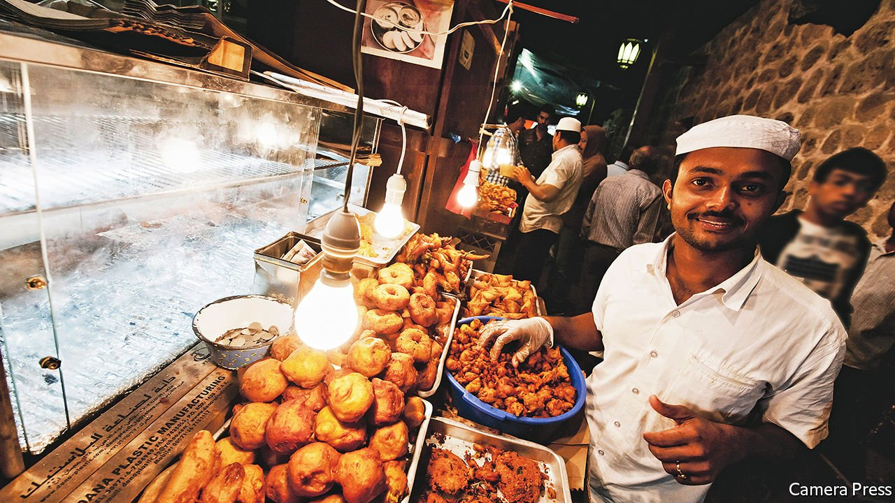

###### Kitchen inconsequential

# Why is it so hard to find local fare in the Gulf? 

##### In some places there are more Hawaiian food outlets 

 

> Jul 1st 2021 

A  VISIT TO the Middle East can feel like one endless lunch. Lebanon offers no end of delicacies. Tour guides in Egypt take their charges for koshari, a bowl full of carbs topped with tomato sauce. A trip to Baghdad requires a stop for masgouf, a beloved platter of grilled carp (American troops found Saddam Hussein in 2003 by tracking his fish deliveries).

Ask residents of the Gulf countries where to sample Gulf cuisine, though, and you may be met with blank stares. Local fare has long been limited to home kitchens, while restaurants offer grub from everywhere else. One restaurateur estimates that of the 5,000 or so eateries in Dubai, fewer than 1% serve Emirati food. A glance at a food-delivery app seems to confirm this: there are more options for Hawaiian food. It is one of the few places where visitors might spend a week and never eat a local dish.


In part that is because the Gulf’s cuisine was long defined by scarcity. Less than 2% of land in Saudi Arabia, Kuwait and Oman is arable. Much of that was given over to date palms which, along with meat, yogurt and grains, formed the basis of a simple local diet. The national dish in most Gulf countries, known as kabsa or machboos, is a bed of (imported) rice topped with cuts of meat. And many dishes are time-consuming to prepare. One traditional style of cooking involves burying seasoned meat underground for hours, which is fine for family feasts but tricky for fast food.

The Gulf’s cuisine was also shaped by commerce, which can make it hard to say what exactly qualifies as “local”. Towns on the Gulf littoral traded extensively with Asian countries, and those links show up on the dinner table. Machboos has its roots in biryani, from the Indian subcontinent. The informal national drink of the Gulf, known locally as karak, is a cup of masala chai. For visitors curious about the local fare, Dubai’s tourism authority suggests a small chain of restaurants that serves up dal (an Indian dish) and ash-e jow (an Iranian soup).

The oil boom brought millions of migrants, along with their cuisines. The most celebrated kebab joint in Dubai was founded by Iranian émigrés. America has left its mark, too. Big chains like McDonald’s are ubiquitous, along with more obscure brands (Famous Dave’s, a barbecue chain, had to tweak its logo for the Emirati market, since the original features a decidedly non-halal pig).

In recent years both chefs and governments have made a push to revive the local fare. Abu Dhabi, the capital of the United Arab Emirates, has asked hotels to offer local options. Breakfast buffets now often feature balaleet, a plate of sweetened vermicelli topped with eggs, or chebab, pancakes topped with cream and date molasses.

Younger chefs from Gulf countries have culled recipes from the experts (their grandmothers) and experimented with modern twists on local dishes. Camel-meat sliders topped with date jam would have caused befuddlement a few generations ago, but they seem a fitting match for the Gulf’s modern melting pot.

