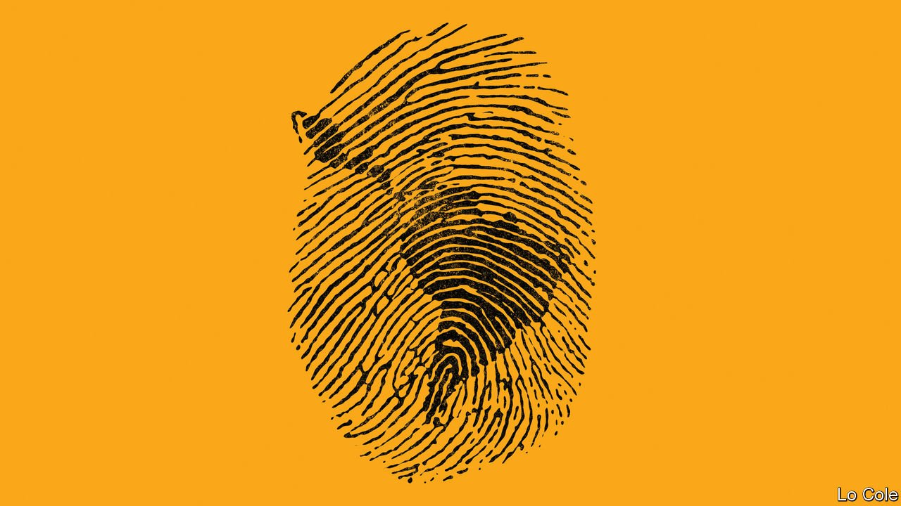

###### Bello

# Latin America’s national identities are being questioned 

##### Statues are being toppled in Colombia, while Mexico has apologised to the Mayans 

 

> Jul 1st 2021 

“MEXICANS EMERGED from indigenous people, Brazilians emerged from the jungle, but we Argentines arrived on boats. On boats from Europe.” So said Alberto Fernández, Argentina’s president, last month. It was meant as a friendly nod to Pedro Sánchez, Spain’s prime minister, who was sitting beside him. Two decades ago the comment, which Mr Fernández attributed to Octavio Paz, a Mexican poet, but which was really more faithful to an Argentine rock song of the 1980s, would have gone unremarked. Not now: many took offence. What made his timing especially clumsy is that Latin Americans are once again engaging in one of their periodic bouts of questioning their national identities.

In Colombia in April indigenous demonstrators toppled a statue of Sebastián de Benalcázar, a Spanish conquistador. Monuments in Bogotá to Queen Isabella of Castile and her hired help, Christopher Columbus, were also attacked and have been removed for safe-keeping. Chile has decided to make June 24th a public holiday as “the day of the original peoples”. In May Mexico’s president, Andrés Manuel López Obrador, apologised to the Mayans for the abuses of the past five centuries. Pedro Castillo, a left-wing teacher and the presumptive winner of Peru’s presidential election, said that to be “of Andean blood” is to be “authentically Peruvian”. Some of his opponents brandish red and white flags featuring the cross of Burgundy, an emblem of Spanish colonial rule.


National identities evolve everywhere. And they tend to be closely linked to race. That has been especially so in Latin America. Most of the region became independent two centuries ago, just when the French revolution and the European Romantics made nationalism fashionable. The new nations set out to create collective identities. It was a tricky task, as Simón Bolívar, the liberator of northern South America, wrote: “We are neither Indians nor Europeans, but a race halfway between the legitimate owners of the land and the Spanish usurpers.”

Throughout the 19th century historians, painters and poets worked to create national myths and heroes. These were generally whitish men: although Indians and black slaves were accepted as part of the nation, it was in subordinate roles. In the 20th century more inclusive national identities emerged, centring on mestizaje, the racial and cultural mixing of indigenous people, Europeans, Africans who arrived as slaves and immigrants from elsewhere. “There is not a single Latin American, from the Rio Grande to Cape Horn, who is not an heir to each and every aspect of [this] cultural heritage,” Carlos Fuentes, a Mexican writer, declared in 1992 as the region marked the quincentenary of Columbus’s arrival.

That commemoration in fact prompted a questioning of mestizaje. In 2010 around 42m Latin Americans, or 8% of the total, defined themselves as indigenous, according to censuses; others took pride in their African descent. These people tend to be poorer than average, whereas elites tend to be whiter than average. Racism and racial tension survive, albeit in less overt form. Take Argentina: behind the European façade proclaimed by Mr Fernández lay the extermination of some indigenous people in the 19th century and the hidden survival of others. Or Peru: according to Gonzalo Portocarrero, a sociologist, its history contains two persistent fantasies, that of a race war feared by whites and that of Inkarri, the return of the Inca emperor to rescue his people from bondage. Portocarrero, writing in 2015, thought both were fading. Recent events call that conclusion into question.

Statue-toppling is currently widespread, and there is an element of anarchist vandalism to it. But Latin American leaders would be foolish if they fail to recognise that in recent mass protests there is a demand not just for material improvements but also for more inclusive national identities in countries where the pandemic and the prior economic slowdown have deepened social fractures. The conquistadors were brave, but they were brutal too. They belong in museums, not in public squares (Columbus is a more complicated case, as a generic symbol of the European roots of many Latin Americans). But while Latin America should pay due recognition to its cultural and ethnic diversity, it should not lose sight of the many things its people have in common. Cultural mestizaje is in some ways a myth and it should not be imposed. But it remains the only inclusive and unifying narrative the region possesses.

