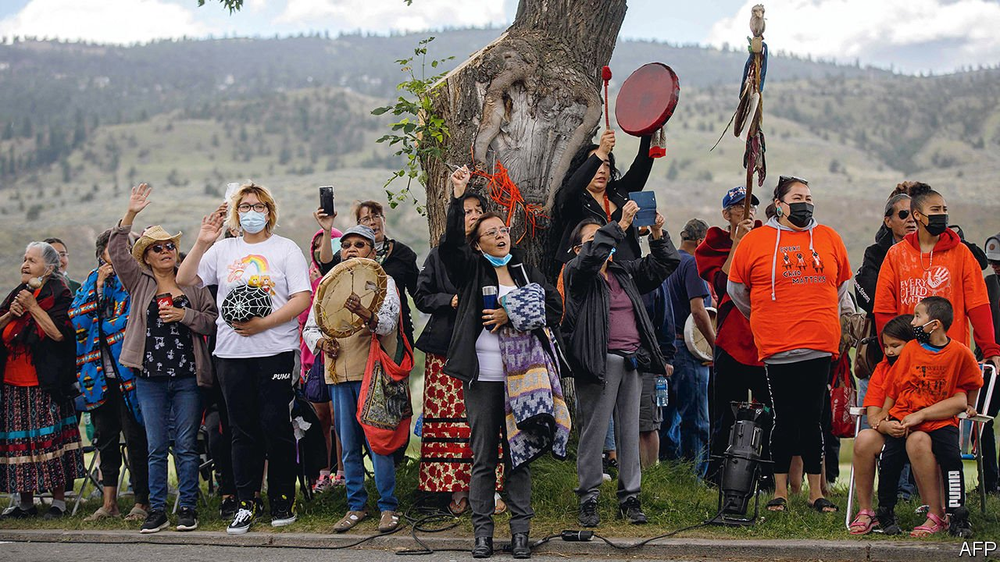

###### Searching for the truth

# More graves are found at Canadian schools for the indigenous 

##### The revelations confirm what many indigenous groups have long suspected 

 

> Jul 3rd 2021 

THE PURPOSE of Canada’s residential schools for indigenous children was to “kill the Indian in the child”. Sometimes the child died too. Over the past month 1,148 unmarked graves have been found at the sites of three former residential schools. Ground-penetrating radar confirmed what indigenous groups have long suspected: that more children died at these schools than was previously thought.

Beginning in the mid-1800s the Canadian government forced at least 150,000 indigenous children into residential schools, mostly run by the Roman Catholic church. The last closed in the late 1990s. Children were beaten for speaking their native language. Many suffered sexual and physical abuse. Disease spread rapidly because of cramped dormitories and poor living conditions. Some children died in accidents or in attempts to escape.


The number of graves has shocked Canadians, even though many indigenous people had complained about the residential schools for decades. “Now our truth is finally out,” says Barbara Lavallee, a Cowessess First Nation researcher who is part of the team of elders and technicians that uncovered the second gravesite.

The Canadian government has previously tried to atone for the residential school system. In 2008, in response to the country’s largest class-action lawsuit, the government formally apologised for the schools. It held a truth and reconciliation commission, deeming the schools a form of “cultural genocide”, compensated survivors and paid for programmes to locate graves. Since the 1980s aboriginal rights have been enshrined in the constitution.

By contrast the United States, which also ran boarding schools for indigenous children, has done none of these things. Even so, it may nowadays be doing a better job than Canada at keeping indigenous families together.

In both the United States and Canada, indigenous children have been disproportionately put into foster care and adoptive homes. That perpetuates the break-up of families initiated by residential schools, argues Margaret Jacobs of the University of Nebraska. She reckons that social workers have tended to remove children from homes that were simply poor, rather than abusive. They may have interpreted grandparents raising children—a common feature in some indigenous communities—as a sign of parental neglect. In 2016 a Canadian human-rights tribunal found that the government spent less money on reserves on programmes to support families; as a result indigenous children were more likely to be taken from their homes.

In the United States indigenous people are given more autonomy to govern themselves. Tribal courts can experiment with innovative approaches and tend to have smaller dockets, giving judges more time to evaluate cases. This is partly why the United States has made more progress in reducing foster-care numbers. About half of children in foster care in Canada are indigenous, despite making up only 8% of the population. In the United States around 3% of children in foster care are indigenous, closer to the proportion of Native Americans in the population. However, following the revelations in Canada, Deb Haaland, the United States’ first indigenous secretary of the interior, has announced an investigation into America’s boarding schools. Both countries can learn from each other.■

