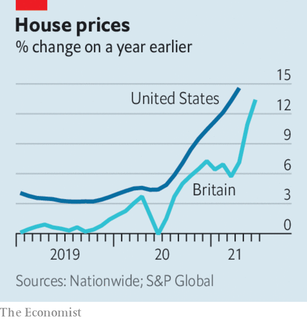

###### 

# Business this week 

#####  

 

> Jul 3rd 2021 

In America a federal judge dismissed two brought by the Federal Trade Commission and by a group of state attorneys general. The latter was thrown out on a technicality. The FTC’S case claimed that the tech giant was abusing its market power in social networking and using it to crush smaller rivals. But the judge found that the FTC failed to provide enough evidence to prove that Facebook is a monopoly. The company’s share price jumped 4% on the news.

Separately, Amazon filed a petition to try to force Lina Khan, the new chair of the FTC, to recuse herself . It argued that she had “already made up her mind” that the company was a threat to competition.


Microsoft and Google ended a truce in which they had agreed not to litigate or complain about each other to regulators without trying to resolve the disagreements first. The deal was struck in 2015 by two then-new bosses who wanted a fresh start to a fraught relationship.

America’s biggest banks said they will pay an extra $2bn in dividends in the next quarter. The announcements come after the Federal Reserve relaxed restrictions on shareholder payouts, which it imposed last year to guard against large capital losses related to the pandemic.

The news from Facebook and the banks helped to push American stockmarkets to new highs. Both the Nasdaq and S&amp;P 500 reached all-time highs. On Wednesday the S&amp;P 500 achieved its fifth record-breaking close in a row. The surge was also boosted by an expectation among investors that the upcoming corporate earnings season will yield strong results as well as a new survey which showed an uptick in consumer sentiment in America.

Binance, one of the world’s biggest cryptocurrency exchanges, froze customers’ ability to withdraw and deposit sterling on its main platform. The firm claimed the function was “suspended for maintenance”. It is unclear whether the incident is related to a decision by the Financial Conduct Authority, a British watchdog, which found that the exchange was not registered in Britain and so was not allowed to operate there. Later Binance said that it had unfrozen sterling withdrawals.

Hot property

 


 by 14.6% in the 12 months to April. That is the fastest growth rate in 30 years. The jump is largely because of low mortgage rates and greater demand for suburban dwellings. Similar factors pushed house prices in Britain to their highest year-on-year growth rate since 2004.

Argentina was dropped from an index of emerging-market economies compiled by MSCI, a big index provider. The decision was made in response to Argentina’s capital controls which were imposed in September 2019 to try to support the weakening peso. Argentine share prices tumbled as a result.

Didi Chuxing, China’s biggest ride-hailing app, ended its first day of trading on the New York Stock Exchange with a market capitalisation of $68bn. It is the biggest foreign listing in America since Alibaba’s debut in 2014.

UBS said it will allow around two-thirds of its staff to mix working from home and the office. The Swiss bank hopes that this will give it a recruitment edge over rivals. Other big banks, such as Morgan Stanley and Goldman Sachs, are pushing for a full .

The UN estimated that the pandemic’s impact on the tourism industry will reduce global GDP by $1.7trn-2.4trn in 2021 (1.9-2.7% of the total). Poor countries are expected to be hardest hit because they will probably have the lowest vaccination rates.

Nevertheless, United Airlines is betting that air travel will eventually rebound. It spent $30bn on 270 new planes, its biggest-ever addition to its fleet. United plans to replace two-thirds of its 50-seat jets with larger craft. That will help the airline offer customers more premium seats.

Shareholders at Toshiba, a Japanese conglomerate, voted to dismiss the chair of the company’s board. The vote comes after an independent report found that last year the firm’s management colluded with government officials to crush an activist investor rebellion. Following their show of strength, activist investors are reportedly keen to invite bids from private-equity firms.

Rocket man

Elon Musk said that Space x, his private rocket company, could spend between $20bn and $30bn on its low-orbit network. The firm has 1,500 satellites which provide broadband to places without fibre connections or 5G. It wants to expand the network to 12,000 satellites. The cost is much higher than previous estimates. As Mr Musk put it: “It’s a lot, basically.”

