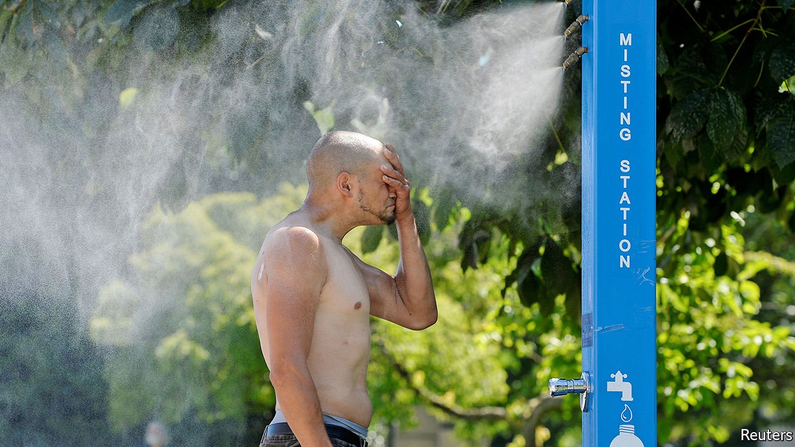
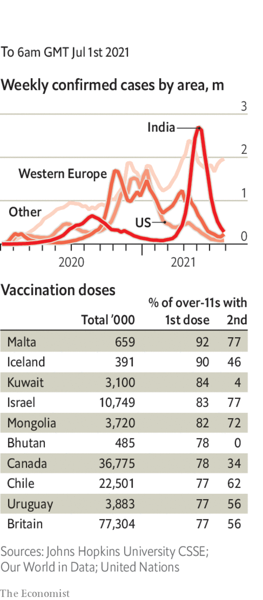

###### 

# Politics this week 

#####  

 

> Jul 1st 2021 

Much of America’s Pacific north-west and Canada’s west coast baked in a . Police in Vancouver reported more than 130 sudden deaths, most of them old people or those with underlying conditions. The extreme temperatures were caused by a phenomenon known as a “heat dome”, in which an area of high pressure in the atmosphere stops air escaping.

President Joe Biden backed down over his claim that he would not sign a bipartisan infrastructure bill worth roughly $1trn unless it was accompanied by more expansive provisions off the Democratic party’s wishlist, such as tax increases. Mr Biden had tied the two together after striking a deal with a group of senators from both sides last week, riling Republicans.


 after a beach-front condominium building in Surfside, a suburb of Miami, collapsed. At least 18 people have died and almost 150 are missing. A study published last year charted subsidence in the ground beneath the building in the 1990s.

Donald Rumsfeld died at the age of 88. The Republican served twice as America’s defence secretary, under Presidents Gerald Ford and George W. Bush. He was instrumental in the invasion of Iraq in 2003, and bore much of the criticism when it led to violent insurgency and sectarian strife.

A high-ranking official at Brazil’s health ministry was fired after being accused of asking for a bribe in negotiations over the AstraZeneca covid-19 vaccine. A whistleblower also denounced alleged irregularities in a contract for the Indian-made Covaxin. The vaccine, which has yet to be approved by a Western regulator, cost Brazil more per dose than any other and was acquired by a third-party firm. President Jair Bolsonaro denied wrongdoing. The health ministry suspended the contract.

Mexico’s Supreme Court ruled that sections of a law which prohibit recreational use of marijuana were unconstitutional, in another step towards narrow legalisation. When a bill currently in parliament is enacted, those who want to smoke the drug recreationally, or grow plants at home, would be able to apply for a permit. The sale of cannabis would continue to be illegal; Andrés Manuel López Obrador, the president, has called the idea of a legal market “immoral”.

America carried out air strikes against Iranian-backed militias in Iraq and Syria. The Pentagon said the militias had conducted drone strikes against Americans in Iraq.

Yair Lapid, Israel’s foreign minister, became the highest-ranking Israeli official to visit the United Arab Emirates (UAE) since the countries signed a historic deal to normalise relations last year. Mr Lapid inaugurated Israel’s embassy in the UAE, saying: “We’re here to stay.”

South Africa’s highest court sentenced , to 15 months in prison for ignoring legal summons and impugning judges. His time in the dock is not over; he is also accused of taking bribes from a French arms company while he was deputy president.

Sudan’s reform-minded government said it would send the former president, Omar al-Bashir, to the International Criminal Court ( ICC) at The Hague after a local trial. The ICC has accused him of genocide, war crimes and crimes against humanity said to have been committed in the Darfur region in 2003.

The second round of France’s local elections were a disappointment for Marine Le Pen and her National Rally party. She had high hopes that the party would for the first time take control of one of the regional governments, in the south. But other parties teamed up against her candidates, who lost. President Emmanuel Macron’s La République en Marche also failed to win any regions.

Britain and the European Union agreed a truce in the “sausage war”. They delayed for three months a ban on some British meat products being sold in  Northern Ireland, a consequence of the post-Brexit arrangement which in effect keeps the province in the EU’s single market and customs union.

The military junta in  Myanmar released nearly 2,300 people who had been locked up for protesting against the army’s coup. Some activists and journalists critical of the regime were also released. No reason was given for the move, but the junta may be trying to temper popular ire. A cross-section of society has joined the protests.

India’s government, which is seeking more control of online content, piled pressure on Twitter. In the latest of many twists, the social-media company was accused of treason for carrying a map that placed territory claimed by India outside its borders.

. To mark the occasion, the party’s leader, Xi Jinping, appeared in front of 70,000 people at Tiananmen Square. He waxed lyrical about how the party had transformed China for the better, and promised that the party would never allow the country to be bullied, oppressed or subjugated.

Coronavirus briefs

 


Australia’s states closed their borders as new clusters of the Delta variant emerged across the country. Around 80% of Australians are now living under restrictions and their “travel bubble” with New Zealand has been suspended. Just 5% of the population has been vaccinated.

Mixing different covid-19 vaccines could boost immunity against the coronavirus, according to researchers at Oxford University. A shot of Pfizer-BioNTech’s vaccine four weeks after one of Oxford-AstraZeneca’s, and vice versa, produced a high level of antibodies.

Kim Jong Un, North Korea’s dictator, dismissed senior officials for “incompetence and irresponsibility” related to pandemic prevention. Mr Kim did not admit that there had been a covid-19 outbreak in his country. Last week North Korea again told the World Health Organisation that it had recorded no cases.

