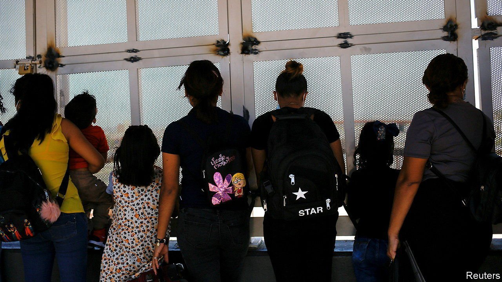

###### Border disorder

# A Trump edict that shut America’s borders may soon be lifted 

##### Which may prove inconvenient for Joe Biden 

 

> Jul 1st 2021 

THEY WERE rallying like it was 2016. On June 30th Donald Trump and the governor of Texas, Greg Abbott, held a “security briefing” in south Texas to talk about the surge in migrants at the border and the need to build a wall—this time financed by private donations and state funds. Mr Trump’s visit, streamed on Facebook Live and covered loyally by Fox News, was a throwback to a different era, when hardline immigration policies ruled the day.

President Joe Biden has promised a more tolerant, humane approach to immigration. Since entering office, he has reversed some of Mr Trump’s restrictive border policies, such as a rule limiting asylum claims from victims of domestic violence and gangs. Yet to the dismay of human-rights groups and immigration advocates, he has kept in place Mr Trump’s most hardline policy of all, known as “Title 42”, which, in effect, sealed America’s borders to new arrivals. He is under increasing pressure to end it.


“Title 42” is an obscure provision of a 77-year-old public-health law, which allows the surgeon-general to block the entry of people and goods from countries with a communicable disease that could be introduced into America. It was invoked by the Centres for Disease Control (under pressure from Mr Trump’s White House) in March 2020, citing the risk of the spread of covid-19, and was extended indefinitely in May that year. In effect, it bars entry to most migrants arriving at America’s southern and northern borders, including those seeking asylum. They are expelled quickly to the country they came through—usually Mexico—even if they are not from there. From March 2020 until this past May, there have been 845,000 expulsions by Border Patrol under Title 42.

Immigration advocates and human-rights groups are frustrated that Mr Biden has continued to use this Trump-tainted tool. “Title 42 is illegal, inhumane, and not justified by public health,” says Lee Gelernt of the American Civil Liberties Union (ACLU), which sued the Trump administration over the legality of using title 42 to expel unaccompanied minors and asylum-seekers. “We hoped that the Biden administration would eliminate it on day one in office," he says. Of particular concern is the treatment of asylum-seekers, who are being expelled so quickly under Title 42 that many are not allowed the opportunity to make an asylum claim. (The Biden administration has already started exempting unaccompanied minors, who are being let into America.)

Yet for the Biden administration Title 42 has been a convenient solution at an inconvenient time. The number of migrants arriving at the southern border is the highest in more than two decades, and Title 42 has enabled Mr Biden to keep America’s borders mostly closed, despite the Republicans’ rhetoric about his “open borders” policy. “Title 42 was a stop-gap that was useful to buy time to figure out how they are going to manage immigration at the border long-term,” says Andrew Selee, president of the Migration Policy Institute, a research organisation. “They’ve bought time, but they don’t have the answers yet.”

That time is close to running out. Theresa Cardinal Brown of the Bipartisan Policy Centre, a think-tank, predicts that the administration has “weeks, not months” before it will be forced to end Title 42, if it doesn’t voluntarily suspend it first. One factor forcing its hand is the ongoing lawsuit from the ACLU over expulsions of families seeking asylum. The ACLU and the federal government are in negotiations to end the lawsuit, and the government has recently allowed 250 especially vulnerable asylum-seekers into America each day to get on with their claims. Another factor is the Mexican government, which is murmuring about no longer taking back the non-Mexicans who are being expelled in large numbers. It is also becoming harder to justify such a restrictive public-health law when states have reopened and vaccines are available.

A phase-out is more likely than a quick end. But the administration’s plans to make the immigration system more efficient, fair and manageable after Title 42 is lifted are not yet in place. There is talk of speeding up asylum for those arriving at the border with credible fear of persecution at home, by, for example, hiring more asylum officers to process their claims quickly. A huge backlog of more than 1.3m immigration cases is making its way through immigration courts; on average each one takes more than two and a half years to resolve. But next year’s budget for the Department of Homeland Security, which oversees border control, “doesn’t appear to take into account the scale of what they’ll need to grapple with between now and then”, says Ms Cardinal Brown, as the flow of migrants continues to grow.

Republicans are going to keep criticising Mr Biden’s and Kamala Harris’s handling of the border no matter what action they take. But when Title 42 has ended, immigration hawks will quickly swoop down. And Mr Trump and Mr Abbott will no doubt hold another “security briefing” for their concerned supporters.

For more coverage of Joe Biden’s presidency, visit our dedicated 

A version of this article was published online on June 30th 2021

