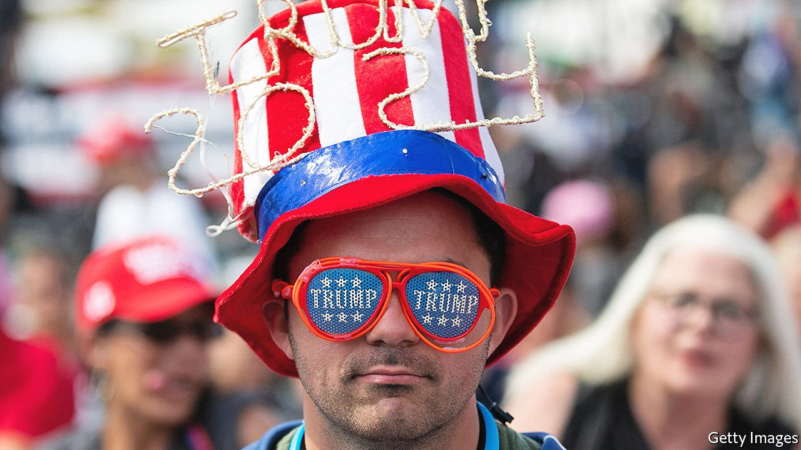
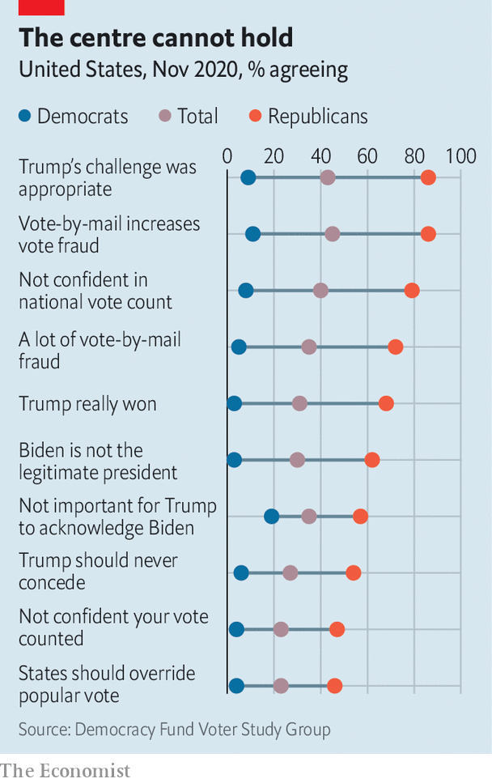
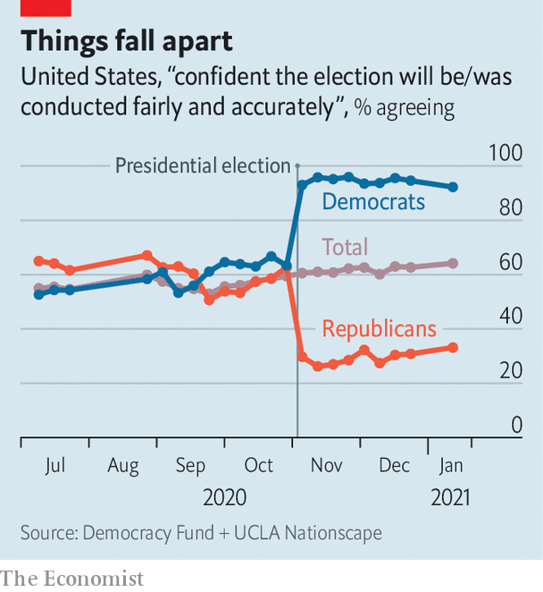
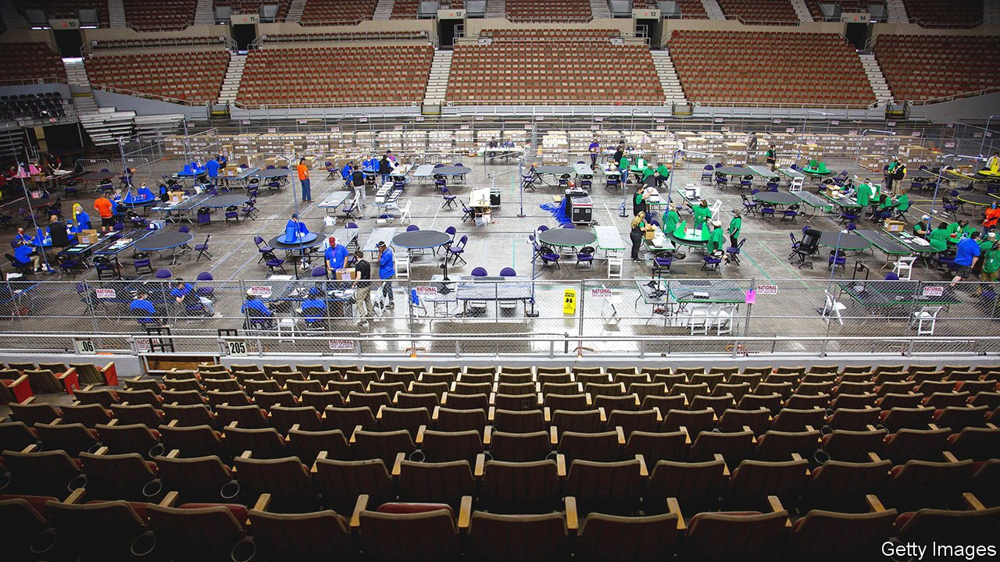

###### Razing Arizona

# State-level Republicans are “reforming” how elections are administered 

##### The hair-raising election audit in Maricopa County points to a much deeper problem 

 

> Jul 3rd 2021 

FROM THE outside, the vast edifice looks deserted and unremarkable. The only indications of what is unfolding inside the Arizona Veterans Memorial Coliseum are the signs posted in a barren parking lot outside, sporting slogans like “Audit the votes” and “Board of Supervisors are enemies of the nation”. Even on an oppressively scorching day in Phoenix, when temperatures reached 117°F (47°C), a diligent and solitary supporter of President Donald Trump sat guard next to a cooler of water bottles under a pitched shade.

Inside the Coliseum, something serious is unfolding: a partisan review of all the ballots cast in Maricopa County (which includes Phoenix and 61% of all the state’s voters in 2020). Despite the fact that two audits have already been completed, reaffirming that Joe Biden won 45,000 more votes than Mr Trump, the Republican-controlled state Senate used its subpoena power to instigate yet another. This one has been shambolic. A previously obscure company called Cyber Ninjas was contracted to conduct this audit—despite never having done one before. The chief executive of the ninjas is a man called Doug Logan who, before he deleted his Twitter account, often posted about what he saw as the rampant fraud in the presidential election that cost Mr Trump his victory.


The audit is being privately financed; its donors are undisclosed. The volunteers tabulating the ballots are searching for bamboo fibres (to test the theory that thousands of ballots were flown in from an Asian country) and mail-in ballots without fingerprints (that might prove the use of machine printing). After Merrick Garland, the attorney-general, warned that these “abnormal post-election audit methodologies” may “undermine public confidence in our democracy”, Mark Brnovich, Arizona’s Republican attorney-general, shot back, claiming that this showed “an alarming disdain for state sovereignty”.

It is tempting to see the Arizona audit as a sideshow, nothing more than a monument to the intransigence and inanity of Kelli Ward, the chair of the state party, who has been chasing celebrity and fundraising over the furore. In fact it is a forewarning of the Republican Party to come. Six months after the spectacle of a Trump-supporting mob overrunning the Capitol in a bid to “stop the steal”—and despite no credible evidence emerging of widespread voter fraud—the party apparatus remains enthralled by the idea that the last election was illegitimate, that Democrats win by cheating and that election rules must be changed to guard against future steals.

The audit is inspiring Republican legislators in other states. Rules governing the previously sleepy arenas of election certification are being rewritten; supporters of Mr Trump’s new Lost Cause are running to be election administrators. More than 200 bills modifying election rules in states have been filed this year; 24 have already been enacted in law. Political attention has shifted elsewhere, however, as Mr Biden makes a start on his presidency while Mr Trump remains muzzled on social media. Democrats are focused more on what they call “voter suppression” laws (and what Republicans call “election integrity” measures). This attitude misses an alarming development: that the probability of a serious constitutional and democratic crisis in elections to come may have actually increased since Mr Trump left office.

To understand how this is happening, consider the various loci of power in the Republican Party. There is Mr Trump, the king in exile, of course, but also the activist primary base, the donor class, the elected elites and the conservative-media ecosystem. More than ever before, this system represents a hermetically sealed loop, in which alternative facts and outright conspiracies can flourish unchallenged. Just two decades ago, 47% of Republicans trusted the mainstream media, according to Gallup, a pollster. Today, only 10% do. There is of course a parallel system within the Democratic Party, though it does not seem (yet) to have resulted in a widespread rejection of unfavourable election results.

By contrast, the various blocs that make up the contemporary Republican Party have slipped into a destructive, destabilising equilibrium. Dissenters are ejected from the party. Secretly sceptical elites acquiesce. William Barr, Mr Trump’s former attorney-general, recently said that Mitch McConnell, the Republican leader in the Senate, was privately urging him to refute the president’s fraud allegations from mid-November even as he was publicly doing nothing to counter them. Kevin McCarthy, the Republican leader in the House, had a moment of conscience after the attack on the Capitol, saying that the president “bears responsibility”. Weeks later, he was taking an ingratiating mission to Mar-a-Lago, the ex-president’s court.

 


Sceptical media coverage and failed lawsuits alleging fraud, meanwhile, are taken as evidence of deeper conspiracy. That is why, despite dozens of unsuccessful court challenges, a remarkable majority of Republicans still believe that the election of Mr Biden was illegitimate—a share largely unmoved since the initial claims of fraud and even after the attempted insurrection at the Capitol in January. Perhaps most alarmingly, 46% of Trump supporters thought it appropriate for Republican legislators to overturn the results in states won by Mr Biden, according to a recent study conducted by Lee Drutman, a political scientist. “We need to regard what's happening now as epistemic warfare by some Americans on other Americans,” says Jonathan Rauch of the Brookings Institution. “The fever did not break with Trump's loss. The fever is now being institutionalised.”

Arizona shows what this looks like in practice. The chief justification for the audit is voter concerns about election integrity—which were manufactured by Mr Trump and subsequently amplified by conservative media and elected officials. The organisers of the audit wished at first to keep the mainstream press away from it, though One America News (OAN), a Trumpist broadcaster, has been given floor access. A broadcast from June 18th offered the following monologue:


The on-air personalities reporting on the audit have launched Voices and Votes, a non-profit group which raises money to send delegations of Republican lawmakers from other states to tour the audit. “Arizona is Mecca right now, and they’re doing their pilgrimage,” says Jeff Flake, a former Republican senator from the state who fell out of favour with the party for his loud objections to Mr Trump’s norm-breaking. “It would be laughable if it weren’t so dangerous, that this is now seen as a template for other states to challenge their own elections,” he adds. Delegations from at least 13 states are thought to have visited Arizona.

Election integrity “and critical race theory are the two main issues” in the elections to come, argues Anthony Kern, a former Arizona state representative who has championed the audit. “I’m not going to say who because I don’t have proof, but I do think there’s an organised effort to thwart our elections.” Mr Kern was removed from counting the votes after local media raised questions about his impartiality, given that he was an unsuccessful candidate in one of the races on the ballot and attended Mr Trump’s rally on January 6th that preceded the storming of the Capitol. (Mr Kern maintains he never entered the building, but decamped to a nearby flat for coffee.)

“My opinion is that the election should have never been certified. Because...half the nation—and half the system—thought that there were some shenanigans going on.” That is because the elections were fundamentally flawed, he says. “We’ve already got issues of illegals voting, we’ve got issues of dead people voting, we’ve got issues of numerous ballots going to vacant lots.” The basic question election authorities resistant to the audit have to answer is, “What are you hiding? So, I mean, why not? Why wouldn’t anybody want to look and see—whether you’re left or right.”

Peering into the canyon

Beyond Arizona, Republican state legislators back from their haj are hoping to start similar partisan audits. Top Republicans in Georgia—the state where Mr Trump unsuccessfully tried to pressure Brad Raffensperger, the Republican secretary of state, to “find 11,780 votes”—are seeking to emulate the process despite the three recounts, including one audit, already conducted. A state judge ruled that a group alleging fraud could inspect 147,000 absentee ballots in Fulton County, which includes Atlanta (but the lawsuit is pending).

Nearly six months after Mr Trump narrowly lost Wisconsin, the Republican speaker of the state House announced that he had hired three ex-cops to investigate allegations of double voting and other irregularities. There are efforts in Michigan (supported by Mr Logan, the chief cyber ninja) to audit results in some counties on the basis of alleged voting-machine failures. Some Republicans in Pennsylvania’s Senate are agitating for an audit of their own. Tom Wolf, the state’s Democratic governor, retorted that this would be “a taxpayer-funded disinformation campaign and a disgrace to democracy”.

To the most committed loyalists, these efforts will surely amount to something. “Arizona is the first domino that will fall and then other states will look into irregularities, abnormalities, mistakes and potentially outright fraud that happened in their states as well,” Ms Ward, the head of the state party, told Newsmax, a right-wing outlet. Her phrasing is a reference to the theory, adhered to by the QAnon crowd, that states will reverse their election results months after the election and reinstate Mr Trump as president, perhaps by as early as August. Mr Trump has closely followed the progress of the audit, cheering on the efforts to instigate versions in other states, while reportedly keeping in touch with Christina Bobb, the OAN anchor (and former Trump-administration official) reporting on the Arizona audit.

In reality these spectacles will not change the outcome of the last election. “There’s nothing that we’ve seen that would give any credibility to the outcome of this audit,” says Katie Hobbs, Arizona’s Democratic secretary of state, whose office oversees state elections. “The goal is not to restore confidence or verify anything. It’s to continue to increase the doubt and undermine the integrity of our elections.” But their spread will have other effects: keeping election integrity at the top of the Republican agenda secures Mr Trump’s hold over the party. And it encourages future election-meddling.

Inability to get over the loss of Mr Trump has inspired a fire-hose of election-related legislation in states where Republicans are in charge. In Georgia, state officials now have the authority to remove county election officials. In Texas, an elections bill that was thwarted when Democrats walked out of the state legislature is likely to be resurrected in a coming special session. It would make it easier to sue to overturn election results in counties by requiring evidence that more illegal ballots were cast than the margin of victory—using only a standard of the “preponderance of the evidence” rather than “reasonable doubt”. Arkansas has recently enacted legislation granting its state elections board, which is dominated by Republicans, powers over county election boards, allowing partisans “to oversee or even undo election results”, warns the States United Democracy Centre, a non-partisan group.

The power of elected secretaries of state, who are normally the chief election administrators, is also being wrenched away. In Georgia, the obstreperous secretary of state, in addition to being censured by his party on June 5th, has been stripped of his position as chairman of the election board. Republicans in Texas have proposed legislation threatening criminal penalties for election administrators for soliciting mail-in ballot applications. In Wisconsin, correcting small defects in mail-in ballots would become illegal for clerks.

In Kansas, the authority to modify election procedures has been taken away from the governor (a Democrat) by the Republican state legislature. The legislature has also usurped the secretary of state’s ability to contest election lawsuits filed in courts. Ms Hobbs in Arizona is a target of legislation that aims to take away her authority over state election procedures; another bill would take away her office’s authority to defend state election laws in court until 2023, when her term happens to expire.

 


Election administration and certification used to be a folksy corner of the American experiment. Now it is the latest to be captured by extreme polarisation. In Republican primary contests to be a secretary of state, fealty to the myth of the stolen election is becoming a litmus test.

In Arizona there are three declared candidates: Shawnna Bolick, best known for sponsoring a bill that would allow the state legislature to overturn election results in the state at any time; Mark Finchem, who attended the riot at the Capitol and is a firm adherent of the “stop the steal movement”; and Michelle Ugenti-Rita, a comparative moderate who is nevertheless also pro-audit. Kristina Karamo, who came to prominence on right-wing media outlets for her claims of witnessing voter fraud in Michigan, is now running to be the secretary of state in order “to remove corruption from our elections”. Jody Hice, a Republican congressman, is aiming to replace the “back-stabbing” Mr Raffensperger in order “to stop Democrats before they rig and ruin our democracy for ever”.

In a narrowly divided country, it does not take much to throw an entire election into dispute. The American system has many embedded protections against democratic crisis. Most of these were implicit: the decency of the losing candidate, the losing party and their boosters, who would not act to endanger the democratic transition. That has proved less stable than was thought. Not only did Mr Trump claim fraud, he also found support from 18 Republican state attorneys-general who joined a lawsuit to, in effect, not count four of Mr Biden’s narrow victories. More than 100 Republicans in the House of Representatives voted against certifying election results on January 6th, in what was previously a merely ceremonial procedure.

That has left only explicit protections: the impartiality of election administrators and courts. The first of these is now under threat. The courts held their own in 2020, even under Trump-appointed judges, and perhaps they will in the future. But American democracy, like aeroplanes, once had several redundant systems for ensuring the safety and integrity of its elections and transitions. It is now getting dangerously close to having only one.

Democrats, for their part, are more concerned about voter suppression, and have largely missed this bigger threat. There is indeed some reason to worry. The Republican Party’s acceptance of Mr Trump’s conspiracy has led to a swathe of changes to election rules across the country—limiting early voting, requiring photo identification to cast ballots and reducing the number of drop boxes. Republicans justify these changes by citing voter concerns over the fraud that has proved so difficult to substantiate. Democrats fear that this is mere pretext to securing partisan advantage, with some labelling it, overheatedly, the new Jim Crow.

There is no doubt that some of these changes are being made in bad faith. Texas may soon pass rules that bar early voting before 1pm on Sundays, which seems to be directly aimed at disrupting the practice of “souls to the polls”, in which black voters head to the ballot box directly after church. The state may also outlaw two new voting methods, drive-through and all-day voting, established in Houston to increase turnout during the covid-19 pandemic.

But so far these changes have not made much difference. A recent study of voter-ID laws from 2008 to 2018 published in the Quarterly Journal of Economics found little evidence of actual disenfranchisement—turnout, including of minorities, remains flat after other effects are controlled for. That corroborates much of the political science on this subject. One randomised experiment found that notifying voters of ID requirements actually increased turnout modestly. A commanding majority of Americans, including a majority of Democratic voters, support such requirements.

And yet this is the issue that most Democrats in Congress have focused their attention on. They argue that democracy can be saved only by the passage of a bill called HR1. This is a catch-all bill that tries to pre-empt some of the state-level changes that allegedly suppress voting, but that also devotes much of its attention to ancillary concerns such as a public-financing scheme for election campaigns.

There is an Orwellian circularity to what is happening with election administration. In the name of removing doubt, much more of it will be sown. In the name of removing interference in the election system, more of it will be allowed. To ensure public trust in fair counting of ballots, ever more will be treated as inherently suspect. Fear of fraud is highly correlated with results and unrelated to actual evidence. That is a dangerous dynamic for one of the two major parties in the world’s most powerful democracy to have fallen into.

Some cracks could be repaired immediately. The Electoral Count Act, a poorly written law from 1887 governing certification in Congress, was intended for ceremonial use. It could be modified to make federal overturning of legitimate state elections harder. Paper-ballot backups could be required nationwide. And perhaps the Republicans who emerge victorious from the upcoming primaries will prove too extreme to win general elections. But ultimately the repairs will have to come from within the Republican Party itself.

That is why it is particularly worrying that it is so resistant to internal correction. Disbelief in Mr Trump’s lies is now seen as apostasy; its punishment is usually excommunication from the party. Liz Cheney was formerly the third-leading Republican in the House; her unwillingness to stay quiet about Mr Trump’s responsibility for the attack of January 6th led her colleagues to take away that title. Of the ten Republicans in the House of Representatives who voted to impeach Mr Trump for his actions in January, nine have now acquired primary challengers. The ex-president has pledged to back a challenger for the tenth.

After eight months of investigation, a Republican-led committee of Michigan state senators recently released a report finding no evidence of fraud. Like the queen of hearts, Mr Trump quickly called for their heads. “Michigan State Senators Mike Shirkey and Ed McBroom are doing everything possible to stop Voter Audits in order to hide the truth about November 3rd,” he wrote. “The truth will come out and RINOs [Republicans in name only] will pay at the polls, especially with primary voters and expected challenges.”

“It’s a vicious loop, because these elected officials will say ‘I’m just responding to my constituents’, but their constituents are responding to them,” says Mr Flake, the former senator from Arizona who has been in the political wilderness since his prominent break with Trumpism. “What’s really troubling is that too few elected officials are willing to take a stand.”

Sand in their eyes

Bill Gates, a member of the Maricopa County Board of Supervisors (and one of the “enemies of the people” blasted outside the Coliseum), is a lonely example. A longtime Republican of the Ronald Reagan and Jack Kemp mould, Mr Gates has received death threats for defending the legitimacy of the election. “If this is a new normal, our democracy is definitely in peril. Because you can’t do this and have a healthy, functioning democracy,” he says.

 


His other Republican credentials—cutting taxes and even supporting tighter voting laws—have ceased to matter. “There may be electoral consequences to me down the road. I'm not currently worried. This is too important…9/11 was a threat to our safety. This is the biggest threat to our democracy,” he adds. “We were the party of the rule of law.” Mr Gates argues that the party has lost its Burkean roots in favour of feverish populism. Thought of as a careful and pragmatic politician before, with some aspirations for statewide office, Mr Gates’s stance may have sunk his chances.

In his retirement, he had dreamed of going to the former Soviet republics to serve as an election observer in fledgling democracies. With some emotion in his voice, he reflects, “I never imagined that it would be here. I would do it here in Maricopa County…that’s what’s just stunning.” Looking around he repeats, almost to himself: “I don’t need to go to Belarus. I got it right here.” ■

