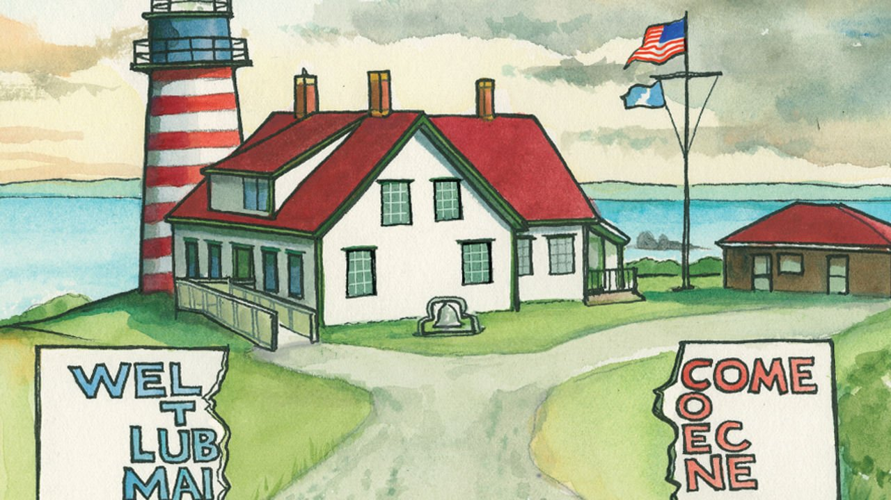

###### Lexington

# There goes the neighbourhood 

##### What gets lost when national politics eats everything 

 

> Jul 1st 2021 

A  VISITOR TO Lubec, the easternmost town in America, can still hope to leave the rubber lobsters and other clutter of the Maine tourist trade two hours behind in Bar Harbor. But these days national politics follows everyone everywhere in America. So the visitor should not be surprised to spot a particular red-white-and-black flag hanging from a pine tree along a road into town. “Fuck Biden,” it reads. “And fuck you for voting for him!”

The visitor has the luxury of forgetting the message, since everyone he meets is kind, if a bit gruff, and what is familiar and wearisome gets shouldered out of the way by what is majestic and new—the 28-foot tides, the granite bluffs, the stands of birch, even the fog, which seems to erase the whole world, leaving just the sound of the surf.


Residents aren’t so lucky. They have to live with the damn thing, as well as with the same flag hung by someone across town. (The flag sells on Amazon for just $23.99.) It is one matter when a stranger raises a middle finger to you. It is quite another when your neighbour does it, particularly in a place like Lubec, where only about 1,300 people live. Some of them have had enough.

A letter to the editor published in the Quoddy Tides, the local biweekly newspaper, urged someone to make off with the flag if the owner did not remove it. (Many residents seem to know who the flag-wavers are, but they are delicately not named in print.) Another letter called one flag-waver “a deeply disturbed soul unable to accept personal responsibility for their dismal failures to be good citizens or good neighbours”.

For Americans, those two roles generally go together. They like to think of themselves as good neighbours, and of their neighbourliness as the foundation of their democracy. But from the start the idea of American neighbourliness has been part myth. Members of the Passamaquoddy tribe living on the small reservation just north of Lubec could tell you about that.

The relationship between neighbourliness and citizenship is also complex. For philosophers like John Dewey, the give-and-take within small communities was the essential stuff of American democracy, fostering communication and trust that would flow upwards through representatives at the national level. That, residents say, has been the story of Lubec for many years, even as the sardine canneries and herring smokehouses closed, the population dwindled and those who remained struggled to find some new form of industry.

What is happening now, in Lubec and across the land, is that the flow of influence is reversing. It is starting to move from the national level to the local one, and from American-as-citizen to American-as-neighbour. America is the worse for it.

In “Good Neighbours: The Democracy of Everyday Life in America”, published in 2016, Nancy Rosenblum, a political philosopher, warned of a “social and political holism” that comes with opening the neighbourhood gates wide to civic concerns. “For reciprocity among neighbours as ‘decent folk’ turns on the real possibility of disregarding precisely the social inequalities, racial and sectarian differences, and conflicting ideological commitments that citizens bring to public life,” she writes. Passions about such matters can simplify and coarsen relations among neighbours. They collapse the generous spaces made—not always, but often enough—for eccentricities, personal lapses and political opinions, for the tolerance and empathy that sustain pluralism.

This is what happened, in Ms Rosenblum’s telling, as Americans of other races watched their Japanese-American neighbours get packed off to internment camps during the second world war. “The family next door was seen through the lens of racial and political categories, and through the miasma of mistrust thrown up by war,” she writes. “Pluralism gave way to totalism.”

Maybe not totalism, but certainly holism, is becoming the story of life in America. On the Trumpist right the formula is simple: commitment to one man shapes your view of reality. On the left the formula is more slippery, compounded of doctrinal, identitarian and even stylistic commitments that are evolving in ways that surprise even would-be adherents and catch them out.

The effect is that little space is safe from political judgment. Not just whom you vote for or what flags you wave but what products you buy, what national story you tell, and what words you use or capitalise all answer the dangerous question that is once again at the centre of American life: which side are you on?

Dewey-eyed

Though surrounding Washington County voted overwhelmingly for Donald Trump, within Lubec 457 people voted for Joe Biden and 406 for Mr Trump. Not just the artists but seemingly everyone here assembles a livelihood from more than one job, like diving for scallops and also taking tourists out to see minke whales. Melissa Lee works for a statewide land trust and also for the local library. She says the signs send a message that all that matters about her is her vote. They make her feel “cut off, without any thought to any communication, or that maybe you’re an individual and you might have other qualities”.

They are just signs, and may not be portents. Another representation of Lubec’s spirit is the Lost Fishermen’s Memorial, resting on a rise looking out over Lubec Narrows towards Canada’s Campobello Island, where Franklin Delano Roosevelt, who envisioned the world as a neighbourhood yet also oversaw those internment camps, took holidays. The monument was created in 2016 to remember local fishermen lost at sea since 1900, in pursuit of lobsters for New York or sea urchins for Tokyo. More than 110 names are engraved on the granite. Many family names are repeated. Money for the memorial was raised locally, some by neighbours organising trips or holding yard sales. It is this version of Lubec, of life larger than politics, that its residents are right to defend.■

