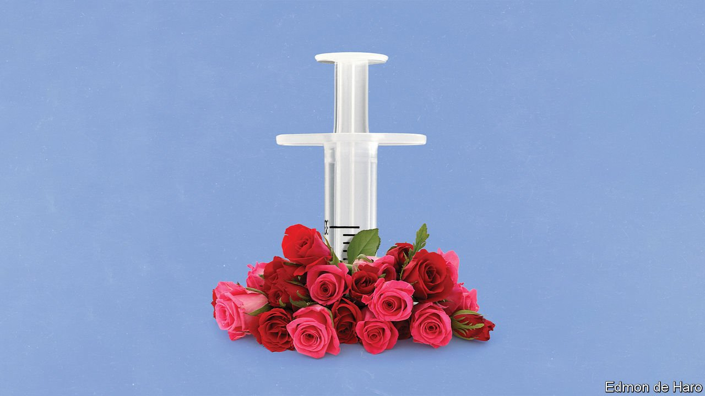
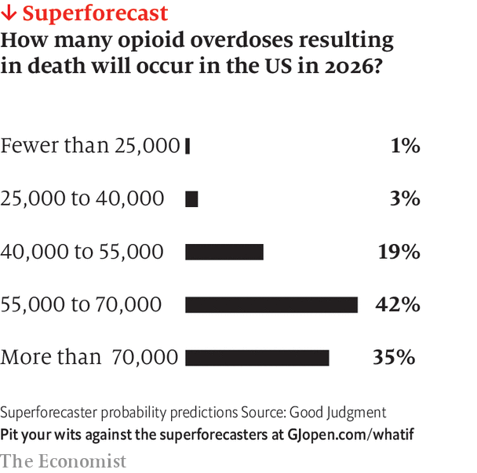

###### The other epidemic: June 2025

# What if America tackled its opioid crisis? 

##### Kamala Harris’s administration is getting serious about tackling deaths from drug overdoses. It is a problem with deep roots. An imagined scenario from 2025 

 

> Jul 3rd 2021 

 This year What If?, our annual collection of scenarios, considers the future of health. Each of these stories is fiction, but grounded in historical fact, current speculation and real science. They do not present a unified narrative but are set in different possible futures

PROJECTIONS FROM the Centres for Disease Control and Prevention (CDC) published this month predict that in 2025, for the first time, more than 100,000 Americans will die from a drug overdose, bringing the total to more than 1m since 1999. At current rates, by the time of the next presidential election in 2028, more Americans will have died in the 21st century of drug overdoses than died in all of America’s wars over its entire history. These horrifying statistics have at last focused attention on this neglected crisis.

The roots of the problem go back a long way. Since the 1980s, America’s drug-overdose death rates have increased at the terrifyingly steady clip of 7.6% per year. In 2018, when the death rate dropped for the first time in ages, the Trump administration took a victory lap much too soon, touting the success of its policies. Then came covid-19. Drug-overdose rates exploded as people sheltered in self-enforced quarantine, addiction-treatment clinics were closed and Mexican cartels established supply lines of cheap, potent drugs to all parts of America. The rising death toll was barely dented by the modest sums spent on the problem during the Biden administration, which did little more than twiddle its thumbs after Republicans took back control of Congress in the mid-term elections of 2022.


Though addiction to all types of drugs (including cocaine and methamphetamines) has steadily increased, the primary problem remains opioids. They came to the fore in the early 1990s in the form of prescription painkillers that were unscrupulously marketed to doctors as unlikely to cause addiction. The most famous was OxyContin, launched in 1996. By the time it had been reformulated to make it harder to abuse, too many Americans were already hooked and the drug crisis had morphed into something else entirely, as addicts looked for alternatives. “Reformulation led markets to sell deadlier substances and contaminate non-opioid drugs, expanding illicit opioid drug use,” concluded David Powell and Rosalie Liccardo Pacula, two drugs-policy researchers, in 2020.

 


Prosecutors spent years in litigation against the makers of OxyContin and other opioid manufacturers and distributors, culminating in last year’s momentous judgment and a penalty of $350bn—larger than that imposed on tobacco giants over their promotion of smoking. But few pharmaceutical executives went to jail, and this immense sum seems small, given that the crisis has lasted a quarter of a century and costs America $80bn a year, according to the CDC.

In addition to the cash from the settlement, Democrats in Congress, with the backing of the White House, now propose to spend an extra $250bn over the next ten years to tackle the problem (President Kamala Harris shares her predecessor’s proclivity for eye-popping sums). It is something that a few Republican senators could even agree to—curtailing addiction being one of the only remaining bipartisan issues. The emerging consensus reflects a continuing shift in America’s approach to drugs policy, with less emphasis on reducing the supply of illicit drugs via enforcement and incarceration, and more emphasis on reducing harm and the risk of death for those addicted.

The model for the new legislation is the Ryan White Care Act, passed in 1990 to deal with the HIV/AIDS epidemic by establishing the federal government as the payer of last resort for patients. It was part of a successful campaign against the disease, as the distribution of therapeutics rapidly reduced mortality, and prevention efforts stemmed the growth of infections. The introduction of a prophylactic treatment in 2012 has since helped keep rates of infection among vulnerable groups (mainly gay and bisexual men) in check.

There is now hope that similar progress can be made against drug addiction, particularly to opioids. The Food and Drug Administration (FDA) long ago approved three drugs to provide medically assisted treatment to those addicted to opioids: methadone, buprenorphine and naltrexone. The first two are opioids used as replacements, with less scope for abuse. The third blocks cells’ opioid receptors and thus the euphoria from abusing drugs. All three medicines substantially reduce the risk of dying from an overdose.

Yet they are surprisingly underused. Only around half of those addicted to opioids in America receive these therapies. But for years their use has been hampered. Bureaucratic restrictions kept doctors from widely prescribing buprenorphine. The requirement that methadone be doled out in person remains, even though evidence shows that allowing it to be taken home reduces subsequent hospitalisations. Skittishness among non-specialist doctors limited the use of these treatments, as did a shortage of addiction specialists in rural areas.

Much of the cash will be steered towards the expansion of these treatments for the already addicted. Democratic aspirations for universal health coverage having failed during the Biden administration, it will be channelled through Medicaid, or via specialised grants. These have the advantage of being targeted, but the disadvantage of being temporary. Some funding will also be directed to purchasing naloxone, a drug that saves lives by immediately reversing the effects of an opioid overdose. Yet in classic American fashion, little attention is being paid to constraining costs. Naloxone, which was patented in 1961 and once cost $1 per dose, now costs $150, hamstringing cities that had tried to buy the life-saving medicine. Bidencare’s failure means the federal government remains unable to negotiate bulk purchases of essential drugs.

None of the cash, however, will be steered towards the creation of “safe-injection sites”, centres where users can go to shoot up under the watchful gaze of health professionals, for which left-leaning cities had been agitating. Calls for “heroin-assisted treatment”, as practised in some European countries, also went nowhere. America is still not Switzerland. Even if it managed to build 5,000 supervised injection sites, says Keith Humphreys, a professor of psychiatry at Stanford, that might only cover 1% of actual usage. “It’s just not scalable,” he says. “Buprenorphine is scalable. Needle exchanges are scalable. Naloxone is scalable. That’s what covers public health.”

All epidemics are sustained by the inflow of new cases. Researchers are encouraged that in America the flow of new addictions has slowed, partly because of reductions in opioid prescribing. At the peak of the prescribing blitz, in 2012, physicians wrote 81 opioid prescriptions per 100 Americans; by 2019, there were fewer than 46.7 per 100 (still high compared with the rest of the world). But even if new addictions are rarer, there are still more than 20m addicted people for whom better treatment is necessary.

The challenge is that the nature of addiction has transformed into something deadlier in recent years—and not just because of potent synthetic opioids like fentanyl and carfentanil, though these have certainly made inadvertent opioid overdoses easier. It is also because of rising abuse of multiple types of drug at once. In 2011, 19% of opioid drug users said that they also used methamphetamine; by 2017, that number had grown to 34%. Such polydrug use makes treatment more complicated. Vaccines that blunt the worst effects of synthetic opioids, currently in development, may provide protection against overdoses in future. But there are not well-developed pharmaceutical therapeutics for addiction to methamphetamine.

As with all epidemics, the curve can be bent. The new administration is taking the problem seriously, after years of neglect. But as the past 50 years of drug policy have demonstrated in America, the longer a problem persists, the worse it tends to become. ■

Full contents of this What If?


The other epidemic, June 2025: What if America tackled its opioid crisis?*


