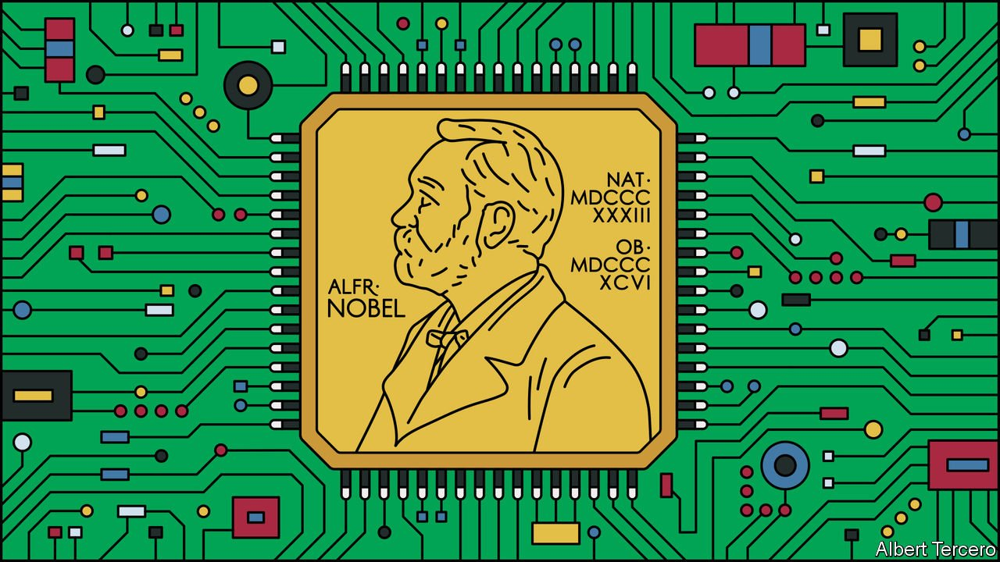

###### Rage against the machine: December 2036

# What if an AI won the Nobel prize for medicine? 

##### Controversy ensues when the greatest prize in medical research is awarded to a non-human. An imagined scenario from 2036 

 

> Jul 3rd 2021 

 This year What If?, our annual collection of scenarios, considers the future of health. Each of these stories is fiction, but grounded in historical fact, current speculation and real science. They do not present a unified narrative but are set in different possible futures

IT WAS A scene that the Nobel committee had dearly hoped to avoid. As the recipients of this year’s prizes filed into the Stockholm Concert Hall to take their seats, dozens of protesters, including several former laureates, clashed with police in the streets outside. They had gathered to express their opposition to the unprecedented decision to award the Nobel prize in physiology or medicine to an artificial intelligence.

The committee’s citation recognised YULYA—the nickname of a machine-learning system officially known as System for Automated Lymphoma Diagnosis—as the discoverer of ancillary vulnerability, a mechanism whereby specific pairs of antibiotics, working in tandem, can prove effective against bacteria that are otherwise resistant. The committee estimates that in the 18 months since the discovery, which occurred when the death rate associated with the failure of existing antibiotics had risen to around 2.5m a year, YULYA’s work has saved around 4m lives, both through direct treatment of infections and by allowing the resumption of surgical procedures, including caesarean sections, that were considered too dangerous without antibiotics.


Bringing to an end the greatest global public-health crisis since the coronavirus pandemic of 2020-22 would, you might have thought, be considered qualification enough for anyone, whether human or machine, to win the Nobel prize. But the decision has proved hugely controversial. Though the statutes of the Nobel Foundation have historically been interpreted as implying that only a human can win the award, another of its dictates was deemed to take precedence: recognition for having “conferred the greatest benefit to humankind” in the preceding year. Another factor behind the break with tradition was a demographic shift in the prize committee. When two of the committee’s five members succumbed to bacterial infections last year, younger replacements were elected, both of whom happened to have used machine-learning systems in their doctoral research.

YULYA was originally built to tackle a different problem: finding more effective cancer treatments. One of the world’s most advanced causal nets, it is one of a new generation of artificial-intelligence systems combining the pattern-recognition skills of conventional “deep” neural networks with the ability to distinguish causation from mere correlation. By examining records from patient databases, in conjunction with a corpus of papers from medical journals and historical data from pharmaceutical companies, it sought to identify the patterns of symptoms that led to the most severe outcomes, in order to diagnose them earlier. It was also programmed to evaluate the effectiveness of different treatments, including combinations of treatments, in order to suggest new therapeutic regimens that could be tested in patients.

Its focus shifted, however, when a software upgrade in 2034 accidentally gave it access to all recent papers in medical journals, rather than just those associated with cancer. YULYA duly began to crunch data relating to antimicrobial resistance, which accounted for a steadily growing proportion of medical-research papers as the crisis intensified. At first, its requests for more data in specific areas, and suggestions for new approaches to treatment, were thought to be errors, because they did not relate to cancer. Then YULYA’s operators realised what had happened, and saw that it had used its reasoning capabilities to build a testable hypothesis: the forerunner of what would become ancillary vulnerability. It highlighted the data that would be needed to validate the hypothesis, including specific guidelines as to how it should be collected. “It amounted to a full-scale programme of research,” says Anisha Rai, one of YULYA’s creators.

Under less exceptional circumstances, such trials might never have been authorised. Many funding bodies require scientists to lay bare the reasoning process of AI systems, in order to be sure that their recommendations do not lead to deadly conclusions. Dr Rai and her colleagues got funding for YULYA’s trial by playing down its role in suggesting the hypothesis. Only when the results showed promise did they publish YULYA’s original proposals.

That, in turn, led to a heated debate about whether YULYA, or its creators, deserved credit for the breakthrough. Dr Rai continues to insist that YULYA deserves sole credit, a position that has prompted the departure of several members of her original team in the past year. She even refused to go to Stockholm to receive the award on YULYA’s behalf from the queen of Sweden. “It’s not my prize,” she says.

AIs are commonly used to predict the onset of diseases like Alzheimer’s, make personalised treatment recommendations and enhance the diagnostic abilities of physicians. And the use of AI in drug discovery, in particular to help pharmaceutical companies wade through databases, is not new. In 2020 an algorithm developed at the Massachusetts Institute of Technology made headlines when it identified a new antibiotic. Dubbed halicin, after the computer in the film “2001: A Space Odyssey”, it proved to be effective against some resistant bacteria, but was limited in its scope. “Ancillary vulnerability makes halicin look like a homeopathic treatment, like a placebo,” says Una Científica, a researcher at the Houssay Institute in Buenos Aires.

Even so, the Nobel committee’s reference to YULYA’s “discovery” has angered those who see it as little more than a clever tool. “YULYA is an AI capable of winning a Nobel. That is not the same thing as an AI that’s capable of discovery,” says Hars Kritik of the European Robotics Institute in Prague. He argues that even the best AIs are only useful in specialised areas like drug design, where large quantities of data are married to well-defined metrics of success. Saying that they can make discoveries, he says, waving a placard outside the concert hall, is “flawed anthropomorphism”.

Rightly or wrongly, YULYA is unlikely to be the last artificial intelligence to win a Nobel prize. Sources within the Nobel Foundation say that similar nominations have been received for prizes in physics and chemistry, as AI systems are used to search for new materials and chemical compounds suitable for use in batteries, solar panels and carbon-capture membranes. Given the chaos that erupted in Stockholm this week, however, the chances of an AI winning the Nobel peace prize seem rather more remote. ■

Full contents of this What If?


Rage against the machine, December 2036: What if an AI wins the Nobel prize for medicine?*


