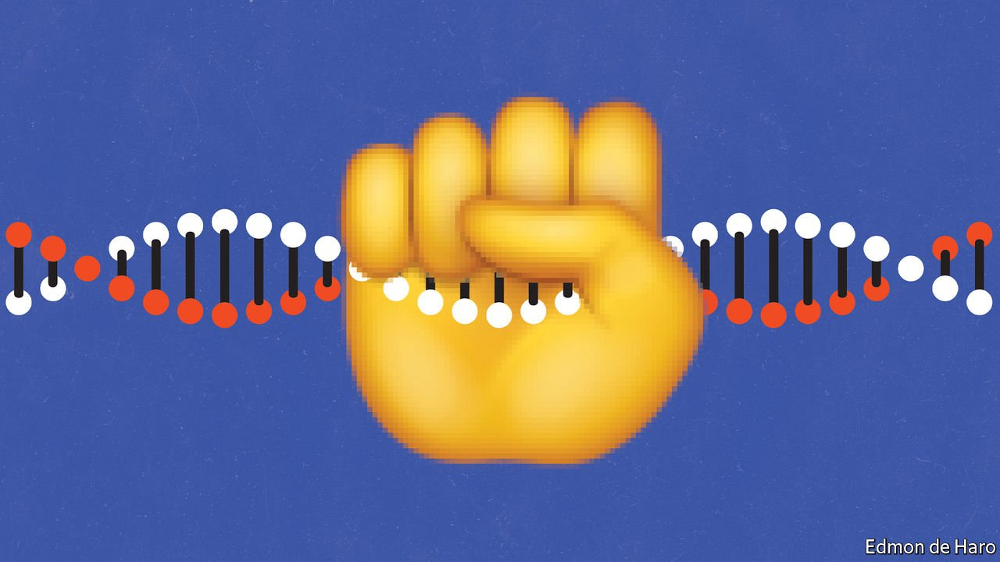
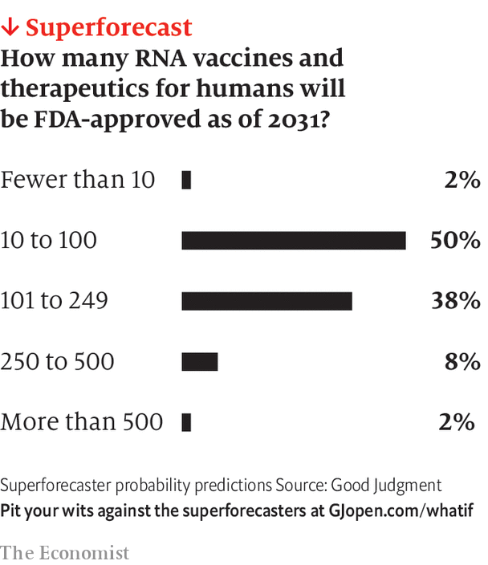
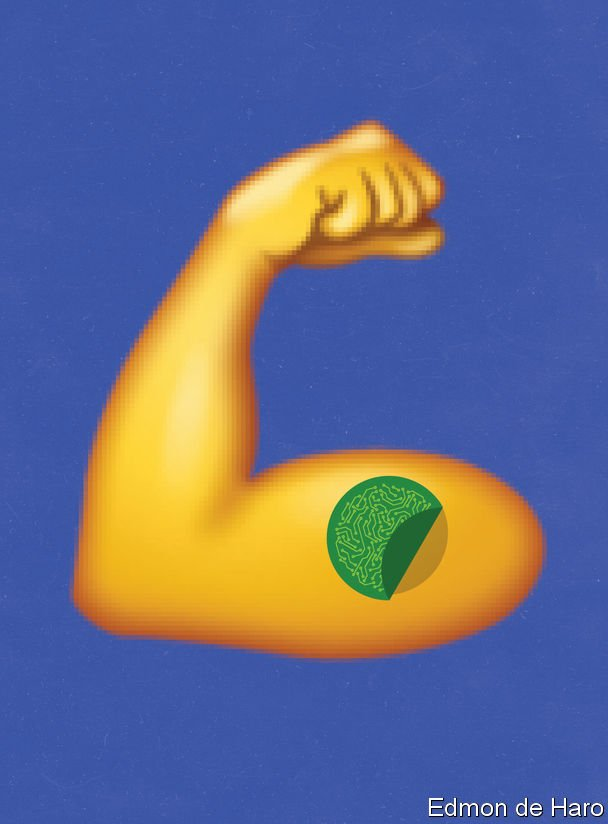

###### Freedom to tinker: October 2029

# What if biohackers injected themselves with mRNA? 

##### Members of the Witnesses of Bioinformatic Freedom, a biohacking-rights group, demand the right to alter their own biology. An imagined scenario from 2029 

 

> Jul 3rd 2021 

 This year What If?, our annual collection of scenarios, considers the future of health. Each of these stories is fiction, but grounded in historical fact, current speculation and real science. They do not present a unified narrative but are set in different possible futures

TO UNDERSTAND THE controversy around the Witnesses of Bioinformatic Freedom (WBF), a biohacktivist group, cast your mind back to the coronavirus pandemic a decade ago. Within days of the discovery of the SARS-CoV-2 virus in 2019, its genome had been sequenced and used to create prototype vaccines containing molecules of messenger RNA, or mRNA. Hundreds of millions of people were injected with these artificial mRNA molecules, which instructed the protein-producing machinery inside the body’s cells to make a “spike” protein, identical to that found on the virus’s surface. The resulting spike proteins then triggered an immune response, priming the recipient’s immune system so that it could recognise and fight off the virus if required to do so.

The same mRNA technology had been used in the 2010s to develop experimental vaccines for other diseases, including Zika virus and Ebola. But the power of mRNA was demonstrated on a global scale during the pandemic, paving the way for other treatments in the 2020s. Like the vaccines, these use carefully crafted mRNA messages to boost temporarily the production of needed proteins, or inhibit the production of harmful ones—a technique often likened to using the patient’s own cellular machinery as an on-demand drug factory. This approach is now used to treat cancer, heart disease and neurological disorders.


The story of that medical revolution has been widely told. Less well known is the parallel story that has been unfolding alongside it. During the pandemic, new technologies, infrastructure and supply chains were created to manufacture mRNA vaccines at vast scale, while also allowing their mRNA payloads to be quickly and easily tweaked as new variants emerged. Once covid-19 was brought under control and demand for vaccines subsided, some of that infrastructure began to be put to new and unexpected uses.

 


The possibility of using mRNA for self-enhancement first emerged in 2024, after the Paris Olympics. In 2012, Katalin Karikó and Drew Weissman, two of the main actors in the intellectual development of therapeutic mRNA, had shown that carefully designed mRNA molecules could transiently raise the level of erythropoietin (EPO), a protein hormone which stimulates production of red blood cells, in mice. More EPO means more red blood cells, which means more oxygen delivered to working muscles, which improves physical performance. In the months after the Paris Olympics rumours began to circulate that some competitors had been taking regular injections of EPO-producing mRNA. But the tests available failed to show conclusive evidence of foul play. New tests were then developed in time for the 2028 games.

Meanwhile, a group of biology doctoral students at the University of Belgrade began producing and distributing an mRNA molecule said to enhance learning abilities by boosting the synthesis of small proteins involved in memory formation. The government launched an investigation after a student, Luka Dragotin, died of a mysterious autoimmune complaint in 2025. The test scores of the students who had been dosing themselves with mRNA did seem to have risen relative to those of their peers. The doctoral students went to prison for 15 years, and the government imposed strict new regulations on mRNA technology.

 


The following year Wired, a technology-news outlet, published a story about a group of mothers in Austin, Texas, who had dosed themselves with mRNA molecules during pregnancy. The treatment was said to keep their production of thyroid hormones within the optimal window for neurological development in utero, thus maximising the cognitive capacity of their offspring. None of the mothers suffered any complications in pregnancy, and the mRNA-dosed children all turned out to be healthy. But there was an outcry from evangelical Christians and right-wing politicians who denounced “meddling” with biology. In 2027 the federal government banned self-dosing with mRNA and set up a Senate committee to investigate the use and misuse of the technology.

It was at this point that the WBF, a group championing biohackers’ rights, stepped onto the public stage. It declared in its manifesto that people had the right to send genetic messages of their own making to their own cells. WBF members, it emerged, had documented successful mRNA dosing for alertness, minor tweaks to physiology (such as to prevent hair loss), and suppression of stress hormones. It was, they argued, already too late for governments to stop them.

The group has since turned out to have members and sympathisers throughout the research community, who have helped refine the process of delivering messages to human cells. Needles and syringes are no longer required. Biohackers have built small patches of flexible electronics and microfluidics, worn on the body much like a nicotine patch, capable of crafting specific mRNA sequences in situ and inserting them into the bloodstream. New sequences can be beamed to the patch from a smartphone or computer.

A flourishing open-source ecosystem has developed around the designs of the patches and the molecules they can produce. New mRNA molecules are usually released to a select group of alpha testers, and made widely available only after the alpha testers have granted approval. Not all mRNA molecules are therapeutics or enhancements; the fastest-growing category is for molecules that offer transient, drug-like experiences, supposedly with no long-term side-effects.

Some doctors are said to be quietly dabbling in mRNA hacking themselves, and even recommending it to patients. For their part, drug companies have called for a clampdown on what they deride as “amateur pharmaceuticals”. They have also tried to have some repositories of mRNA molecules taken offline, claiming violation of intellectual property.

The question now is whether governments can put the genie back in the bottle through concerted, co-ordinated action. Many politicians say the power to tinker with biology is too dangerous to have in the hands even just of doctors and must be regulated. Next month’s global meeting on the topic in Belgrade, the Dragotin Conference, will bring together policymakers, medical experts and regulatory specialists. Representatives from the WBF have not been invited. ■

Full contents of this What If?

Freedom to tinker, October 2029: What if biohackers injected themselves with mRNA?*


