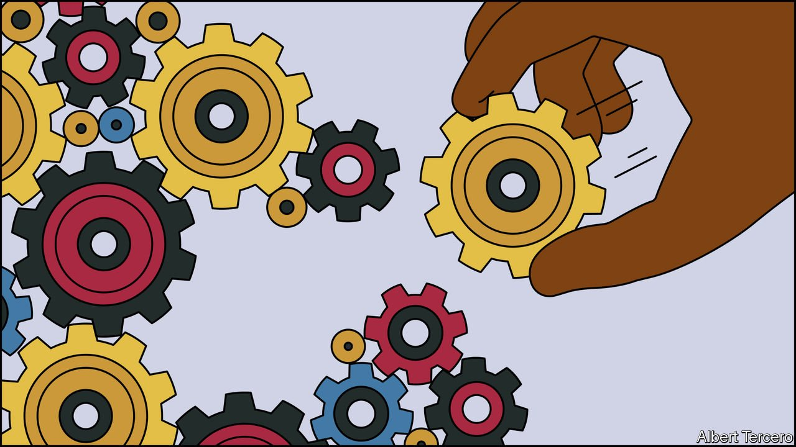

###### Novel treatments: August 2050

# What if dementia was preventable and treatable? 

##### How behavioural changes and new therapies turned the tide against dementia. An imagined scenario from 2050 

 

> Jul 3rd 2021 

 This year What If?, our annual collection of scenarios, considers the future of health. Each of these stories is fiction, but grounded in historical fact, current speculation and real science. They do not present a unified narrative but are set in different possible futures

RELUCTANTLY, WATANABE KEIKO puts down her book. She enjoys Tolstoy so much more in the original Russian, she explains. When she first decided to learn it, a decade ago in 2040, she was already 82, and felt a little old for the endeavour. But the doctors who monitored her were delighted: that, they purred, would be just excellent for her brain. They had been watching her closely ever since a routine test back in 2023, when she was 65, identified her as being at high risk of developing dementia. So terrifying was this prospect that she meekly submitted herself to many of the recommendations they made about her lifestyle, as did many of her neighbours on Shikoku island.

Much of that medical advice echoed public-health campaigns about reducing the chances of contracting heart disease, cancer and diabetes: exercise regularly, eat sensibly, drink little alcohol, keep blood pressure low. But it also included maintaining an active mind. The doctors occasionally put Ms Watanabe through “cognitive training”, a set of computer-based mental gymnastics. They also insisted she maintain an active social life, which was not easy for a widow whose only family lived far away in Tokyo. So she began attending thrice-weekly informal gatherings at a so-called “Dementia Café”, of which Japan had many by the mid-2020s. Most had been set up early in the century for people suffering a mild version of the condition.


But during the 2030s something unexpected happened. The change was almost unnoticed at first, but then surprisingly fast, as old people with dementia died, and the incidence of new cases quickly shrank to almost zero. The informal gatherings were renamed “Anti-Dementia Cafés”, in recognition of their effectiveness, with other measures, at keeping dementia at bay. Back in 2020, such an outcome had seemed inconceivable. Ms Watanabe had watched as her elder sister’s “senior moments” of mild cognitive impairment progressed, like an inexorable tide, into severe forgetfulness and confusion. Ultimately her sister could not recognise her own children and required care around the clock. Thirty years ago, when The Economist published a special report on dementia, that same tide seemed destined to engulf the world.

Dementia is not solely a condition of old age, but the risk of developing it rises sharply with the years. Japan, as the world’s oldest country, was suffering worse than anywhere. In 2020, with 28% of the population aged over 65 and 2.4m people over 90, including more than 70,000 centenarians, it also had the highest percentage of people with dementia: about 4%, or 5m people. With high life expectancy at birth (81 for men, 87 for women), low birth rates (seven births per 1,000 people in 2020 and falling), and low immigration, that percentage seemed certain to grow rapidly.

Nobody knew how Japan was going to find the carers to look after so many bewildered old folk; nor where the money to pay them would come from. Similar worries weighed on every country in the world. Just behind Japan demographically were greying west European countries such as Italy and Portugal, and the Asian tigers: Hong Kong, Singapore, South Korea and Taiwan. And the same trends—longer lifespans and lower fertility rates—affected the rest of the world. China already had more people with dementia than any other country—an estimated 9.5m people.

Yet since the early 2030s dementia has been in retreat. The advantages this has brought are incalculable both in terms of human misery relieved and economic benefits gained. The global cost of caring for people with dementia doubled during the 2020s to $2trn a year. But then it began to decline. Millions of people who would otherwise have required care were able to stay economically active—and millions more who would have had to provide that care, at home or in residential facilities, were freed to do other jobs.

Part of what turned the tide was a trend in some rich countries towards healthier ways of life. Even by 2020, there was evidence that the age-specific incidence of dementia was going down. A study published that year in the journal Neurology followed nearly 50,000 people in America and Europe between 1988 and 2015. It found that 8.6% developed dementia. But the risk of being among them had, remarkably, fallen by an average of about 13% a decade, from about a one in four chance for a 75-year-old in 1995 to less than one in five by 2015.

 


More important, though, was a new international focus on finding ways of preventing or treating dementia. At first, the coronavirus pandemic of 2020-22 had seemed to set this back. Long a poor relation in funding and papers published to other diseases such as cancer, dementia research seemed to assume an even lower priority as resources were ploughed into combating the virus. But the pandemic highlighted the extent and danger of dementia. In some countries it was the biggest single pre-existing condition of people who died of covid-19.

A surge in funding for dementia research and a growing sense of urgency about the scale of the problem coincided with a tipping-point in neuroscience. The first and most important breakthrough was the development of a simple blood test, like the one that Ms Watanabe took in 2023. Until then, all that had been available were cognitive tests followed by an expensive brain scan or intrusive lumbar puncture. The new test could predict, decades in advance, how likely it was that someone would in later life develop Alzheimer’s disease—much the most common of the dozens of causes of dementia, accounting for 60-80% of cases.

Identifying those at risk early meant that existing therapies such as aducanumab, a treatment for Alzheimer’s which had little effect once symptoms were far advanced, could be deployed early enough to make a difference. And a stream of new treatments followed. The next successes came with rare genetic conditions such as Huntington’s disease and frontotemporal dementia, which could be treated with antisense oligonucleotides and mRNA therapies. Then came new treatments for Alzheimer’s (which turned out to be an umbrella term for a variety of conditions susceptible to different medicines), and vascular dementia.

It had long been known that the last of Shakespeare’s seven ages of man—“second childishness and mere oblivion”—was not inevitable, but bad luck to which people became more prone the older they grew. In recent decades researchers have found ways for people to improve their odds, both through novel treatments, and indeed reading novels. At 92, Ms Watanabe is already contemplating her next challenge. As she sets out to discuss “War and Peace” with her friends at the café, she says she might tackle Shakespeare in English next. ■

Full contents of this What If?


Novel treatments, August 2050: What if dementia was preventable and treatable?*


