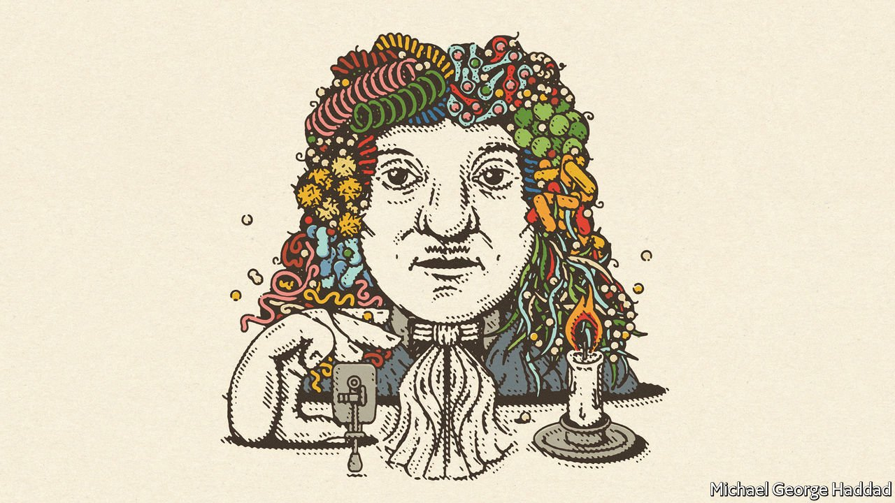

###### Germ of an idea

# What if germ theory had caught on sooner? 

##### The idea that tiny micro-organisms could cause disease was embraced only in the 19th century. But it could have been discovered sooner 

 

> Jul 3rd 2021 

 This year What If?, our annual collection of scenarios, considers the future of health. Each of these stories is fiction, but grounded in historical fact, current speculation and real science. They do not present a unified narrative but are set in different possible futures

ANTONIE VAN LEEUWENHOEK, a 17th-century Dutch businessman and scientist, was inordinately proud of his clean teeth. Every morning he scrubbed them with salt before rinsing his mouth with water. After eating, he carefully cleaned his teeth with a toothpick. Few people his age, he remarked in a letter in 1683 (when he was 50), had such clean and white teeth. Yet when he looked closely, he found “there remains or grows between some of the molars and teeth a little white matter”—now called dental plaque.

As an expert microscopist who had observed tiny organisms in water a few years earlier, van Leeuwenhoek wondered whether they might also be present in this white matter. A microscope showed that it did indeed contain “many very small living animals, which moved very prettily”. His drawings of them, which he sent to the Royal Society in London, are considered the first definitive evidence of bacteria.


Few people suspected that such micro-organisms might cause disease. At the time, doctors followed the doctrine of Hippocrates, believing disease was caused by an imbalance of the “humours” within the body (blood, phlegm, yellow bile and black bile). Epidemic diseases, meanwhile, were attributed to miasma, the “bad air” given off by swamps or decomposing matter. Suggestions that disease might be transmitted by tiny living things were rejected by doctors. But the advent of the microscope showed these tiny creatures existed. Robert Hooke, an English scientist, published depictions of mucor, a microbial fungus, in the 1660s, and van Leeuwenhoek spotted what are now called protozoa and bacteria. Could the idea that tiny organisms caused disease have caught on in the late 17th century?

This notion, now known as germ theory, was only embraced in the second half of the 19th century. In the 1840s Ignaz Semmelweis, a Hungarian doctor, realised the importance of hand-washing and sterilisation of surgical instruments, but was ignored. In the 1850s John Snow traced cholera deaths in London to a neighbourhood water pump. Louis Pasteur demonstrated in the 1860s that fermentation and putrefaction depended on living micro-organisms that could be killed by heating. Joseph Lister, a British surgeon, then convincingly showed that using antiseptics to sterilise surgical instruments and clean wounds saved lives.

Yet there was no practical reason why germ theory could not have arisen in the 1680s. As David Wootton, a historian at the University of York, puts it, “an intellectual revolution that should have taken place failed to occur”. A better understanding of hygiene could have saved countless lives lost in childbirth, in surgery and on the battlefield. If one country had embraced germ theory before its rivals, it might even have gained a military advantage as European powers vied to build foreign empires. There was nothing to stop anyone doing Pasteur’s experiments or reaching Lister’s conclusions in the 1680s. So why didn’t they?

The key obstacle, says Mr Wootton, was not intellectual but cultural. Doctors were conservative and regarded new, experiment-based findings as a challenge to their professional identity. While astronomers rushed to adopt telescopes, which transformed their understanding of the universe, doctors turned a blind eye to the new worlds revealed by the microscope. Lister was a notable exception: trained as a doctor and surgeon, he learned about microscopy (and micro-organisms) from his father, an amateur naturalist who devised an improved form of microscope. Lister was thus able to bridge the gap between science and medicine. And his status as a professor of surgery, not to mention surgeon to Queen Victoria, gave him the authority to put his methods into practice, despite initial mockery, and gather clear evidence of their effectiveness.

Anyone trying to do the same in the 1680s would have had to have been a doctor, a surgeon and a microscopist—separate groups at the time. They would also have needed support among the political or medical elite. Pasteur’s and Lister’s theories were more readily accepted because of their social status, notes Corinne Doria, a historian at the School of Advanced Studies of Tyumen. “Miasmatic theory was medical orthodoxy—one single person could not undo it,” she says. It was the slow accumulation of evidence, and waning confidence in humoral medicine, that enabled germ theory to prevail. Like diseases, new ideas can spread quickly, but only in a suitable environment. ■

Full contents of this What If?


Germ of an idea: What if germ theory had caught on sooner?*

