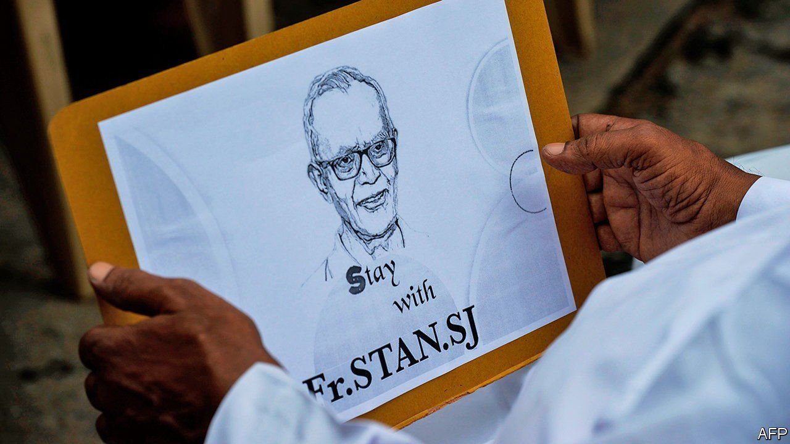

###### Who art in prison

# Father Stan Swamy, an 84-year-old activist, perishes awaiting trial 

##### India’s draconian security law and an uncaring state denied him even dignity 

 

> Jul 10th 2021 

SLOW JUSTICE may be no justice, but a slowly unfolding tragedy remains no less a tragedy. When police charged Father Stan Swamy with terrorism and threw him in jail last October, friends of the Jesuit priest and human-rights activist feared for his health. They were right to worry. Prison wardens denied Father Stan, as he was known, in his 80s and shaking from Parkinson’s disease, the use of a straw and sippy-cup from which to drink water until the press raised a fuss.

Judges turned down repeated pleas for bail, even as his health declined and India entered a second, ferocious wave of covid-19 in the spring. They insisted that since he was charged under special terrorism laws, this frail old man with no criminal record, who had devoted his life to helping remote tribal peoples, must somehow represent a danger to the republic. In May Father Stan, now unable to feed himself or walk, was finally allowed to visit a private hospital. Doctors promptly diagnosed covid-19. Soon he was on a ventilator. On July 5th, as yet another judge was set to hear yet another bail plea, he died.


The death of an “undertrial”, as India calls people who are yet to be found guilty of anything but languish in jail nonetheless, is not normally news. After all, they make up more than two-thirds of the country’s prison population. Even the death of detainees accused, like Father Stan, under the draconian Unlawful Activities Prevention Act (UAPA), seldom raises eyebrows. In January Kanchan Nanaware, a 38-year-old tribal activist, died during her sixth year awaiting trial as a “terrorist”.

Because UAPA grants police sweeping powers to designate suspects as dangers to the state, and specifically limits opportunities for bail, lengthy periods of pre-trial imprisonment are not unusual. In a typical case last month, two Kashmiri “terrorists”, who together lost 18 years of their lives awaiting trial in prison, were acquitted for lack of evidence. In fact, of the 7,840 UAPA cases raised from 2015 to 2019—the last year for which numbers are available—just 2% resulted in a conviction. In nine-tenths of cases police did not even bother to frame charges. Despite the apparent failure of the law, the temptation to use it to lock up troublemakers seems irresistible: over the same period the annual number of UAPA arrests rose by 72%.

In the case of Father Stan, it is not just the casual callousness that stands out. He was one of 16 co-defendants, all but one of whom remain in jail, in a case that police describe as a Marxist terror plot. They have tied the group, which includes distinguished academics, human-rights activists and a well-known poet, to a rally held in 2018 by low-caste Dalits (so-called “untouchables”) at a village called Bhima Koregaon, some 170km east of Mumbai. This was marred by a stone-throwing incident involving higher-caste Marathas, during which one person died. Police have also claimed the group funnelled money to Naxalite guerrillas seeking to overthrow the state, and were plotting to assassinate Narendra Modi, India’s prime minister.

So far, the only evidence produced has been electronic, consisting of files retrieved from the personal computers of the accused, all of whom say they had never seen any of this supposedly incriminating material. According to independent investigations by Arsenal Consulting, a Boston-based digital forensics firm, they appear to be right. Close analysis by Arsenal of two of the defendants’ computers shows they were victims of malware attacks dating back to 2016, which allowed dozens of documents, including those later leaked by police as proof of a conspiracy, to be inserted surreptitiously into their filing systems. Separately, both Amnesty International, an advocacy group, and Citizens Lab, a Canadian research group, have found that Dalit activists were targeted by hacking software, typically sold only to governments, that permits remote control of devices.

A statement from Father Stan’s family and friends decries his death as “the institutional murder of a gentle soul by an inhuman state”. That sounds about right.■

