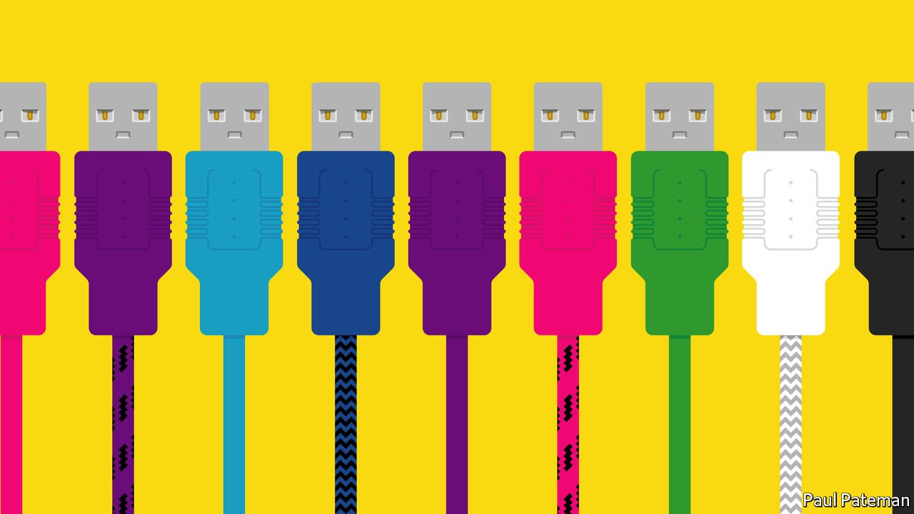

###### (; —,_—)

# South Korean tech workers are having a lousy time at work 

##### New internet firms suffer from many of the same problems as old corporate giants 

 

> Jul 10th 2021 

WHEN PARK HAE-RYUNG started her job at a big internet company near Seoul, South Korea’s capital, she had high expectations. “They promise you flat hierarchies, flexible work and a young, innovative workplace,” says the 26-year-old graduate. “But what actually happens is that they give you tons of work without telling you how to do it. There’s no structure and no communication. And you can’t complain to HR because the person in charge probably went to school with your boss.” Ms Park (not her real name) is planning to quit as soon as she can. She says many of her colleagues feel the same.

South Korea’s work culture is notoriously punishing. Its people work some of the longest hours in the OECD, a club mostly of rich countries. Office-goers have scant control over their time and little chance to escape from bad management. They have long complained of gapjil, the authoritarian attitude of senior managers who abuse their power to shout at underlings, insist on unpaid all-nighters and weekend work, assign personal errands, and force juniors to go out drinking for hours upon hours.


The country’s most prestigious employers, such as Samsung, a technology conglomerate, attract the best-qualified jobseekers with well-paid jobs and generous benefits. But the perks come with strict hierarchies, long hours and no doubt numerous opportunities to experience gapjil.

By contrast, relatively newer firms such as Naver (a search engine, among other things), Kakao (messaging) and Coupang (e-commerce), as well as many smaller startups, model themselves on their forerunners in America’s Silicon Valley. They promise a meritocratic idyll where workers refer to each other by their made-up English names instead of their job titles, are valued as individuals and are judged on the basis of their ideas rather than the hours spent at a desk. There are beanbags.

Yet a string of incidents in recent months suggests that South Korean workplaces—and bosses—are proving hard to change. In February workers at Kakao took to Blind, an app that allows verified employees to whinge anonymously, to lambast their company’s peer-rating system, which they said encouraged personal attacks and poisoned the atmosphere. In April employees at Krafton, the company behind “Player Unknown’s Battlegrounds”, a popular online game, petitioned the labour ministry to stop their boss forcing them to work overtime without time off.

In May, an employee at Naver committed suicide after being bullied at work, causing outrage in the press, sermons from concerned politicians and union protests outside the company’s headquarters. Coupang, the country’s biggest delivery service, which has long been criticised for the conditions endured by its logistics workers, faced a consumer boycott in June after a blaze at one of its warehouses killed a firefighter. White-collar employees grumble about overbearing bosses and erratic decision-making at the firm.

Some observers attribute the misery to growing pains at companies that are making the transition from startups to big corporations. One worker told a local news outlet that Korean tech firms seemed to be incorporating the worst aspects of Korean corporate hierarchies coupled with the American obsession with performance ratings. Others see the challenging work conditions as par for the course in a new industry. “Nobody teaches you what the original process for something is because the process probably doesn’t exist yet,” says Yu Dong-hyun, a 27-year-old startup worker in Seoul. “You go to these places to grow and take what you can from them and once that’s over, you leave.”

The companies seem keen to be seen to tackle the problem. Naver’s chief operations officer resigned in June following an inquest into the worker’s suicide. The company promised to overhaul its management structure. Kakao launched a consultation process for unhappy employees. Krafton doled out extra holidays and said it would look into whether employees were working too much.

It may be that the firms are serious. Until it is clear that they are, disappointed tech workers who cannot afford to take Mr Yu’s advice to leave will have little choice but to stick to the time-honoured method of dealing with gapjil: grin and bear it.■

