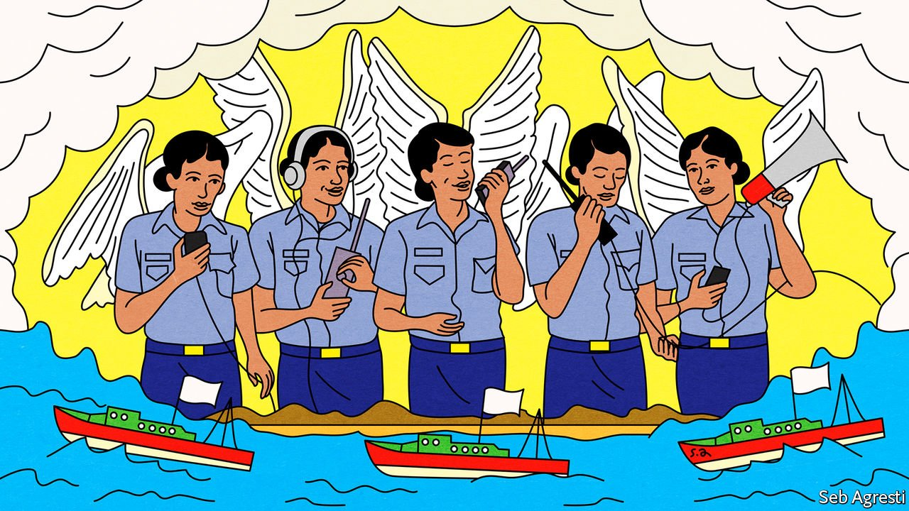

###### Hark! The herald angels say “buzz off”

# The Philippines’ secret weapon against Chinese incursions 

##### Female radio operators appear to have greater success in driving away unwelcome boats 

 

> Jul 10th 2021 

IN THE COLD WAR over the warm waters of the South China Sea, one combatant, the Philippines, has discovered a new weapon for keeping its adversaries out of the areas it claims: the voices of women. On June 30th the Philippine Coast Guard vessel Cabra spotted seven foreign craft, five of them Chinese, in waters claimed by both the Philippines and China. One of the Cabra’s officers, Provisional Ensign Gretch Mary Acuario, a woman, hailed the foreign craft, and asked them to identify themselves and state their intentions—a sort of nautical formal invitation to buzz off. Without waiting around to answer, all seven craft scooted. It was no fluke. The same officer had pulled off a similar feat in April.

Ensign Acuario demonstrated what the coast guard had suspected for a while: that its women are more effective with the spoken word than its men. The suspicion was so strong that the coast guard arranged a special course of training, exclusively for women, as radio operators. The course culminated in the graduation of 81 female radio operators just days before Ensign Acuario’s latest triumph. Vice-Admiral Leopoldo Laroya told the trainees that, in their interactions with foreigners, their voices were less likely than men’s to raise tensions. “We want our Angels of the Sea to become the voice of peaceful and rules-based order at sea, especially in our country’s sensitive maritime frontiers,” he declared.


The waters of the South China Sea contain fish in abundance, lie above deposits of oil and gas and are a busy corridor for ships carrying many of the goods the world trades. The other littoral states, although anxious to maintain their claims, do not want to get into a shooting war with China, which claims most of the sea and has built artificial islands bristling with missiles and fighter jets to defend it. For the most part, however, both China and the other claimants try to assert themselves with fishing boats or coastguard vessels, to reduce the risk of escalation. Via radio or loudhailers, each side tells the other it is trespassing, and to clear off.

Why the voices of the Angels of the Sea should be more persuasive is a matter of speculation. The coastguard spokesman, Commodore Armand Balilo, explained to local media that a female radio-operator’s voice “becomes soothing. The environment becomes calm, and no one is raising their voice.” The Philippine National Police had set an example by putting female officers in the front rank of its riot squads, in the expectation that the mere sight of the women would dissuade angry crowds from attacking. The tactic works, usually.

Or perhaps the sex of the speaker makes no difference at all. Chinese skippers may simply be heeding the whispers of their own government warning them to act with restraint in disputed waters while there is still a chance that Rodrigo Duterte, the Philippine president, will in return weaken his country’s military alliance with America. That alliance is a far greater deterrent to Chinese assertiveness in disputed waters than a whole choir of Angels of the Sea.

