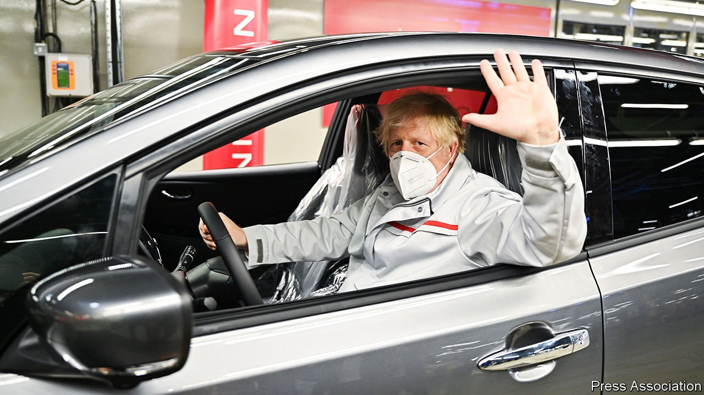

###### Pedal to the metal

# Britain’s car industry is finding Brexit far less of a problem than expected 

##### Dollops of government cash are a big part of the reason 

 

> Jul 10th 2021 

FIVE YEARS ago, straight after Britain’s vote to leave the European Union (EU), Nissan, a Japanese carmaker, warned that the future of its factory in Sunderland was in doubt. On July 1st it announced a £1bn ($1.3bn) investment in a new battery plant that will secure the factory’s future. And on July 6th Stellantis, another motor manufacturer, said it would be investing £100m to produce electric vans in Ellesmere Port. Further news is expected soon from BMW and Toyota. The trade deal that Britain struck with the EU in December 2020—and eye-watering amounts of government cash—have bosses musing less about upping sticks, and more about the advantages of post-Brexit regulatory freedom.

Before the vote, things had been going swimmingly for Britain’s motor industry. Production hit a two-decade high in 2016, at over 1.8m units. Measured by vehicles per employee, Britain had become one of Europe’s most productive carmakers by 2016, with around 160,000 employees producing almost 11 vehicles each annually, compared with an EU average of less than eight. By making it harder to transport parts across borders, Brexit put this at risk.


A modern car is the result of a complex, international production process. It typically has around 3,000 components. For cars assembled in Britain, only around 40% of those components are produced domestically. The crankshaft in a BMW Mini crosses the Channel three times before being installed in Oxford. Around four in five cars made in Britain are exported, over half of them to the EU. Nissan opened its Sunderland plant in 1986, drawn partly by the prospect of a liberalising labour market, but also by easy access to Europe. Others followed, and since the failure of MG Rover in 2005 all the volume manufacturers in Britain have been foreign-owned.

Although the Trade and Co-operation Agreement (TCA) between Britain and the EU did not give the industry all it hoped for, it came close. Trade can mostly continue without tariffs or quotas. Customs checks and fees introduce some friction, but are minor compared with the threat of 10% tariffs under World Trade Organisation rules if no deal had been struck.

“Rules of origin” requirements are more troublesome. These aim to stop companies importing goods from a third country, and re-exporting them as if they were domestically produced. For the purpose of tariffs, the TCA treats Britain and the EU as a single bloc, but excludes countries with which both have a trade deal, such as Japan. By 2027 the percentage of components by value originating from outside Britain or the EU must be cut to 45% for most cars, if tariffs are to be avoided. Manufacturers that sell in the EU and have supply chains that extend into Asia thus have a choice: shift from Britain, or double down on it. They are making different calls. Nissan is investing in Britain; Honda is closing its Swindon factory next year.

All this coincides with industry-wide reinvention, as carmakers shift to electric vehicles. Batteries, like the engines of petrol-fuelled cars, are expensive. “If you are not sourcing the batteries domestically, I don’t see how you can stay compliant,” says a production manager. Britain currently lacks a so-called “gigafactory”—a word coined by Elon Musk of Tesla—to mass-produce them.

Nissan’s planned new plant, a joint venture with Envision AESC, a Chinese firm, will be able to produce 9 gigawatt-hours (GWh) annually by the mid-2020s, enough to power 100,000 cars. Capacity could reach 25 GWh by 2030. Britishvolt, an independent consortium of battery manufacturers, plans capacity of 30 GWh by the end of the decade. But both together would not reach the 60 GWh that the Society of Motor Manufacturers and Traders, a trade body, reckons will be needed by 2030 if as many cars are to be made then as now.

In the upheaval, Britain’s government spies an opportunity to influence carmakers’ thinking about where to invest. The “super deduction”, an especially generous time-limited tax break announced in the budget in March, will let firms reduce their tax bills by up to 25p for every pound of capital investment this financial year and next. Billed as a pandemic-recovery measure, it is better seen as a “huge subsidy to cover the costs of supply chains adapting to Brexit”, says an accountant. Cash is also being splashed. Nissan and its partners will receive around £100m of direct subsidy for the new gigafactory, on top of £80m from Sunderland city council to build an energy grid connecting it to wind farms and solar parks. Such measures would have been possible while Britain was in the EU—but might not have been needed.

Power play

Rather more pleasingly for those who hoped Brexit would mean less red tape, rather than more handouts, climate-change targets and new technologies are providing a pretext. Carmakers think the British government will be nimbler and more forward-looking when it comes to regulating electric and autonomous vehicles. European regulators, who must hold the ring between 27 countries, always move slowly. Moreover, they are bound to be heavily lobbied by the big German carmakers, for whom the industry’s reinvention is a serious threat. Industry bosses point to the fact that, whereas Britain has already pledged to ban the sale of new diesel- and petrol-powered cars by 2030, the EU is still only debating banning them from 2035. Big car firms are pressing it to move slower still.

Overall, Brexit is still likely to be negative for Britain’s economy, reducing potential growth. But subsidies, tax breaks and fewer barriers to innovation mean that for carmakers, life outside the bloc will be cosier than they once feared. ■

For more coverage of matters relating to Brexit, visit our 

