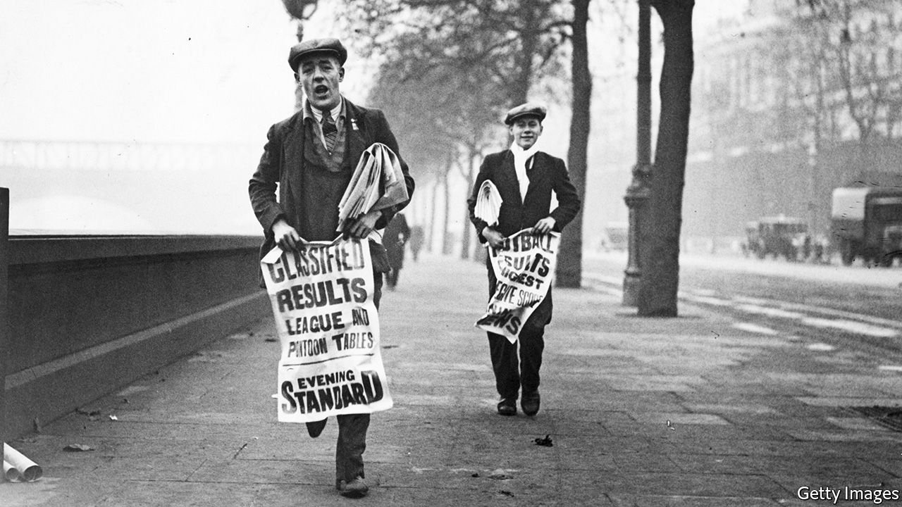

###### Night crawlers

# Local news is booming 

##### Small, independent outlets are finding readers—but little profit 

 

> Jul 10th 2021 

“SOMETIMES WE TURN up at crime scenes before fire engines and ambulances,” says Darren Toogood, editor of the Island Echo, an independent news site on the Isle of Wight. An army of “tippers” share information about sirens and suspicious activity on a dedicated Facebook group. The yarns they yield are often thrilling. A 5am chase after a police helicopter led to a kidnapping. Another tip turned up a London gang stealing shotguns from a clay-pigeon-shooting range.

Falling ad revenue and competition from social media mean local papers have been on life support for years now. Some 265 closed between 2005 and August 2020. Most survivors are now owned by conglomerates. Reach, which owns at least 111 digital and print titles (plus the Mirror, a national tabloid) closed four free papers in 2020. It also launched 19 “Live” websites, each with a similar layout. Its sites were viewed nearly 15bn times in 2020, two-fifths more often than in 2019.


Tom Baldwin, a former local journalist, has written a book about what he sees as a crisis in democracy, including the decline of local papers. This “news-factory model” neglects their most important task, he says: holding power to account by covering court hearings, council meetings and the like. To the extent that this is still done, it is often by tiny, sometimes amateurish independent outlets. A survey by the Public Interest News Foundation (PINF), published on July 8th, found 200 independent publications with a turnover of under £2m ($2.8m). The 56 it surveyed had a median of just three staff members.

Most are online-only, and see themselves as the opposition to mainstream local papers. They are a varied bunch. Birmingham Updates covers culture: a Spice Girls Bottomless Brunch at a local drinkery; businesses providing free school meals. The Manchester Meteor investigates “local power structures”: a bus drivers’ labour dispute; a letter to the mayor about public land. Cornish Stuff expresses the local identity: a fisherman upset by a planning decision; silver discovered in a mine. Wiltshire999s, which closed in June, focused on crime. One of its final headlines was “Hammer used after mass disorder breaks out at toddler’s birthday party”.

Competition is particularly fierce on the Isle of Wight. In 2017 the County Press, a 137-year-old newspaper, was bought by Newsquest, an American-owned publisher. Last year it sold 15,000 copies a week, and in its highest month had 2.2m page views. It might be doing better, were it not for Mr Toogood’s Island Echo, which was founded in 2012. It claims to have had 2.8m online page views in its peak month last year. Meanwhile the Observer, a printed free-sheet, claims to outstrip the County Press, with 18,000 weekly sales. Yet another online outlet, On the Wight, offers in-depth investigations into local scandals and social problems.

Surprisingly, given how contested their territory is, all these outlets claim to be profitable. That is rarely true for similar outlets elsewhere. PINF found that the typical annual revenue for those covering niche or local news was just £21,099. Milo Perrin, who founded Cornish Stuff, says it makes £5 a day from ads and is kept afloat by his wife’s “nice job”. And here, too, industry consolidation is taking a toll: Wiltshire999s closed after Daniel Webb, its founder, was hired by Reach’s new Wiltshire Live site. “They have found an audience,” says Jonathan Heawood of PINF. “That’s a fantastic step from the days of print. But it isn’t paying the bills.” ■

