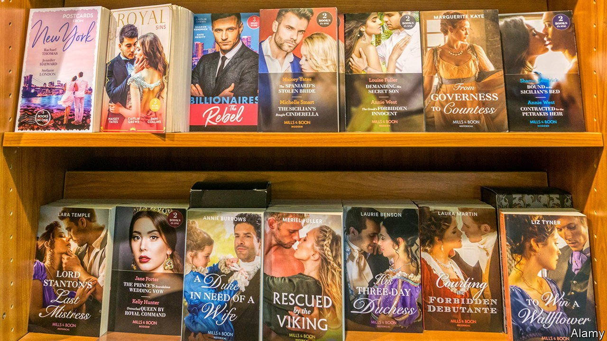

###### Tall, handsome—and darker

# Mills & Boon wants to diversify its hero base 

##### The publishing house has a keen eye for social change 

 

> Jul 10th 2021 

SHE HAD so much. But she wanted more. Over more than a century Mills &amp; Boon readers have fallen for “The Mediterranean Tycoon”; thrilled to “The Italian Millionaire’s Virgin Wife”; swooned at “The Greek’s Secret Passion” (which comes after “The Greek Tycoon’s Mistress” and, somewhat inevitably, before “The Greek Tycoon’s Secret Child”). Yet still, they murmured, something was missing. Effective contraception, perhaps. But also diversity.

Of late the lack of it has seen the world of romantic fiction smouldering even more than usual. Heroes are all tall and handsome, but they are rarely, critics point out, all that dark. “Romance is still too white,” says Nadine Gonzalez, a Haitian-American author now published by Mills &amp; Boon. The publisher has launched a competition to find writers from “underrepresented ethnic backgrounds” in order to “bring more diverse characters” to the genre.


Mills &amp; Boon has long been a bellwether of British society, in everything from sexual attitudes (affairs were once consummated with a kiss; now the word “moist” is regularly deployed) to climate change (a growing number of heroes work in conservation). Feminism arrived late last century, when the publisher advised aspiring authors that the heroine “need not be a career girl”, but might have a job, even an “unfeminine-sounding one”, such as doctor.

The titles speak volumes about Britons’ broadening horizons. One in 1956 was called “Romance Goes Tenting”; today’s include “Reclaimed by the Powerful Sheikh”, “The Argentinian’s Demand” and “Penniless Virgin to Sicilian’s Bride”. Italian heroes work well, says Sharon Kendrick, the author of over a hundred titles (they are seen as sybaritic). So do Greeks (enigmatic) and sheikhs (masterful), though not the French (unfaithful) or English (class-ridden).

In her novels for other romance publishers, Ms Gonzalez has written heroes who are African-American, Afro-Cuban and half-British, half-Jamaican. The hero is changing in other ways, too, she says. Formerly, he had to be emotionally repressed; now, though he must be confident, he “doesn’t need to smoulder”.

But some sorts of diversity seem as distant as ever. Ms Gonzalez says she has never seen a hero shorter than the heroine, and that a balding one would be “a step too far”. So, it seems, would a man of modest means. One current series is called “Marrying a Tycoon”; there is none entitled “Marrying an Electrician”, or indeed “Marrying a Journalist”. Here, only inflation brings change. Heroes were once millionaires, says Ms Kendrick. “They are all billionaires now.”

