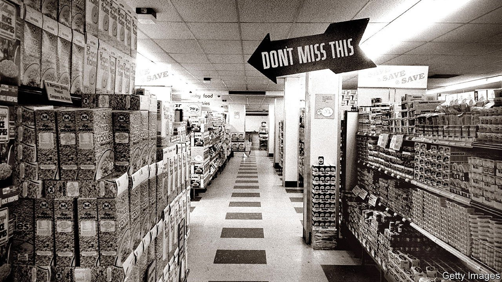

###### British equity market

# Private-equity firms battle to buy Morrisons 

##### Investors are clamouring to buy Britain’s fourth-largest supermarket group 

 

> Jul 10th 2021 

SIR KEN MORRISON took over his father’s market stalls in Bradford in 1952, 53 years after they started selling eggs and butter. Soon he was running one grocery shop, and then many. In 1967 Morrisons went public, in a share offering that was 174 times oversubscribed.

Now Britain’s fourth-largest supermarket chain—and the poshest of its budget outlets—is in high demand once more, this time from bidders seeking to take it private again. On June 14th Clayton, Dubilier &amp; Rice (CD&amp;R), an American private-equity group, offered £2.30 ($3.25) a share, a 31% premium to the closing price the previous day. The board turned its nose up at the bid, saying that it “significantly undervalued Morrisons and its future prospects”. But on July 3rd it accepted a rival offer of £2.54 from a consortium led by Fortress, another private-equity group. That values Morrisons at £9.5bn, including £3.2bn of debt.


Under Britain’s takeover code, CD&amp;R has until July 17th to make a better offer. Apollo, a third private-equity group, is also considering a bid. Industry analysts think Amazon may be interested, too. As The Economist went to press on July 8th, the share price stood at £2.67, 52% higher than before CD&amp;R’s offer.

The battle to buy Morrisons fits into a broader trend in London’s stockmarket. The first half of 2021 saw a record-breaking number of bids from private investors, even after years in which the number of firms listed on the London Stock Exchange declined. Five years of Brexit-induced political and currency risk have left shares looking cheap. Although the turmoil has largely subsided, sterling is still low by historical standards, which adds to the attraction for private-equity funds sitting on $1.9trn of unspent capital.

All the same, many wonder how private investors can justify such a high premium for Morrisons. One possibility is that they intend to asset-strip: its property portfolio, which includes 85% of its stores, is thought to be worth around £8bn. (Fortress, for its part, has said it intends to hang onto them.)

Another is that the bidders spy more productive routes to increasing profits. James Anstead of Barclays, a bank, points out that Fortress owns Majestic Wine, a high-street retailer, and CD&amp; R owns Motor Fuel Group, a petrol-forecourt operator. Either, but particularly the latter, could combine well with Morrisons and make both more valuable. For CD&amp; R, this would mean following a trail blazed by Asda, Britain’s third-largest supermarket chain by market share. It was taken private earlier this year by the Issa brothers, who also own a petrol-forecourt business.

A third possibility is that public markets are seriously undervaluing Britain’s food retailers. They have spent years cutting debt and filling holes in their pension funds, says Clive Black of Shore Capital, an investment firm. The larger chains are now generating enviable—and enviably stable—cash flows, but with little benefit to their share prices. Private investors, it seems, place a higher value on them than the stockmarket does. “If traditional fund managers want to know why British supermarkets are going private,” says Mr Black, “they ought to look in the mirror.” ■

