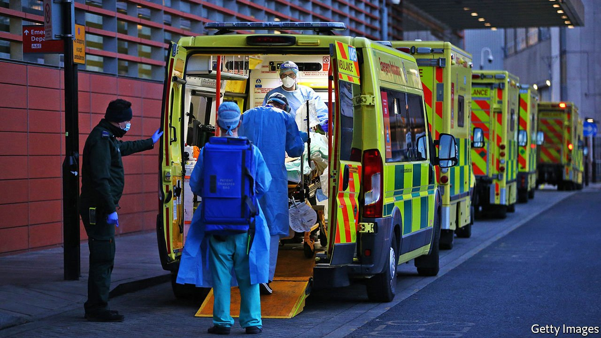
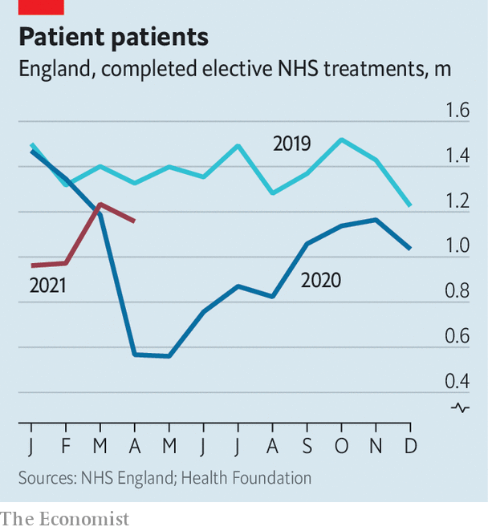

###### Get ready for queues

# The mystery at the heart of the National Health Service 

##### Millions of patients did not turn up during the pandemic. When will they finally do so? And how ill will they be? 

 

> Jul 10th 2021 

IT IS MIDDAY in Milton Keynes, and a young woman is coming round after surgery on her vocal cords. Her breathing was controlled during the operation, so she is woken carefully, surrounded by blue-scrubbed medics. A chronic smoker, she issues a series of hacking coughs, attempting to clear built-up phlegm—and the medics are once more exposed to any illnesses she may be carrying.

Throat surgery is known by a newly popular acronym: it is an AGP, or Aerosol-Generating Procedure. The entire point of ear, nose and throat surgery, says Hamid Manji, Milton Keynes University Hospital’s clinical director for surgery, is to “mess around with that airway mucosa, be it pharyngeal, be it nasal or in this case vocal”. That releases viruses, which is a problem during a pandemic.


Lots of this sort of surgery stopped last year. Now theatres are deep-cleaned between procedures, and patients must isolate and take a covid-19 test before arriving. The result is an enormous backlog. Across England, and in all specialisms, more than 5.1m operations are waiting to be carried out, the longest list since records began. And the waits are increasingly lengthy: nearly 400,000 of these operations have been planned for more than a year, up from 1,500-odd before the pandemic.

 


These numbers tell only part of the story. Some 4.6m fewer people completed elective treatment in 2020 than in the year before, as patients avoided their general practitioners and hospitals shut to all but the most unwell. The trend has not abated this year (see chart). Nobody knows when, or in what condition and numbers, these missing patients will eventually show up. But a year without treatment is certain to have taken a toll.

All this is making politicians nervous. “The public totally understand the cause now is covid,” says a senior Tory. “The hardest thing to explain is that [waiting lists] will keep going up.” Sajid Javid, the new secretary of state for health and social care, has started preparing the ground, warning in an article for the Mail on Sunday that the backlog is “going to get far worse before it gets better”. The last time queues were so long, under Tony Blair’s Labour government, polling found that no issue bothered voters more.

In the early 2000s Mr Blair sought to cut waiting lists by raising inflation-adjusted spending on the health service by at least 6% a year. Boris Johnson’s government has so far promised £1.2bn ($1.7bn) extra, less than 1% of the health service’s pre-pandemic budget. More is expected in the next spending review, due later in the year. By then, the true length of the queue should be clearer. So, too, should the health service’s ability to get through it. “We need to identify how fast we can go,” says Chris Hopson, the chief executive of NHS Providers, which represents hospitals.

One requirement will be to increase capacity. England has fewer CT or MRI scanners per person than any other European country, for example, so money has been set aside for 44 new community diagnostic hubs in the next financial year. That should free up equipment for patients in hospitals. Extra covid-19 funding is enabling hospitals to recruit local private providers. But the hope is that the health service can become more efficient, too.

“They are now calling us Bones R Us,” laughs Krishna Vemulapalli, a surgeon in east London. Last year his hospital ran a “bones week” to see how many joint replacements could be done in seven days, and to identify bottlenecks. Across six theatres, ten consultants worked from 8am to 8pm. An extra porter ensured there was no down time between patients. Lunch breaks were staggered. The aim was 100 joint replacements; they managed 135, with most patients going home the same day. The hospital has also tried a “gut-feeling week” (to maximise endoscopies) and is planning “ENT 3.0” (three times the normal number of ear, nose and throat operations).

Bones week was an extreme example of “high-volume, low-complexity” (HVLC) surgery. The approach originated in London, helping to explain why the capital has been quicker than other places to cut waiting lists. The surgical process is broken down into steps, from before patients arrive at hospital to their recovery, with hospitals benchmarked against the top 10% of performers for outcomes and efficiency. By streamlining the simple stuff, time is freed up for trickier operations. The health service now wants to spread HVLC across the country, and across specialities.

NHS board papers promise “air cover” (extra money) to reward top performers and to support stragglers. Yet cash is not the only obstacle. Covid-19 continues to be another, because hospitalisations eat up resources, cases cause staff absences and precautions slow things down. “Even if it’s only five minutes to clean the outpatient consulting room, it’s five minutes on 20 patients, and suddenly you’ve lost an hour and a half,” says Joe Harrison, chief executive of the Milton Keynes hospital trust.

Mr Harrison credits free parking and coffee for all staff with helping recruitment in Milton Keynes. Across the country, though, hiring problems will place limits on the recovery. Recruiting from abroad is increasingly difficult because of global shortages, notes Siva Anandaciva of the King’s Fund, a think-tank. “You can start expanding training places; you can start building medical schools, as the government is doing,” he adds. “But will that bear fruit between now and the end of Parliament? Probably not.”

Nor is the recovery the only task faced by hospital managers. A new NHS bill published on July 7th requires them to forge ahead with plans to move health care out of hospitals and integrate it better with social care. “I was talking to one chief operating officer,” says Mr Anandaciva, “and he was saying, ‘I feel like I’ve got two jobs: one is to go for the biggest elective backlog in two decades; the other is to make the biggest transformational shift in how health care is planned and delivered in 20 years.’”

In fact, reforms introduced in the early 2000s by Labour to deal with waiting lists are now being undone. Even with the focus on waiting lists, and lots of cash, it took Labour the best part of a decade to meet its targets. Few expect a quick resolution this time, but one date looms large. “Health-care leaders know that ministers will be focused on the next general election,” says Mr Hopson. The government came to power promising to protect the NHS. Any failure to do so will be punished. ■

