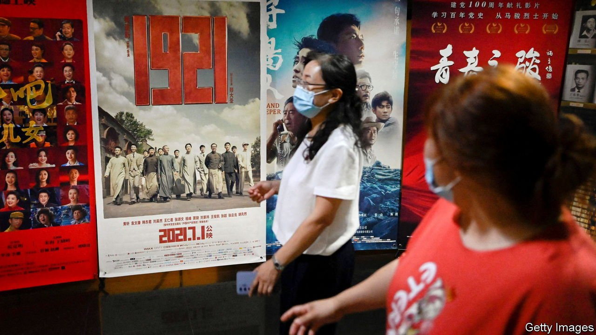
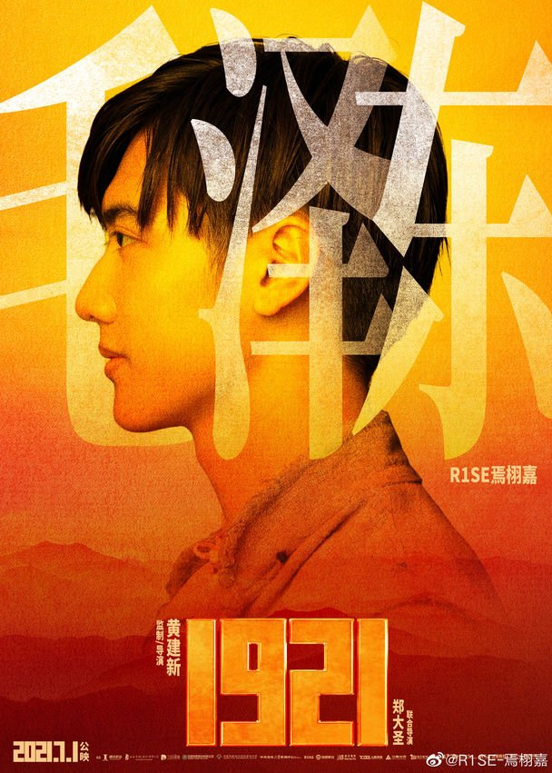

###### Airbrushing Mao

# A Chinese film removes scenes featuring a young Mao Zedong 

##### Rumours suggested that the actor playing him cheated on his girlfriend 

 

> Jul 10th 2021 

PROPAGANDISTS HAD teed it up as one of this year’s blockbusters. The film “1921”, named after the year China’s Communist Party was born, was intended to grip the imaginations of young people with the story of the party’s founding 100 years ago this month. Mao Zedong would be played by different actors depending on his age in the scene depicted. One of them would be Yan Xujia, a 19-year-old pop star who frequently appears on reality television. In mid-May the heartthrob’s profile appeared on promotional posters against an orange-yellow background, suggesting the dawn of Chinese communism (see picture).

 


But a few months before the film’s release on July 1st, reports appeared on entertainment news sites that Mr Yan had cheated on a girlfriend. He denied this, but disbelieving internet users said he was unfit to play a character as important and upstanding as Mao. Some directed their ire at the main producer of “1921”: Tencent Pictures, a production house owned by a privately run social-media and gaming giant. They accused it of involvement in a capitalist conspiracy to smear the party’s most revered founder. “Mao must be portrayed as great and glorious. He must not be besmirched,” read one popular comment.


These posts must have stung officials at the party’s Publicity Department, which was closely involved in making the film (with the help of one of the country’s most famous directors, Huang Jianxin). Earlier this year the law had been amended to make insulting, slandering or infringing on the memory of national heroes punishable by up to three years in jail. Never mind that Mao was a zealous philanderer while he was married. (Mao’s private physician, Li Zhisui, provided lurid details of this in his book “The Private Life of Chairman Mao”, which was published in 1994 shortly before Mr Li’s death.) No mention is allowed in China of such matters.

The film has not been a sensation. In its first five days it grossed 300m yuan ($46.3m), one third of the amount earned in a comparable period by “Fast and Furious 9” (or “F9: The Fast Saga” as it is known in America) after the Hollywood action movie was released in China in May. And audiences noticed that Mr Yan was missing. In one telling scene, Mao is chased through a forest by his parents, but does not appear himself. Online articles about Mr Yan being cut were deleted by censors.

As the party increasingly turns to celebrities for help with spreading its message, their private lives are likely to be subjected to ever greater scrutiny. Yet the stars know they have little choice but to play along with the cultural commissars. At midnight on July 1st, a message posted on Weibo, China’s answer to Twitter, by state television said “We will forever walk with the party! Best wishes to our great party!” Hundreds of popular actors, singers and other celebrities quickly shared the post. Their fans followed suit. Within 12 hours, the message had been forwarded 15m times.

Without celebrities’ support, state media would struggle to strike such a chord. The Weibo account of People’s Daily, the party’s main mouthpiece, has about 130m followers. That is about the same as the number who follow Xie Na, an actress and television host. Celebrities’ accounts on Weibo have more than 21bn followers, almost twice as many as in 2017, the platform says. The majority of these fans are 26 or younger. And they are widely scattered: almost 90% do not live in the biggest cities.

But the party’s attempts to boost its ratings among the celebrities’ armies of admirers are fraught with difficulty. Officials might give the limelight to one heart-throb, such as Mr Yan, only to find that jealous fans of another idol take umbrage and try to undermine the reputation of the party’s chosen one. Mr Yan may have been the victim of such an onslaught. “The filmmakers succumbed to pressure from fans of other actors who went crazy reporting and exaggerating Yan’s immorality,” says one Chinese film critic. Mao once said that Marxists should not be afraid of criticism from any quarter. That is poor advice for China’s entertainment stars. ■

