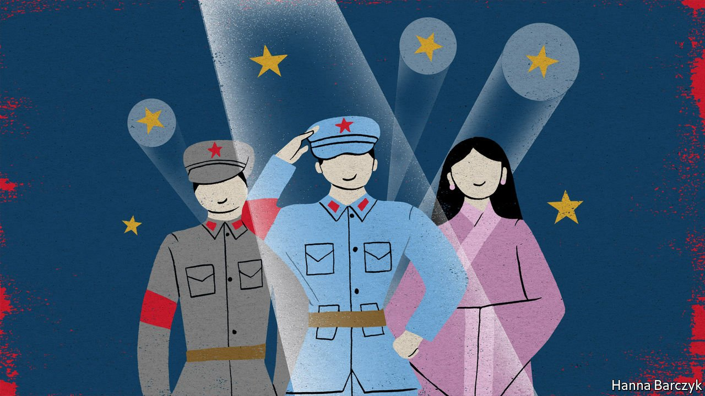

###### Chaguan

# In China, patriotic nostalgia is big business 

##### One of China’s odder sights is tourists in replica Red Army uniforms. A visit to the villages where they are made 

 

> Jul 10th 2021 

FIVE OR SIX years ago, when many Chinese still associated American culture with novelty and fun, Halloween was big business in Caoxian. This rural county claims to be China’s largest source of cheap costumes for children’s parties and school concerts as well as for dramatic galas that are sometimes staged in Chinese workplaces, from small factories to government ministries. Not long ago, Caoxian’s entrepreneurs could live for a year on one month’s sales of pumpkin costumes, witches’ robes and other Halloween paraphernalia, says Ren Yafeng, a local costume merchant, perhaps exaggerating just a little.

In the past three years, however, America’s image has darkened and consumers have become more nationalistic, nudged by Communist Party propaganda and four years of Trumpian bluster. The market signals were swiftly received in Caoxian, for this light manufacturing hub in the eastern province of Shandong is linked to customers by e-commerce. Officials in Mr Ren’s home village, Sunzhuang, report that almost three-quarters of households sell goods on such online platforms as Taobao, 1688 and Pinduoduo.


This month marks the 100th anniversary of the party’s founding. All year, orders have poured in to Caoxian for replicas of the Red Army uniforms that were worn by Communist guerrillas. Schools have been buying child-sized ones for more than a decade, for use in performances. But it is not only children who don them. Such costumes are now all-but-required wearing for groups visiting party-approved “red tourism” sites, such as bases used during the Long March and battlefields where the Communists suffered ghastly but inspiring losses. Since January Mr Ren has shipped 100,000 Red Army uniforms from his warehouse, located at a crossroads between cornfields and a duck pond. He hopes to sell the same number again before the year is out.

The sight of grown men and women dressed as soldiers from the 1930s, in powder-blue or grey tunics, trousers and octagonal caps bearing a red star on the peak, is one of the spectacles of modern China. They can be seen panting up Red Army supply trails in Jinggangshan, a mountain in southern China called the cradle of the revolution. They can be heard reciting Mao’s poems in Yan’an, an old party headquarters, and singing red hymns around vats of thin soup that troops might have eaten long ago. These are pilgrims, for the party, though atheist, unabashedly talks about “sacred” sites, “martyrs” and filling hearts with revolutionary fire. The costumes are an aid to faith. Official documents talk of tourists being inspired by “wearing Red Army clothes, eating Red Army meals and walking Red Army paths”. Some visitors are bureaucrats on government-paid study tours, or workers from private firms eager to show loyalty to the party. Commercial guides also rent out or sell uniforms to individual tourists. Devotion to authenticity varies, with some visitors pairing uniforms with trainers and plastic bags full of modern-day snacks. Those attentive to detail sport old-fashioned cloth slippers, canvas satchels and toy guns.

Children’s costumes still make up most of Mr Ren’s sales, but adult orders are booming. The cheapest Red Army suits sell for 25 yuan ($3.90) while more durable uniforms can go for 100 yuan, including a belt and cap. He reports seeing a first surge in 2015, the 70th anniversary of victory over Japan, and ever-growing orders from revolutionary bases in the past two or three years.

Especially last year, when covid-19 lockdowns forced the cancellation of performances, lots of Caoxian’s costume-makers diversified into another patriotic fashion, selling the supposedly ancient robes known as Hanfu to individual buyers. These floaty gowns and tunics are largely invented, based on a mishmash of historical styles. Still, they are embraced by many Han Chinese, who make up over 90% of the population. They had lacked an ethnic costume they could call their own, unlike Tibetans or other minorities. Even children’s costumes are becoming more patriotic. Those based on “Journey to the West”, a famous folk saga, are brisk sellers, as are some based on a cartoon series from the 1980s about seven brothers born from magic gourds. In Sunzhuang locals call national pride a sign of progress, suggesting that as the Chinese grow richer and no longer worry about their next meal, their minds are turning to “higher things”, such as their own history. The village party secretary, Sun Xueping, used to encourage locals to seek jobs as migrant workers. Now he urges them to stay and make more money selling goods online. If those products reflect love of the country and party, “that’s a win-win”, he beams.

Red tourism, golden opportunities

Down the lane from Mr Ren’s warehouse, a line of beige uniform trousers drying next to a stack of corn cobs reveals a still more specialised business. Through a farmhouse gate lies a backyard workshop employing a dozen people to make costumes worn by enemy troops decades ago. Inside, workbenches are heaped with caps bearing the blue-and-white insignia of the Nationalist regime, which the Red Army overthrew in 1949. Boxes hold the black-and-white uniforms of Nationalist police, who hunted down underground Communists in Shanghai and other cities. These are used by extras in videos or stage shows, guesses the workshop’s owner, Ren Gen. He only receives orders for adult sizes, perhaps because parents do not want children playing villains.

It is revealing that blue or grey uniforms from the party’s earliest decades dominate the replica trade. There is less demand for the green uniforms worn in Mao’s later years, including by Red Guards during the Cultural Revolution in 1966-76. In Caoxian, as elsewhere, that dark period saw temples smashed and people with the wrong class background, or even a slender connection to the outside world, tortured by mobs. “People don’t really want to mention such things,” says an older local who remembers those horrors. Nostalgia is both party-approved and profitable in today’s China. It is also selective.■

