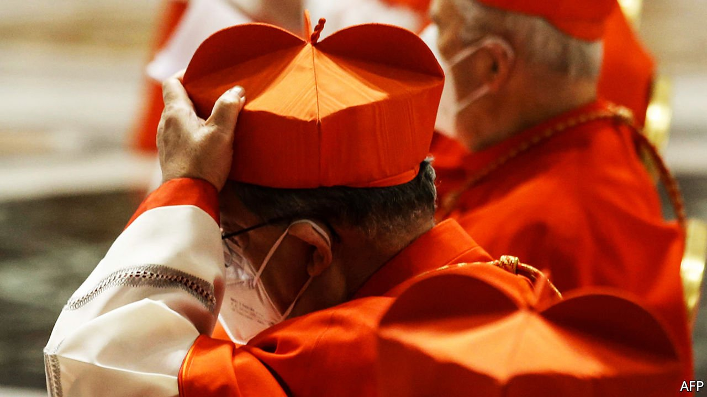

###### Vatican rocked

# A cardinal goes on trial 

##### Not something you see every day 

 

> Jul 10th 2021 

VATICAN SCANDALS are nothing if not colourful. The latest involves claims of extortion, a kidnapped nun, and a security expert alleged to have frittered prodigious amounts of the Holy See’s money on luxury goods and services.

On July 3rd a Vatican judge sent ten people, including a cardinal, Angelo Becciu, for trial on charges including embezzlement, abuse of office, extortion and fraud. All deny wrongdoing. The news was overshadowed by the following day’s announcement that Pope Francis was undergoing an operation to remove part of his colon. But it is the trial, due to open on July 27th, that is likely to leave a more enduring mark on his pontificate.


Cardinal Becciu had been the second most powerful official in the Holy See’s bureaucracy, as deputy secretary of state, a friend of Francis and once seen as his possible successor. Among his fellow defendants are the former president and director of the Vatican’s financial regulator. The indictments suggest Francis will spare no one in his determination to cleanse the Vatican’s murky finances. But they also raise questions about his methods.

The prosecutors have wound three strands into one trial. The first, which prompted the cardinal’s dismissal last year, relates to his payment of €100,000 ($118,000) to a diocesan co-operative run by his brother. The second concerns his relationship with Cecilia Marogna, whom he hired as a consultant and into whose firm his office allegedly funnelled €575,000. The money was meant for operations that included securing the release of a nun kidnapped in Colombia. The prosecution says much of the cash was spent at places like Prada and Louis Vuitton and in spas.

Central to this tangled skein is a property deal. Cardinal Becciu is alleged to have inspired the Secretariat of State’s investment of €350m in a commercial property in London. Structured in a highly complex way, the money was invested through a fund operated by a London-based Italian financier who is among those charged. The secretariat, using money largely donated by the faithful, originally took a minority stake. But, dissatisfied with the arrangement, it decided in 2018 to buy the entire property, and turned to another Italian intermediary, Gianluigi Torzi, who pocketed a €15m fee the Vatican’s prosecutors claim was extorted. The Vatican’s financial regulator, which became involved in negotiating with Mr Torzi, is accused of exceeding its remit and failing to report the transaction to the prosecutors.

Whether it is wise to put regulators on trial is one worry. Another is whether the defendants can get a fair hearing: their lawyers were given just 24 days to respond to a 487-page charge-sheet. A third is whether the Vatican is shifting the blame. According to Mr Torzi, the pope knew of his involvement; and that his right-hand man, the secretary of state, Cardinal Pietro Parolin, approved it. Tricky, your Holiness. ■

