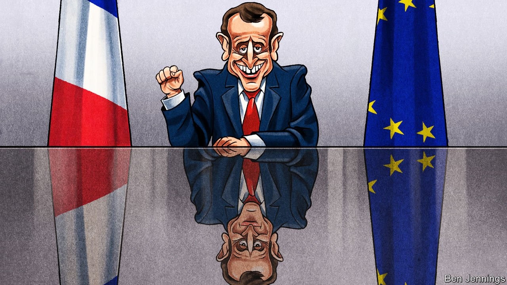

###### Charlemagne

# Emmanuel Macron, surreptitious socialist 

##### The French president, seducer of the right, has embraced big government 

 

> Jul 10th 2021 

THE TONE was sharp. Both hands were thumped testily on the table. The water glass trembled. “We’re putting a mad amount of dosh into social benefits!” cried Emmanuel Macron, sitting with his advisers upon silk-upholstered chairs in the Elysée palace. The video, posted unapologetically by an aide, went viral. This was in 2018, only a year into his presidency, and confirmed what many of the French already suspected. Their new president—a former investment banker, who scrapped the wealth tax and picked one (and later another) centre-right prime minister—was a right-leaning liberal who secretly sought to reward the rich and demolish the modèle social, France’s cradle-to-grave welfare state.

The image endures. The president is still linked in the French mind to looser labour laws, an end to special pension rights for railway workers, and the longest strikes since 1968. In protest at his proposed (and later shelved) general pension reform, these seemed to bring France to a standstill, just weeks before the pandemic really did. Tough laws on security and Islamist extremism appeared to confirm a shift to the right. Today Mr Macron is muttering again about tightening pension rules to keep the French at their desks until later in life. France, a land of slow dining and swift indignation, is bracing itself for the worst. To revive pension reform now, said Laurent Berger, a (moderate) union leader, would be “totally crazy politically” and “socially explosive”.


But what if, for a moment, the conceptually minded French were to set aside the boxes into which they so eagerly confine their politicians and take a closer look at what has also been going on? Those on the left who think the president has shamelessly betrayed all their ideals may find the evidence challenging. For Mr Macron has turned into something of a closet socialist.

The most visible evidence of the president channelling his inner Mitterrand is to be found in his new relationship with the public purse. When the pandemic struck, Mr Macron borrowed a turn of phrase from Mario Draghi, vowing to spend “ quoi qu’il en coûte (whatever it costs)” to fight it. Since then he has, in his own words, “nationalised” wages and firms’ operating accounts, spending ten times more last year to keep firms and furloughed workers going than France ever earned in a year from the old wealth tax.

Macronian handouts have proliferated: €300 ($354) for 18-year-olds to spend on “culture”; an extra €150 for those on benefits; up to €650 a month more for health workers; university meals capped at €1; free breakfasts at schools in deprived areas; free sanitary products for female students; an extra €100 a month for retired low-income farmers—a proposal, incidentally, from none other than the Communists. “We’re catapulting billions” of public money all over the place, declared Adrien Quatennens, a hard-left deputy, as if unable to decide whether to applaud or disapprove.

None of this, of course, is unique to France. Joe Biden’s stimulus plan dwarfs Mr Macron’s. Yet, before the pandemic, France was not only more generous and better at correcting inequality than America (not difficult). As a share of GDP it also outspent all the Nordic countries on social programmes (a lot harder). Mr Macron, in other words, has succeeded in expanding an already highly socialised economy—and in doing so pushed France’s public-debt levels way above the current high European Union average.

Less noticed is a growing corpus of progressive rights and rules Mr Macron has also introduced: a doubling of guaranteed paternity leave to four weeks as of this month, with one week compulsory; fines for firms that fail to close the gender pay gap; the right for gay women to free fertility treatment, a historic first for France.

Abroad, Mr Macron is often judged a solo provocateur, out to impose France’s views while claiming to speak for Europe. Less well known is his Gordon Brown-like record of championing progressive multilateral causes, including those now credited to Mr Biden, from a global minimum corporate-tax rate (a Macron pledge in 2017) to vaccines for Africa. “Coming from the left,” says Clément Beaune, his Europe minister, “I don’t have any sense at all that he has betrayed the social-democratic tendency.”

Why, if this is true, does none of it alter judgments of Mr Macron’s politics? The answer may lie in what psychologists call cognitive dissonance. The president is an elite, tax-cutting ex-banker who recruits from the right; ergo, he cannot also be a lefty. Contradictory evidence confuses. In his well-cut suits and shiny leather shoes, Mr Macron simply looks an improbable defender of the downtrodden. When, in full presidential dress, he turned up to an online youth video studio and talked about the need to combat “menstrual precarity” among the homeless, viewers were dumbstruck. Was this the same president who rejects woke culture, and once haughtily told a gardener to just “cross the road” to find a job?

Centre of attention

Perhaps such dissonance is what Mr Macron seeks. Ahead of the presidential vote in 2022, France’s centre of political gravity has shifted to the right. This, not the left, is where his toughest competition will come from. Mr Macron’s nod to the left is studiously mild by French class-warrior standards, and in line with his intellectual roots. If anything he is reconnecting not with Mitterrand but Michel Rocard, the Socialist ex-president’s centre-left prime minister and a mentor (among many) to the younger Mr Macron.

If Mr Macron gets no credit for progressive policies, this may also be intrinsic to his project. Vowing to be “neither on the left nor the right”, he is forever caught between inflated expectations on both sides and inbuilt dissatisfaction at the compromises pragmatic politics impose. Such is the lot of the radical centrist. Yet the contradictions may also quite suit a country that thinks it prizes theoretical purity, but is actually often happy to live with messy compromise. Unappreciated progressive, imperfect liberal, implausible conservative: Mr Macron’s policy mix may work well enough in practice, even if not in theory. Vive la France! ■

