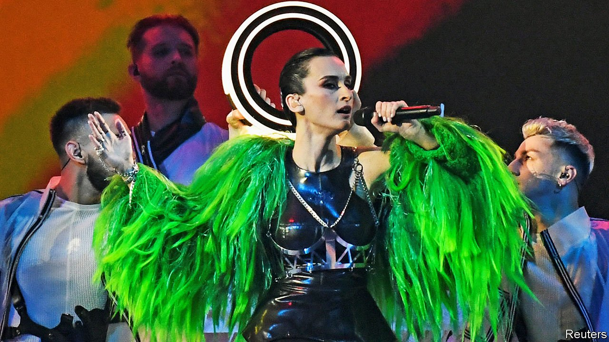

###### Summer of fun

# European folk festivals reboot as covid-19 ebbs 

##### From baptising horses to building human towers, odd traditions revive 

 

> Jul 10th 2021 

IN NORMAL YEARS, on Trinity Sunday (eight weeks after Easter), thousands of denizens of the Belgian city of Mons chase an enormous plastic dragon around the town square until a local, dressed as St George, arrives on a horse and kills it. The procession, known as the Ducasse de Mons or simply Doudou, originated in the 14th century to celebrate the end of an outbreak of plague. But for the past two years the Doudou has been cancelled by a new plague, along with most of Europe’s traditional carnivals and festivals.

This summer, with vaccinations beginning to tame covid-19, the continent’s folk gatherings are coming back to life. In June Swedes staged scaled-back versions of their Midsommar solstice celebrations. (Unlike the film of the same name these did not involve tossing old people off cliffs, though parliament did toss out the prime minister.) In Norway the Sami, an indigenous Scandinavian people, will hold their annual Riddu Riddu art and music festival, this time with new additions such as a seminar on sexuality. The village of Goudelin, in Brittany, plans to resume its peculiar mid-July practice of driving its horses into a pond and baptising them.


Many festivals have roots in Christian or pagan rites, as with the festa major of Vilafranca in Catalonia in late August, which honours the town’s patron, St Felix. Why his celebration should involve the world’s biggest human-tower competition is not clear. Others have lost their religious connections. Manresa, just up the road from Vilafranca, ended its August procession of holy relics (bits of saints’ bodies) decades ago, replacing it with a street carnival involving costumed demons and fireworks.

Such customs give people a sense of belonging. More prosaically, they bring in tourists. They are also often linked to politics. The Lemko Watra, a festival in July devoted to the music and culture of southern Poland’s Lemko minority, got started in the 1980s, when celebrating ethnic traditions was one of the few types of cultural non-conformism that the communist regime tolerated. Similarly, Soviet Ukraine preserved its summer-solstice festivals, called Ivan Kupalo, and its weirdly shrill folk music. That hypnotic traditional vocal style helped Go_A, a Ukrainian group, win the second-most audience votes this spring at Europe’s biggest annual folk gathering of all: the Eurovision Song Contest.

