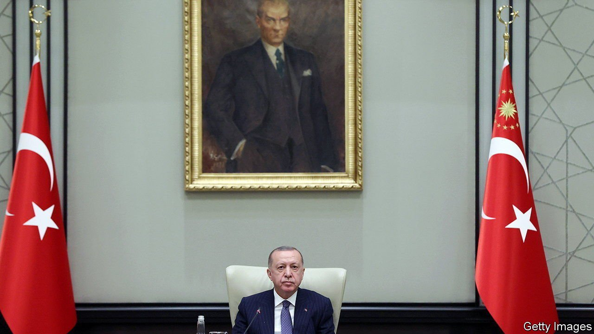
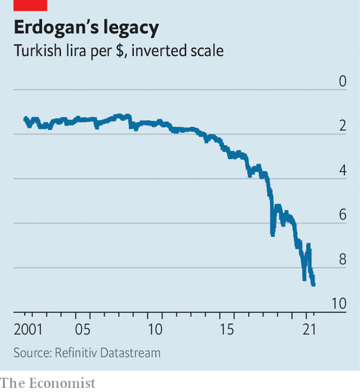

###### Trouble in Turkey

# Recep Tayyip Erdogan’s image and Turkey’s economy are both taking a battering 

##### As belts tighten, Turks are less forgiving of scandal in high places 

 

> Jul 10th 2021 

FOR A MOMENT, Turkey’s President Recep Tayyip Erdogan had reason to hope that the storm unleashed by Sedat Peker, an exiled mobster with a YouTube account and an axe to grind with Mr Erdogan’s government, would blow over. Mr Peker, who has taken to social media to sling accusations of corruption, drug- and arms-trafficking, and murder at senior members of the ruling Justice and Development (AK) party, announced on June 20th that he would temporarily stop uploading new videos. The mob leader, who is thought to be living in the United Arab Emirates, claimed local authorities had warned him he risked being assassinated.

Mr Erdogan’s relief was short-lived. Only a day after Mr Peker’s revelation, America’s Department of Justice announced that police in Austria had arrested a Turkish businessman, Sezgin Baran Korkmaz, who featured in some of the videos. The department accuses Mr Korkmaz of laundering more than $133m of proceeds from a fraud scheme through accounts in Turkey and Luxembourg. The businessman is alleged to have teamed up with two members of a polygamist sect based in Utah and a fuel-company owner to defraud America’s treasury of hundreds of millions of dollars by filing false claims for renewable fuel-tax credits. Mr Korkmaz and company allegedly spent the money on an airline, hotels in Turkey and Switzerland, seafront property in Istanbul, and a yacht 46 metres long. They also tried to cultivate a relationship with Mr Erdogan. Jacob Kingston, who pleaded guilty to his part in the scheme two years ago, was once photographed with the Turkish president at an “Invest in Turkey” event.


Mr Korkmaz, who denies any wrongdoing, may now have some interesting conversations with American investigators. Mr Peker claims that Mr Korkmaz, who is also under investigation in Turkey, slipped out of the country late last year thanks to a tip-off by the interior minister. The mobster has also leaked the names of a number of government heavyweights, including Mr Erdogan’s last prime minister and the head of Turkey’s defence-procurement agency, as well as judges, police chiefs and pro-government journalists, who he says stayed at Mr Korkmaz’s fancy hotel, mostly free of charge.

 


The chances of an official inquiry into Mr Peker’s claims are slim. But Mr Erdogan has been unable to take the sting out of the scandal. AK supporters who stomached evidence of corruption when the economy boomed are less forgiving today, as surging prices and a collapsing currency devour their earnings. The inflation rate shot up to 17.5% in June, the highest level in two years. The lira has dipped to new lows against the dollar (see chart), most recently after Mr Erdogan said he had asked the central bank to begin cutting interest rates. The World Bank suggests that the economic crisis, compounded by the covid-19 pandemic, pushed as many as 1.6m Turks into poverty last year alone.

For the first time in years, Turkey’s president appears vulnerable. Support for his AK party has sunk to 26%, the lowest since its launch two decades ago, according to a poll by Turkiye Raporu, a research group. If a presidential election were held today, Mr Erdogan would lose to any of the three main potential contenders, surveys suggest. Elections are set for 2023. Fully 58% of Turks, as well as the main opposition parties, want them sooner.

Mr Erdogan also seems to be losing his touch. The Turkish strongman recently ordered state institutions to rein in expenditures and suspend property and construction projects. (The office of the presidency was, of course, excluded.) Days later, a handful of newspapers published images of a presidential estate valued at 640m lira ($74m), complete with a swimming pool and a beach shaped to resemble the Turkish crescent, built for Mr Erdogan on the country’s Mediterranean coast. For a leader who still proclaims himself a man of the people, this is hardly a good look. ■

