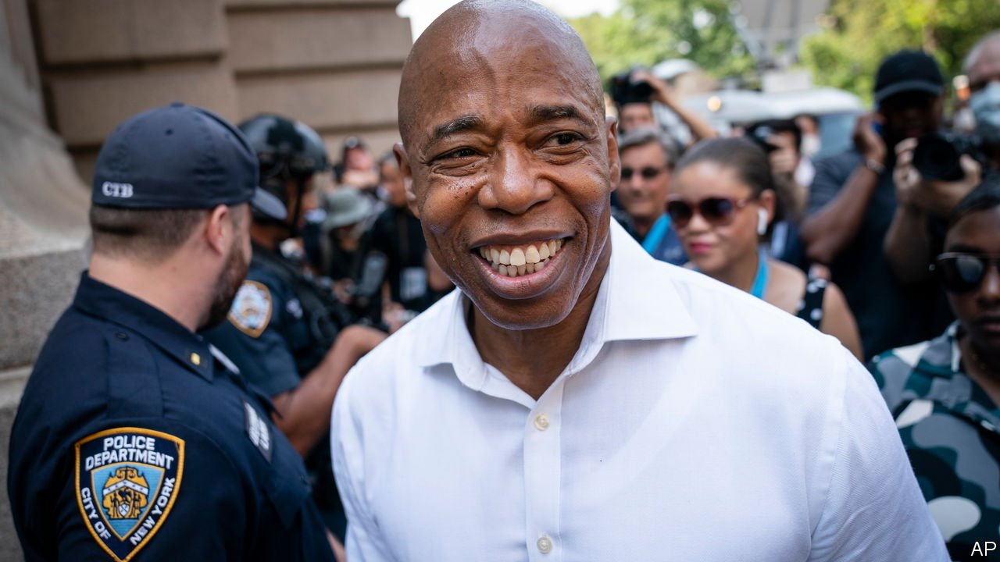

###### New cop on the beat

# Can Eric Adams turn around New York? 

##### The man likely to be in charge brings sanity and a level head to the task 

 

> Jul 10th 2021 

TO BE MAYOR of New York City is no easy task. Bill de Blasio, the departing incumbent, was once a progressive darling. However, his unique political talents—a penchant for self-aggrandisement and a smug disdain for dealing with the city’s problems—along with constant bickering with the governor, rendered Mr de Blasio ineffectual and widely loathed. He will soon be limping out of Gracie Mansion, leaving behind some daunting problems for his successor. Economic growth is choked by regulation and insufficient house-building. There has been a dramatic increase in shootings and homicides. Were it not for a timely federal bail-out, the city would be facing severe cuts to its budget.

The man New Yorkers will choose to pick up these pieces is Eric Adams, a black, vegan, ex-police captain from Brooklyn. In a crowded field, Mr Adams narrowly won the Democratic primary with support from a broad coalition of non-white, non-Manhattanites. As with President Joe Biden, his supporters were the working class, the elderly and minorities. He promises to be mayor for the Bronx and Brooklyn, not the Upper West Side.


His victory in the primary election, and almost guaranteed triumph in the general one to come, is a rebuke to the progressive zeal that has overtaken America’s largest cities since racial-justice protests began more than a year ago. This is a growing movement that is almost contemptuous of the industries that generate urban prosperity. It sees specialised schooling for gifted pupils as oppressive; it interprets pathological housing markets as signs of too little governmental interference rather than too much; and it argues, in contradiction of common sense and political reality, that “defunding the police” is the solution to rising crime. Its most enthusiastic adherents seem to be citizens comfortably insulated from both violence and from need.

Mr Adams is not their avatar. A former cop himself, he wants neither to defund nor abolish the police department, but to reform it. Even before his run for office, Mr Adams had been agitating to make it easier for officers who brutalised citizens to be sacked. But he resists the patronising attitude, adopted by some progressives, that resurgent violent crime visited largely upon the poor is an acceptable trade-off on the path to social justice.

Rather than increase the city’s budget by 25% in real terms, as Mr de Blasio did, Mr Adams has plans to trim its expansive bureaucracy. He says he wants to repeat the $1.5bn reduction in spending that Michael Bloomberg managed while he was mayor.

The problem of high-cost cities largely reflects a lack of housing—something that no “rent stabilisation” scheme, however elaborate, can paper over. From 2010 to 2019, for every five new jobs created in New York, only one new unit of housing was built. Mr Adams is right to say that new development must be rapidly approved in the city—and that the burden of change should be borne not just by poor neighbourhoods but also by posh ones like the charming, absurdly low-slung West Village.

It is folly to place too much faith in anyone who aims to run America’s largest city. Even Mr de Blasio once mustered some enthusiasm. Mr Bloomberg’s admirable technocratic impulses got him mired in unending debates over taxes on fizzy drinks.

Unfortunately, Mr Adams’s judgment also has its flaws. The rumour that he lives part-time in New Jersey did not die even after he let the press tour his sparse townhouse. Incorrect financial filings do not inspire confidence in a man who is about to take over a $100bn operation. As a machine politician, he owes. Alarmingly, during his campaign, he labelled an alliance between two of his opponents in the primary an attempt to suppress black votes in the city—a cheap, false and incendiary attack.

Getting New York back on track will require sustained and skilful leadership, not hollow displays of populism. Gotham has already endured enough of those. ■

