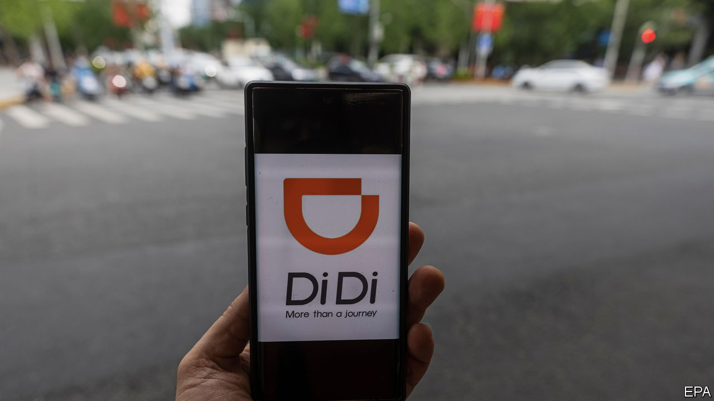
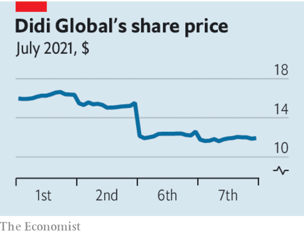

###### Hit and run

# China’s communists take control of tech 

##### The attack on Didi shows how high a price the Communist Party puts on control 

 

> Jul 10th 2021 

ONE INTRIGUING question about China is whether it can combine thuggish, autocratic politics with the predictable rules and property rights that entrepreneurs and capital markets need to thrive. The government’s recent attack on Didi Global, a Chinese ride-hailing firm that has just listed its shares in New York, suggests not. It is a warning to investors around the world—and to anyone hoping to make their fortune by setting up in China.

Didi is one of China’s superstar firms, with 493m users (more than Uber), 15m drivers and a presence in Brazil and Mexico. It listed its shares on June 30th, raising cash from global investors and valuing the firm at $68bn. Its prospectus contained 60 pages of “risk factors”, including a regulatory crackdown, that most investors snoozed over. But almost immediately one of them turned up.


It seems that Didi had pursued the listing against the wishes of the Cyberspace Administration of China. On July 4th the regulator struck back, saying that Didi had violated rules on collecting personal data, and banned it from mobile app stores in China. That sent Didi’s share price tumbling by over 20%. Marco Rubio, a hawkish American senator, said that it was “reckless” to allow Didi to float in New York.

China’s tech industry has been one of the most dynamic areas of the global economy in the past decade. Hundreds of large startups have yet to follow giants such as Alibaba, Tencent and Didi by listing their shares. The intersection of e-commerce, payments and “super-apps” means that most daily transactions in China can take place on a smartphone. Global capital and talent have been critical to the industry’s rise. Didi has big foreign shareholders, including SoftBank and Uber, and owns a stake in Grab, a South-East Asian rival. Many of its top brass were educated at Western universities and have worked at American firms. Almost all the largest Chinese tech firms are listed in America or Hong Kong rather than the mainland. They have cosmopolitan executives and benefit from a flow of ideas across borders.

 


The crackdown began last year when Chinese regulators cancelled the $300bn flotation of Ant Group in Hong Kong and Shanghai at the last minute. The government went on to threaten other tech firms and to humble tycoons, not least Jack Ma, the co-founder of Alibaba and founder of Ant.

All governments worry about data privacy and monopolies, but China’s interventions signal a systematic attack on tech by the party. On July 7th Bloomberg reported that China might re-examine the use of “variable-interest entities”, a legal structure that underpins almost all foreign investment in Chinese tech. The message is clear: powerful tech firms must defer to the Communist Party, their bosses should keep quiet and foreign owners’ property rights can be violated.

An optimistic view is that the crackdown is political theatre. Global firms have often been burned in China only to recover. South Korean and Japanese companies have faced boycotts and protests that later faded away. China’s government shuns foreign banks for a while, to punish them for perceived errors, but eventually welcomes them back.

This time may be different. Foreign investors have lost hundreds of billions of dollars, which may permanently alter the supply of global capital to China. To fill that hole, Chinese firms will depend on less sophisticated mainland markets. Once again entrepreneurs and investors must weigh and reweigh the vast rewards of China’s markets against the risks of its opaque laws, bullying officials and paranoid rulers. If you were risk-hungry, unorthodox and keen to start a business that breaks the mould, would you still choose to do so in China? ■

