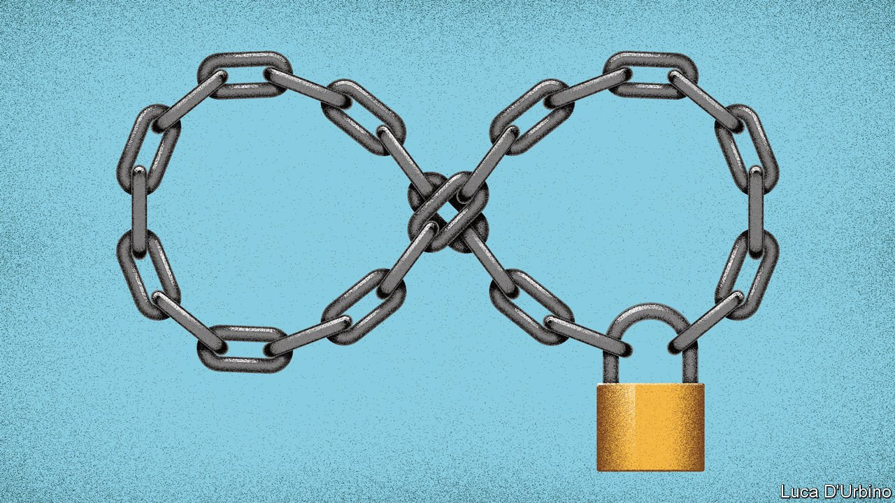

###### Pointlessly punitive

# Why life without parole is nearly always too long 

##### Keeping the elderly imprisoned is expensive and often pointless 

 

> Jul 10th 2021 

HOW SHOULD societies punish those who commit the worst crimes? As fewer countries use the death penalty, . The number of people jailed for life worldwide rose by more than 80% between 2000 and 2014, to nearly half a million.

And a good thing, too, liberals and conservatives might agree. As a punishment for heinous crimes, life in prison strikes many as a sensible compromise between the inhumanity of the death penalty and the leniency of letting the guilty eventually walk free. The success of that argument is one reason why fewer people are now being put to death.


In fact, life sentences can also count as acts of punitive excess. They keep people penned up long after most of them have lost the capacity or inclination to be violent. They are also a poor deterrent. Potential criminals are more effectively restrained by a high likelihood of being caught than by a severe punishment.

Although, in America at least, it is cheaper to lock people up for life than to execute them (because death-row cases involve endless legal wrangling), old codgers make costly prisoners, because of their health problems. By one estimate, they are three times more expensive than younger inmates. Money spent keeping 60- and 70-year-old ex-thugs behind bars for ever would nearly always prevent more crimes if it were spent instead on better policing, or on rehabilitation.

Life sentences take many forms, of varying severity. Critics should focus on the substance, not the label. Sentences that offer no possibility of parole are far harsher than those that offer a chance of release, however distant. Some ultra-long sentences, by contrast, are no different from life. Alaska does not impose life sentences, but it does jail people for 99 years.

Those who want to limit prison terms should start with the cruellest and most egregious. These include sentences imposed on children, or for non-violent crimes, as under “three strikes” laws in some American states. Lifers should not be singled out for harsh treatment as they are in Ukraine, where some are locked in their cells for 23 hours a day. Nor should life sentences be mandatory for particular offences, which bars courts from taking into account any mitigating circumstances.

What about when crimes are shockingly depraved or cost many lives? The judge who sentenced Brenton Tarrant for murdering 51 people in 2019 at two mosques in Christchurch, New Zealand, a country that abolished the death penalty in 1989, had no qualms about throwing away the key. “Your crimes are so wicked that even if you are detained until you die, it will not exhaust the requirements of punishment,” he told Mr Tarrant.

That view is understandable. And yet even in this case life without the possibility of parole is wrong. No amount of time can expiate Mr Tarrant’s crimes. But prisons are about harm prevention, not expiation.

A better approach is that of Norway. It sets a maximum sentence of 21 years. However, if a convict is still judged to be a danger to society after that time, he can be detained until he is not. Such a rule protects potential victims while also offering the criminal a measure of hope and a reason to reform.

Keep the keys

In 2013 the European Court of Human Rights ruled that all prisoners are entitled to the prospect of eventual release. For a few who remain dangerous in their dotage, such as orchestrators of genocide, that may be too big a risk. But for most murderers, 20-25 years behind bars will prove long enough. ■

