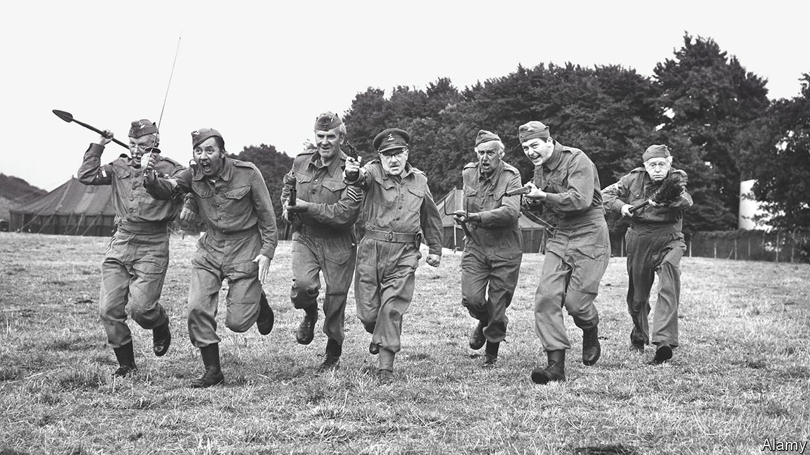

###### On literacy, military reserves, working days, Kenneth Kaunda, historical fiction

# Letters to the editor 

##### A selection of correspondence 

 

> Jul 10th 2021 


The ABCs of education

Regarding “” in teaching (June 12th), effective early reading instruction does indeed include direct and explicit phonemic awareness (sound discrimination) and phonics (sound to letter correspondence) applied to a limited vocabulary of high frequency words. But these alone are insufficient for the transition to fluent academic reading. Such fluency depends not only on the basics but also on vast and deep pools of vocabulary knowledge. Vocabulary learning unfolds gradually over time and is generally not given enough attention in schools. Whereas a daily newspaper requires about a grade-nine reading level (14-15 years old) The Economist is written minimally at undergraduate degree level, and requires a firm grip of vocabulary breadth and depth.


Literacy learning is a complex endeavour. Instruction needs to be explicit, programmatic, developmentally progressive and sustained over time as children become adept at word study and morphology. Good word-attack strategies include phonics (sound the word out: p- o- ll- u- tion) and knowledge of Greek and Latin root words (transcribe, transmit, transport). All of this can be engaging and fun, too. Children delight in the sheer joy of documenting and sharing their thoughts and opinions, and in their growing sense of agency when they master reading and writing.

Humans are not evolutionarily wired for literacy development (literacy is a relative latecomer, existing for only 5,000 years or so). This means repurposing primitive models for pattern recognition and categorisation; sequences, size and shape, for example, in the service of letter recognition, spelling and numeracy. Starting at an early age, play with blocks, puzzles, loose parts, pencils and crayons, scissors and paper help lay the foundations for literacy by engaging the hand-brain complex and creating the neuro-circuitry and muscle memory for meaning and development. Barking at the page without making meaning of the print does not ensure sustained reading comprehension. A balanced approach is necessary.

PROFESSOR HETTY ROESSINGH

Werklund School of Education

University of Calgary

 


Expand the reserves

As an American naval officer and aviator with a combination of active duty and reserve service your article on military reservists caught my attention (“”, June 19th). Capable and ready reserve forces will remain vital for national and collective defence. There is simply no proper substitute and any attempt to work around this reality is dangerously foolish.

One of the greatest challenges for military chiefs is to recruit trained and rapidly available personnel across the spectrum of capabilities, ranging from logistics and mess services (an army still runs on its stomach) to stealth-fighter pilots and cyberwarfare.

Relatively few citizens of Western countries (America and Britain are notable here) have served. This lack of a direct connection to military service will further diminish an interest in the armed forces by younger people. It is a concerning, downward spiral, though a return to conscription is unlikely. Reservists in significantly expanded numbers and capabilities may be a practical and necessary means of countering these adverse trends.

JEFFREY PETIT

Commander

US Navy Reserve (Retired)

San Diego

 


Mid-week special

Bartleby’s column () on picking the best days to work from home prompted a memory from my time working in the Soviet Union in 1976. I bought a chess timing-clock from a store in Moscow, which did not work. When I told my Soviet colleagues, one of them wanted to know what day of the week it was made on?

During that era, appliances left the factory with a ticket indicating the day of the week they were assembled. Knowledgeable shoppers would check those tickets and knew to avoid products made on a Monday or a Friday: Friday workers were thinking of the weekend and Monday workers were hungover. Quality products, if at all, were likely to have been made on a Tuesday, Wednesday or Thursday.

PHILIP RAKITA

Philadelphia

 


Ditching colonial ties

Your obituary of Kenneth Kaunda () was informative and fair. However, the founding president of Zambia might have found the photograph you used of him wearing a tie to be insulting.

In 1968 the house in Chilenje, Lusaka, where the Kaunda family had lived during part of the struggle for independence contained a display illustrating its history. As director of the Zambia monuments commission, I accompanied the then-president on a tour. Seeing a photograph of himself similar to that in your obituary, he said to me: “I remember that occasion. It was the last time I wore a necktie. I resolved that, once Zambia is free, I would never do so again.”

So far as I am aware, he never did.

PROFESSOR DAVID PHILLIPSON

Skipton, North Yorkshire

 


Facts and fictions

Your review of Alberto Angela’s biography of Cleopatra and the phenomenon of imaginative “history” writing (“”, June 12th) raises an intriguing issue of intellectual-property law. Copyright protects creations of the mind but it does not protect historical facts. So what happens when a historian presents the fruits of his or her imagination as fact? Is there copyright in such creations?

The Federal Court of Canada considered this recently in a lawsuit where the author of a historical book was alleged to have infringed copyright in an earlier book purporting to tell the “true story”. Both books were about the Black Donnellys, a notorious Irish Catholic immigrant family involved in a violent feud that led to the killing of five of its members by a mob in 1880. The heirs of the author of the original book argued that the later book copied fictional embellishments in the original. The author of the later book argued that he assumed the embellishments were factual because they were credibly presented as such and that, since he used different words to tell the same story, he couldn't fairly be accused of copyright infringement.

The court agreed, ruling that copyright does not protect plausible assertions of facts, no matter how imaginative they later turn out to be. The court distinguished this from tales like “Gulliver’s Travels” or “The Blair Witch Project”, where representations that the story is “true” are clearly just for fun.

It is a sensible decision. After all, as your review noted, all that “history” has ever been is what others, like Tacitus or Herodotus, say happened, whether it actually happened or not.

JOHN SIMPSON

Principal

Shift Law

Toronto

I see nothing wrong with writers using their imagination to make classical histories readable. As Pliny the Younger observed in ancient Rome, “There is no lack of readers and listeners; it is for us to produce something worth being written and heard.”

DAVE GLANTZ

Fairfax, Virginia

