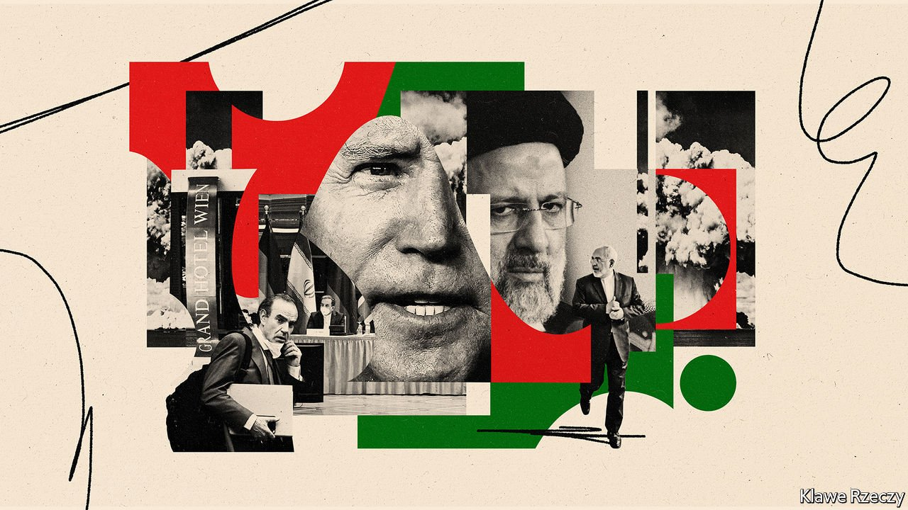
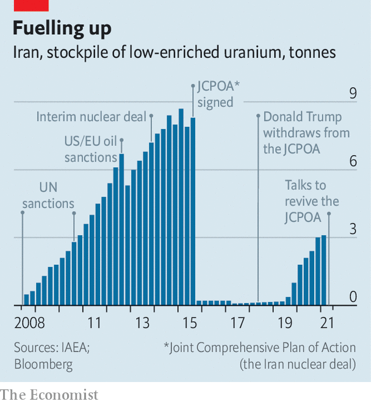

###### Enriching talks

# Can America and Iran revive their nuclear deal? 

##### An agreement is said to be close, but there are plenty of obstacles 

 

> Jul 10th 2021 

THE GRAND HOTEL on Vienna’s Ringstrasse, the city’s elegant main boulevard, is a felicitous spot for nuclear diplomacy. It is not just the opulent surroundings or the unlimited coffee. The hotel was also the headquarters of the International Atomic Energy Agency (IAEA), the world’s nuclear watchdog, for 22 years until 1979. Yet the diplomats who have gathered there for six rounds of talks since April, most recently on June 20th, have had little luck so far. And time may be running short.

 


America and Iran—indirectly, via Britain, China, France, Germany, Russia and the European Union—are discussing how to revive the multinational nuclear deal, known as the Joint Comprehensive Plan of Action (JCPOA), that was signed in 2015 and abandoned by President Donald Trump three years later. In response to American sanctions, Iran has breached the deal’s provisions by testing advanced centrifuges and accumulating enriched uranium, among other forbidden steps. The IAEA estimated in May that Iran had produced over 3,000kg of uranium enriched up to 5% purity (see chart), enough for several bombs if enriched further. Over 70kg is now also enriched to over 20%, which is most of the way to weapons-grade.


Over the past year America, under President Joe Biden, and Iran have each said that they are willing to return to the terms of the original deal if the other does so, too. “We think almost all the agreement documents are ready,” said Iran’s deputy foreign minister after the latest round. There is “a new level of optimism”, enthused the EU’s envoy to the UN on June 30th. Russia’s foreign ministry reckons that a deal may be done by July 14th, the JCPOA’s sixth anniversary. Yet reinstating the original terms is not as easy as it sounds, since circumstances have changed so much in six years.

It does not help that Iran is in the midst of a political transition. Ebrahim Raisi, a hardline nationalist, is due to replace Hassan Rouhani, a pragmatist, as Iran’s president on August 3rd. Mr Raisi and his allies are more hostile to America and the West than the current government is. That does not mean a deal is impossible—it was, after all, another hardline president, Mahmoud Ahmadinejad, who began the talks that eventually led to the JCPOA. But Mr Raisi’s election does complicate things.

Mr Rouhani’s government has “very little incentive” to devote its last month in office to frantic diplomacy, says Aniseh Bassiri Tabrizi of the Royal United Services Institute, a British think-tank. Any political rewards would be distant, since the next election—for Iran’s parliament—is not due for three years. Nor is there any guarantee that the new government will fully implement any deal it inherits, says Ms Tabrizi.

Iran’s domestic politics are not the only hurdle in the way of an agreement. “We still have serious differences that have not been bridged,” warned a senior American official speaking anonymously to reporters last month. “Whether it’s the nuclear steps that Iran needs to take to come back into compliance, the sanctions relief that the US will be offering, or the sequence of steps that both sides would be taking.”

Both sides now accept that they could return to the deal in a series of concurrent steps rather than waiting for the other to do everything first. But Iran has said it wants America to remove all sanctions imposed by Mr Trump. America retorts that it will only lift those covered by the JCPOA. In March the Biden administration imposed new sanctions on two members of the Islamic Revolutionary Guard Corps. It is those sorts of sanctions, “economically inconsequential but highly politically sensitive”, that are most challenging, says Henry Rome of the Eurasia Group, a consultancy. They include America’s labelling of the Revolutionary Guards as a terrorist group, and sanctions against Mr Raisi himself.

On June 30th Majid Takht Ravanchi, Iran’s ambassador to the UN, said that the country wanted “assurances that...the US will not, once again, withdraw from the JCPOA”. American officials say it would be impossible to provide such certainty, not least because the JCPOA could not be turned into a binding treaty without support from two-thirds of the Senate. Republicans, who make up half the assembly, bitterly oppose the deal. In any case, Mr Trump also showed that a president could walk away from long-standing treaties.

Western countries have their own complaints. They argue that although Iran has portrayed its breaches of the deal as remedial and reversible, it has also gained valuable knowledge by, among other things, operating advanced centrifuges and manufacturing uranium metal (the solid form used in reactors or bombs, as opposed to the gaseous compound used during enrichment). The JCPOA was supposed to defer such activity to later years, thus slowing Iran’s nuclear progress. America now wants Iran to agree to follow-on talks that would not only extend the deal’s provisions but also cover issues such as Iran’s ballistic missiles and support for militant groups in the region. Mr Raisi says those things are “non-negotiable”.

The impasse is especially dangerous because Iran is determined to build up its leverage, not only by steadily expanding its nuclear activity, thus shrinking the time it would take to build a bomb, but also by threatening to make its programme less transparent. In February Iran repudiated several of the JCPOA’s tough inspection provisions, such as the installation of cameras at nuclear sites, but promptly agreed to a “temporary technical understanding” with the IAEA to preserve some access.

Those stop-gap measures were renewed twice but expired on June 24th, days after the latest talks in Vienna ended. Iran’s government has yet to decide whether to extend them—and hints that it may delete the data on cameras. The intention may be to make America sweat, but it certainly erodes trust. On July 1st Reuters, a news agency, reported that Iran had restricted the IAEA’s access to Natanz, its main enrichment site, following suspected Israeli sabotage there in April.

For all the positive talk emanating from Vienna, there is also anxiety about how high the stakes are becoming. Mikhail Ulyanov, Russia’s envoy, says renewing the Iran-IAEA understanding would ”avoid uncertainties which can have unjustifiable long-lasting negative effects”. Mark Fitzpatrick, a retired American diplomat, is blunter: “Iran is playing with fire.” ■

