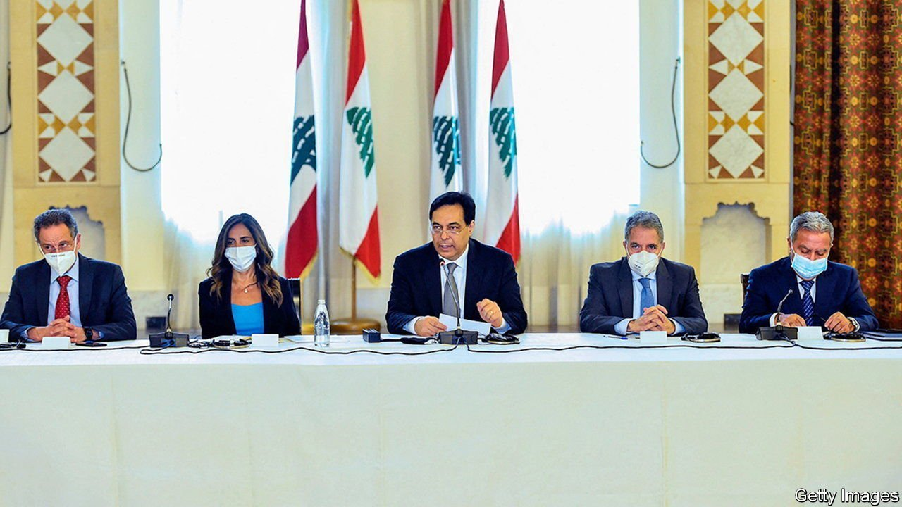

###### Calling for help

# Mired in crisis, Lebanon begs for foreign assistance 

##### But no one trusts parliament’s plan to aid the poor 

 

> Jul 10th 2021 

LEBANON IS “days away” from a “social explosion”. So said Hassan Diab, the acting prime minister, on July 6th. The country has been mired in a crisis that has seen the value of the local currency plummet and left much of the population short of food, fuel and medicine. “I am calling on kings, princes, presidents and leaders of our friendly countries, and I am calling on the United Nations and all international organisations…to help rescue Lebanon from its demise,” Mr Diab told a group of foreign diplomats.

But foreign leaders are not listening. Most do not trust Lebanon’s politicians. Mr Diab has been serving in a caretaker role since a devastating explosion at Beirut’s port last August (the result of government neglect). For nearly a year the country’s politicians, divided by sect and notoriously corrupt, have failed to agree on a new government—and failed to make reforms called for by foreign leaders.


Even when parliament appears to do something right, there are doubts over its intentions. Take its recently passed plan to replace unaffordable subsidies for food, fuel and medicine with a $556m programme of cash aid for the poor. In a sense it was following the recommendation of the World Bank, which predicted in December that Lebanon’s central bank (the Banque du Liban, or BdL) would soon lack the reserves needed to support the subsidy scheme. (The scheme had the BdL selling dollars to importers of the covered goods at below-market rates.) The World Bank was right and the BdL has been removing or cutting subsidies this year.

The old system could have been better targeted, as rich Lebanese consumed more of the subsidised goods than the poor. But the new system, yet to be implemented, is opaque. It is not clear who is eligible for the aid. Regardless, few people think Lebanon’s politicians will distribute it fairly. They have a history of doling out government largesse to their relatives and supporters (an election is scheduled for next year). Contracts go to the connected, leading to unreliable services. It is fitting that sweaty legislators passed the cash-aid programme in an assembly without working air-conditioning, the result of a decrepit and poorly managed power grid.

How the cash-aid programme will be funded is also an open question. The central bank could pay for it, but it is running low on reserves and printing more pounds would increase inflation, which is already sky-high. Outside funding may be an option. Lebanon could, for example, use aid that the IMF is giving to poor countries in order to help with covid-related economic slowdowns. The money is expected to be delivered by the autumn. Some officials want to reallocate loans already given by the World Bank for other purposes.

The World Bank probably would not mind if more of its money actually went to directly helping the poor. But it is running short of patience with the government. In January the bank agreed to lend Lebanon $246m to expand the social safety-net, including cash transfers for the poor. Feeding more money into that programme would be an option—if the government ever implemented it. It has been stalled for months because of a disagreement between the World Bank and Lebanese politicians over who gets the aid and how it is disbursed. In short, the politicians do not like the idea of World Bank oversight.

In the coming weeks the government is supposed to present a detailed plan on the funding and implementation of the new aid programme. But the Lebanese people are not holding their breath. Poverty is rising, basic services are failing and politicians appear more concerned with protecting the patronage system that contributed to the crisis. Is it any wonder that Mr Diab’s pleas have fallen on deaf ears? ■

