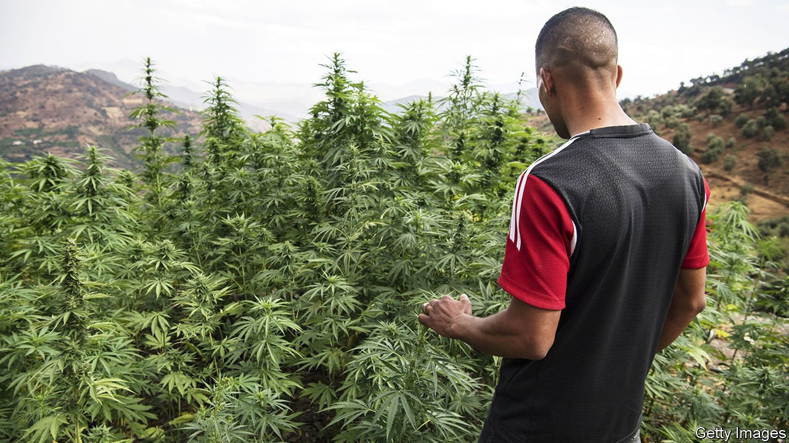
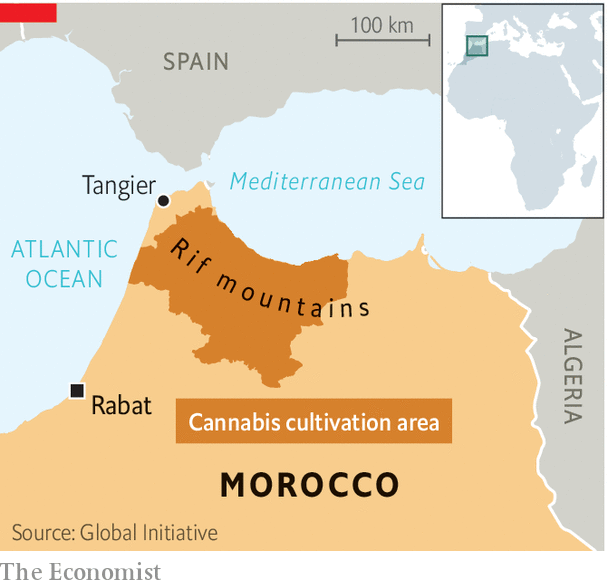

###### High in the mountains

# Morocco moves to legalise some cannabis cultivation 

##### But some pot farmers fear they won’t benefit 

 

> Jul 10th 2021 

FEW COUNTRIES produce more cannabis than Morocco, where locals mix it with tobacco and call it kif, meaning “supreme happiness”. The pleasure extends to Europe, where much of the cannabis ends up. Farmers in the Rif, a poor mountainous region in northern Morocco, produce most of the supply. They operate in a legal grey area. Growing cannabis is against the law in Morocco, but it is tolerated in the Rif.

A bill passed by parliament, but yet to be approved by the king, may clarify the situation, at least somewhat. It would legalise the cultivation, use and export of cannabis for medical and industrial purposes (such as for hemp in textiles). The proposed law, though, would not legalise cannabis for recreational use. And it would allow cannabis farming only in certain regions of the country, such as the Rif.


The Rif has little else going for it. “There’s no infrastructure, no schools, no hospitals, nothing—nothing except cannabis,” says Charif Adardak, who heads an NGO that promotes development in the Rif. It has long been a restive place owing to the government’s neglect and what locals call hogra (humiliating treatment by the state). The previous king, Hassan II, crushed a revolt there in the 1950s. His son, Muhammad VI, has been more conciliatory, backing development projects in the region.

But King Muhammad’s plans have not got very far. Large protests by Riffians in recent years have at times turned violent. The region still relies on cannabis production. The government, in turn, sees its tolerance of the trade as a way to buy peace.

 


One of the reasons Morocco is moving towards legalisation now is because in December the UN removed cannabis for medicinal use from its list of the most dangerous drugs. The proposed law will improve the lot of Riffians and free them from international drug-smuggling networks, says Abdelouafi Laftit, Morocco’s interior minister. Regulating the trade may also allow the government to curb environmental damage in the Rif, which has suffered from deforestation and soil degradation as farmers have adopted new, hybrid strains of cannabis.

Many cannabis farmers in the Rif think the government is blowing smoke. Some fear they will be run out of business by corporations or well-connected businessmen who are better able to navigate the rules. Farmers in the Rif are unaccustomed to growing cannabis to the strict legal standards that importing countries often impose on the medicinal sort.

Others worry about future competition from other regions. There isn’t enough demand for medical cannabis to keep even the Rif’s farmers in business. Cannabis is grown on 73,000 hectares of land in Morocco, says Tom Blickman of the Transnational Institute, a Dutch think-tank. Demand for medical cannabis might support between 5,000 and 8,000 hectares.

Demand is greater for industrial cannabis, but it is of lower value. Its production is “about quantity not quality”, says Mr Blickman. That’s bad for the Rif. Tucked away in the mountains, the region’s remoteness and inaccessibility make it an ideal place for illicit cannabis farming. But the production of industrial cannabis is easier in flat areas with better infrastructure that can support large farms.

People in the Rif are also frustrated that the proposed law does not provide amnesty for the roughly 48,000 farmers who have cannabis-related arrest warrants hanging over them. Some, though, see the law as a prelude to legalisation of recreational cannabis. That would make many Moroccans supremely happy. ■

