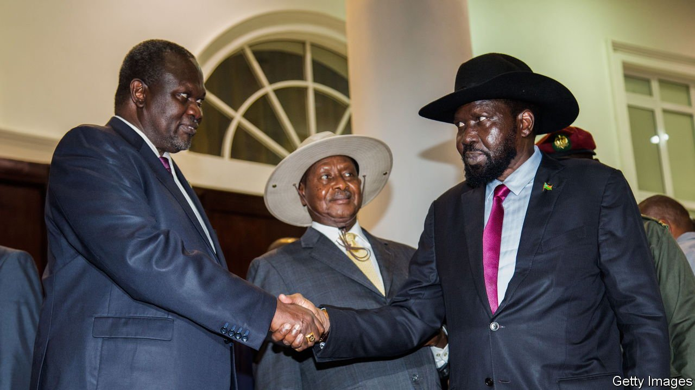

###### Unhappy birthday

# South Sudan’s second decade may be as troubled as its first 

##### Tumultuous wars shall kin with kin confound 

 

> Jul 10th 2021 

MOST NATIONS are born in a flurry of optimism. South Sudan was no different. Ahead of its independence day on July 9th 2011, Salva Kiir, the country’s first and only president, promised his people “a just, equitable and prosperous nation”. Unshackled from its former overlords in the north, the new state would be “united and peaceful” within three years, its founding fathers predicted.

If any nation deserved some slack, it was South Sudan. In the half-century before it seceded from Muslim-dominated Sudan its people had known little but war, famine and enslavement. A decade later, however, South Sudan is neither just, nor equitable, nor prosperous. Having scoffed at those who suggested that it would “slip into civil war as soon as our flag is hoisted” in his independence-day speech, Mr Kiir helped unleash one just two years later. It claimed perhaps 400,000 lives before a tenuous ceasefire in 2018.


The blame for South Sudan’s tragedy does not rest only on the shoulders of its leaders. The country’s Western backers, particularly in America, were ludicrously unrealistic about what a state created from scratch, with little infrastructure or national identity, could achieve.

Such was the naivety that, in the years before independence, some American officials took to handing out Milton Friedman’s “Capitalism and Freedom” to warlords preparing to swap their uniforms for suits. Others took up roles advising the new government on how to woo the foreign investment that would surely follow.

The American advisers have since slunk away. (One now runs a distillery in South Carolina.) Most foreign investors, after all, shy away from war-ravaged states. That South Sudan is ranked the world’s sixth-hardest place to do business by the World Bank and sits at the bottom of Transparency International’s corruption index may clinch the matter for any still wavering.

South Sudan’s leaders turned out to be neither the cuddly human-rights champions imagined by the American left, nor the market-loving Friedmanites hoped for on the right. Instead, Mr Kiir’s ruling Sudan People’s Liberation Movement has proved to be murderous, larcenous and incompetent, as even once supportive Western officials now admit. “We veer between despair and disgust,” says one.

Beyond the political elite, it is hard to find many people who are better off than they were before independence. Few have seen any benefit from the country’s dwindling oil wealth. Humanitarian agencies calculate that a South Sudanese girl is more likely to die in childbirth than to complete secondary school.

There are a few reasons for cautious optimism. In 2018 President Kiir and his former deputy, Riek Machar, agreed to a peace agreement that more or less ended the fighting between their respective tribes. Mr Machar was reinstalled as first vice-president. Yet killing by ethnic militias continues. Four aid workers have been murdered in the past two months. Roughly a quarter of the population is still being fed by aid agencies; otherwise there would be famine. The deal between the president and his deputy is fragile. Should South Sudan ever hold its first election (as it is supposed to do in December 2022), civil war could easily re-erupt.

Such a catastrophe could be averted. Western diplomats and regional powers hope to persuade both sides to strike a bargain whereby election losers are still granted a share of power. This could be done by rotating the presidency among ethnic alliances and guaranteeing vice-presidential slots to losing parties. South Sudan is short of many things, but not of vice-presidents: it has five. A federal system may pacify disgruntled minority groups.

Such reform would happen only if the president and his deputy, who both dream of holding untrammelled power, were persuaded to resign. That step might help South Sudan avoid becoming a failed state. Sadly, it seems most unlikely to be taken.■

