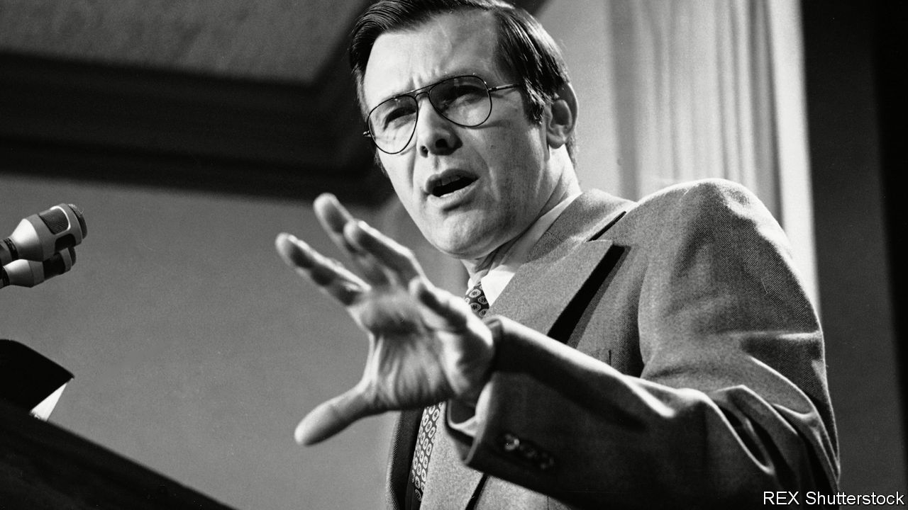

###### Stuff happens

# Donald Rumsfeld died on June 29th 

##### America’s secretary of defence in both the cold war and the modern era was 88 

 

> Jul 8th 2021 

AS HE SAT in the Pentagon on September 11th 2001, Donald Rumsfeld felt the table tremble. It had once been used by General William Tecumseh Sherman; no trembler he. At the same moment, the whole building shook. Running out across the grass, he saw a huge blackened gash in the west side, figures scrambling out of it, dense smoke and flames. He ran towards the fire to help. His staff tried to hustle him to safety, but he wouldn’t have it. The terrorists were not going to win on his watch. The Pentagon, he declared on TV, would be back in business in the morning.

This was the closest he had come to terror since, in Lebanon as Ronald Reagan’s envoy in 1984, he had been blown across a shack by a rocket hitting an SUV outside. That was a near one. But enemies of some form or other lurked on every side. Some, like the Soviet Union, were fundamental and existential. Others, like the Republican old bulls he wrangled with over his four terms in Congress, were just obstructive. At the Pentagon, as defence secretary under Gerald Ford in 1975-77 and George W. Bush in 2001-06, it was jackass bureaucrats who maddened him, as well as the hidebound, turf-obsessed military top brass. Then there was the press, eager to splash the slightest misstep all over the Washington Post.


He didn’t believe in a defensive crouch. He had seen enough of that in the Nixon White House, where he stripped down the Office of Economic Opportunity: enemies lists, walls of lies and ever-smaller protective circles huddled round the president. Skilfully, he got away (to Brussels, as ambassador to NATO) before Watergate blew up. So, no crouch. Instead he faced opponents with his eyes narrowed and his smile darting dangerously, prepared to strike.

His method with sluggish staff was a blitz of memos, on yellow paper (“yellow perils”) or white (“snowflakes”), carrying stray thoughts and reprimands he had barked into his Dictaphone. They were treated, too—as were colleagues in the firms, G.D. Searle and Gilead Sciences, where he later made fortunes—to “Rumsfeld’s Rules”, aphorisms collected since boyhood. A favourite came from Al Capone, another tough talker from Chicago: “You’ll get more with a kind word and a gun than with a kind word alone.”

Political opponents he could beat, too. He wore most down gradually. In Congress, as a reformist spirit, he led a group called “Rumsfeld’s Raiders”, who delayed bills they disliked with repeated quorum calls. In his first turn as secretary of defence, deep in the cold war, he steadily talked up the Soviet threat to get a bigger budget for new tanks,B-1 bombers and missile systems to range against it. The best defence was deterrence. Detente, which involved curbing America’s cruise missiles, gave an impression of weakness. So he neatly pulled the rug from under Henry Kissinger, then secretary of state, at the SALT II talks, and scuppered them. They needed to beat the Soviets, not make nice.

September 11th 2001 brought another enemy to the fore. If the contest with the Soviet Union had been like his wrestling bouts at Princeton, entwined hulks grappling slowly, the new threat from violent Islamism was more like the avid games of squash he played with staff, hardballs bouncing anywhere. But he could deal with it. His Doctrine, already drawn up in his second tour at the Pentagon, replaced the lumbering old army divisions with small, mobile combat brigades. A counter-strike, therefore, could be almost immediate. On October 7th America invaded Afghanistan, and could do more. An aide had caught his thought, a mere five hours after the attacks: “Best info fast. Judge whether good enough [to] hit SH @ same time...Go massive. Sweep it all up.” In 2003, claiming that Saddam Hussein had weapons of mass destruction, America invaded Iraq. Allies and the UN objected, but he waved them off: this was “anticipatory self-defence”. Like his childhood hero, the Lone Ranger, he would take the fight to the enemy. If you cocked your fist, you’d better be ready to throw it.

The two wars tested his Doctrine fully. His new flexible brigades became the norm in both Iraq and Afghanistan, reinforced by half-hidden special forces. Too many men would make too many targets. Helped in Afghanistan by the local Northern Alliance and in Iraq by the melting of Saddam’s army, they made quick progress. There was no long-term plan. That was unnecessary, since they would destroy the terrorist havens, deter violent Islamists everywhere, and come home. They were not in the business of nation-building. These poor, broken societies were not America’s to fix. He had not reckoned on the Islamist “dead-enders” regrouping so quickly, nor on the growing need to protect civilians; nor on the fact that, with such lean forces, that job was too big. Tricky.

Now, as well as violent extremists, he faced his old enemy the press. Against their knee-jerk opposition he posed complexity and conundrums. Hadn’t America gone into Iraq on a false premise, weapons that were not there? “Absence of evidence is not evidence of absence.” Why had they seemed blind to conditions on the ground? “There are known knowns...known unknowns...[and] unknown unknowns”, he said defiantly: complete shocks, as 9/11 had been. Another unknown unknown was the abuse and sexual degradation of detainees in the prison at Abu Ghraib outside Baghdad. He offered to resign over that and, for once, apologised. But freedom was untidy and, as he yelled at the press, “Stuff happens.”

Staying in both Iraq and Afghanistan was hard. Quitting, though, was worse. In 1975, as Gerald Ford’s chief of staff, he had watched the last American marines being winched from the embassy roof in Saigon. That image hurt, and emboldened his country’s enemies. Many Americans might want to consider graceful exits from the agonies of combat, but the enemy thought differently. They were just waiting, regrouping. That conundrum, stay or go, was for others to solve. In either case, though, there were positives in his ledger. In both Iraq and Afghanistan elected governments had replaced tyrannical regimes. Violent extremism, if not eliminated, had been deterred. No secretary of defence had ever again had to pick his way through mangled metal and bodies on the Pentagon lawns. All that, in his book, added up to success. ■

A version of this article was published online on July 6th 2021

