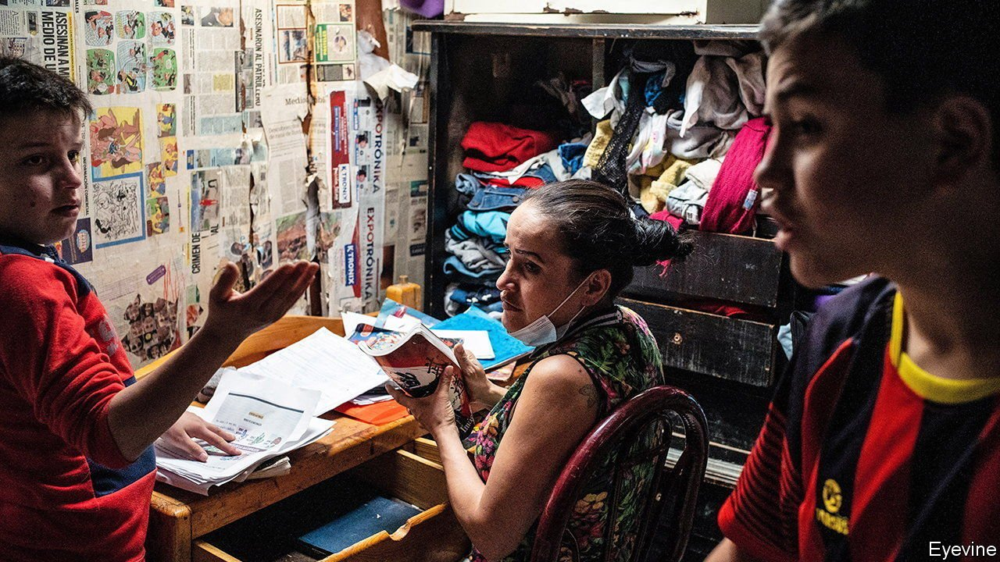

###### Blocking the schoolhouse door

# A teachers’ union tries to keep Colombia’s schools closed 

##### Pupils have endured one of the longest lockdowns anywhere 

 

> Jul 10th 2021 

LEARNING HAS always been difficult for Samuel Duván Rodríguez, a seven-year-old with a neuro-developmental disorder. It has become tougher still since his school in Bogotá, Colombia’s capital, closed because of covid-19. His mother says he uses her phone to log in to his teacher’s lessons. But he seems to take in little. It doesn’t help that he has to share the device with his ten-year-old brother. Lately, however, neither child is learning anything at all, as all their teachers have been on strike.

If all goes to plan, schools in Colombia will finally reopen over the next two weeks, with most back by July 15th. Better late than never. Schools in Mexico and Brazil have already started to resume in-person teaching. By contrast, in Colombia children have borne one of the longest educational lockdowns in Latin America.


Mostly this is due to Fecode, the powerful state school teachers’ union. It is part of the national strike committee that convened the anti-government protests that have convulsed Colombia since April 28th. As thousands took to the streets, its members refused to teach for at least 50 days. On July 8th, as The Economist went to press, it was planning another march in the capital against reopening schools.

The union is one of the most powerful in Latin America, a region already full of over-mighty unions. Fully 87% of Colombia’s public-school teachers signed up to it. It has a history of throwing its weight around. In 2015 it went on strike to oppose a proposal to use more stringent measures to evaluate teachers; after three weeks, the government caved in. Since then the union has felt emboldened, says Isabel Segovia, an education analyst.

The pandemic has further strengthened it. Fecode teachers initially refused to teach because they believed it put them at risk of catching the virus, with some good reason. Around 11% of Colombia's schools lack running water, making hand-washing impossible. Even so much of the reason for the strike is political: the union wants a basic income programme that would cost 6% of GDP and to help elect a left-wing government in next year’s elections.

Nelson Alarcón, a union leader, says all teachers should be vaccinated before Fecode agrees to resume classes. Ideally, children should be vaccinated, too. All teachers should stop working, he says, until the government adapts every school with water and enough space for students to learn at two metres apart. Like many union leaders, he sees no reason to compromise. The government has continued to pay teachers’ salaries as they sit at home, so they have little incentive to get back to work.

Iván Duque, Colombia’s president, has bungled his response to the teachers. Around 25% of Colombians have had one jab, less than in Argentina, Brazil and Mexico. Until recently, many teachers have indeed not been vaccinated; in parts of the country, fitness trainers got their jabs first. For the government “education is not a priority,” claims Sandra García of the School of Government at Los Andes University in Bogotá. Last year it set aside $106m of its pandemic emergency budget (of $4bn) to adapt schools for social distancing. But the measure came months after schools had been shut, says Óscar Sánchez, a former secretary of education for Bogotá. The funds were also disbursed to local governments, many of which are weak or corrupt.

Colombian students were already poorly served relative to their peers. Since the 2000s the government has spent 4% of GDP on education, less than in other poor Latin American countries. As there are not enough state schools, around half of children attend school in shifts. Teachers are poorly paid; nearly a third of primary-school teachers do not have a degree.

Meanwhile, although data are patchy, it seems that many children may not bother to go back to school. A study by Ms García suggests the dropout rate for Bogotá this year could be around 8% (it is usually around 3% nationally). Some teenagers are joining gangs. The pandemic and the school closures will result in a lost generation, worries Ms Segovia.■

