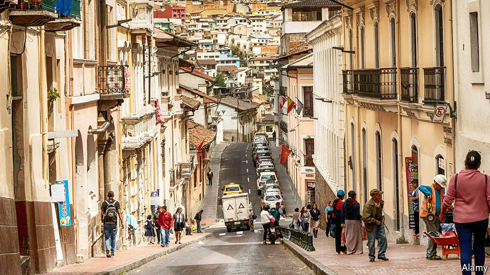

###### Quitting the city

# Ecuadorians are fed up with their dysfunctional capital 

##### After decades of mismanagement Quito is rocked by a political crisis 

 

> Jul 10th 2021 

QUITO HAS a lot going for it. Stretched along a breathtakingly high Andean valley beneath snow-capped volcanoes, Ecuador’s capital is packed with historic buildings and enticing eateries. But it is woefully governed. In June the city council impeached Jorge Yunda, the mayor; he is charged with failing to hold city council meetings that would have solved an underground-railway crisis. He is also under investigation by the attorney-general’s office on suspicion of embezzlement related to the purchase of faulty covid-19 tests (he denies both the embezzlement and the faulty tests). On July 1st the impeachment proceedings were affirmed by the electoral court. Mr Yunda now wears an electronic tag so that the authorities can monitor his movements.

The mayor is not the only problem. A shiny underground railway costing $2bn has yet to be finished after five years of digging. Buses careen through the streets with little regard for road rules. Crime is rife: two policemen were shot in their car in June and a prominent criminal lawyer was gunned down in April. The 500-year old city “needs to be reinvented”, says Gonzalo Ortiz, a former city councillor.


Quiteños tend to point to 2007 as the turning point in the city’s fortunes, when Rafael Correa, a populist, became president. His government pushed through a new constitution that called city administrations “autonomous decentralised governments”, but in practice weakened the authority of mayors. Even so the mayor of Quito at the time, Augusto Barrera, was an ally; he also stripped the vast metropolitan region’s districts of their power.

The new model failed to deliver the promised benefits. A new airport took three more years to complete than planned; Mr Barrera’s administration failed to build a proper access road to it (it was finally completed, five times over budget, by his successor). A project to clean up the main river in the city was never completed; it remains a sewer. Mr Barrera started the railway project but only oversaw the building of two stations and did not bother to work out who would run it.

In 2019 Mr Yunda won office with just 21% of the vote. His weak mandate has not helped matters, but he argues that now he is being targeted by a racist elite (he is of indigenous heritage). Whatever the cause, his shoddy management of the capital means that many are abandoning it for the wealthier suburbs, which are now thinking of seceding. Mr Yunda’s legacy may be an emptier, poorer Quito. ■

