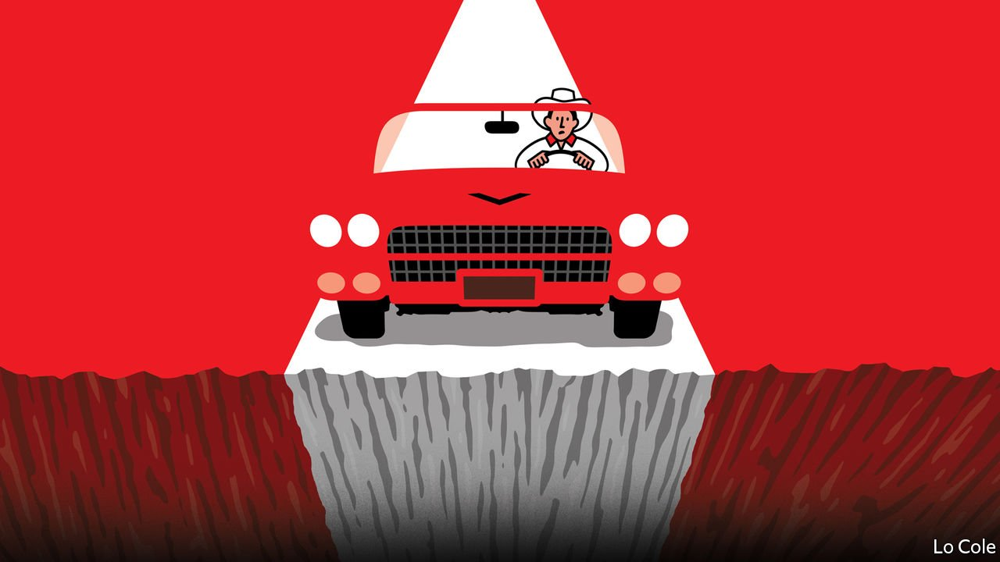

###### Bello

# The clash in Peru over the election result continues 

##### The fight threatens to undermine democracy 

 

> Jul 10th 2021 

FOR A DEMOCRACY to survive, it needs democrats. When large parts of opposing political camps start to see each other as enemies to be crushed, rather than mere adversaries with whom to compete peacefully, then democracy comes under grave threat. That was the case in Spain in the 1930s, on the eve of its civil war, and in Brazil and Chile in the run-up to military coups in 1964 and 1973 respectively. In the past few weeks Peru has seemed worryingly unstable, after a polarised election campaign split the country down the middle.

The official count gave victory in a run-off on June 6th to Pedro Castillo, a teacher and union leader running for a far-left party, by just 44,000 votes (out of 17.6m) over his conservative opponent, Keiko Fujimori. Ms Fujimori’s supporters have spent the past month crying fraud. They want to annul 200,000 of Mr Castillo’s votes, alleging they were falsified. But on election day international observers found no serious irregularities. The United States and the European Union have praised the conduct of the election. Ms Fujimori’s lawyers have produced no proof of fraud. Nobody has come forward to back up their claims that signatures were forged. The electoral tribunal has so far rejected the allegations. It appears poised to declare Mr Castillo president.


Will the conservative camp accept defeat? Ms Fujimori has said she will respect the tribunal’s ruling, though when she narrowly lost in 2016 she set out to thwart the centrist who defeated her. Others have been cruder. In a bizarre development Vladimiro Montesinos, the corrupt spy chief when Ms Fujimori’s father ruled Peru as an autocrat in the 1990s, appeared in a taped phone call from his prison cell to a collaborator to be proposing to bribe members of the electoral tribunal. Scores of retired military officers last month signed a letter calling on the armed forces not to recognise an “illegitimate” president. A former presidential candidate has called for “a civilian-military alliance”. This smacks of trying to overthrow democracy in the name of its defence. “It’s very dangerous to start questioning the rules,” says Paula Muñoz, a political scientist at the Pacific University in Lima.

But there are legitimate reasons for democrats to worry about Mr Castillo, too—and pressing ones, since it is he who is set to become president on July 28th. His party is Marxist-Leninist. Its founder and leader, Vladimir Cerrón, spent a decade in Cuba. Its programme includes large-scale nationalisations. Mr Cerrón is being investigated over claims of illegal campaign financing (which he denies). Mr Castillo’s organised supporters include followers of a successor movement to the Shining Path, a terrorist group whose insurgency cost some 70,000 lives between 1980 and 1992.

Mr Castillo failed to use the run-off election to move convincingly to the centre. Instead of distancing himself from Mr Cerrón, at a meeting last month he agreed he would share power with him. Mr Castillo’s statements have been contradictory. “We are not communists, we are not going to take anybody’s property away,” he said before meeting business leaders. “We will respect this constitution.” Days later he said his first act as president would be to ask Congress to convoke a constituent assembly to write a new constitution “with the smell, colour and taste of the people”. This was the device used by leftist populists such as Venezuela’s Hugo Chávez and Bolivia’s Evo Morales to concentrate power and try to rule indefinitely as autocrats.

Mr Castillo’s position is weaker than that of those leaders. He won only 15% of the vote in the election’s first round; his allies hold 42 of the 130 seats in the new Congress. He won only because many moderate Peruvians couldn’t bring themselves to vote for Ms Fujimori. But he can draw on the force of the teachers’ union and the ronderos (rural vigilantes). And he will have access to state resources.

At best the likely outcome is chaotic, poor governance. Mr Castillo has shown little ability to build alliances or a team capable of governing. He will take over a country still reeling from the pandemic and its associated recession. Peruvians want a government that deals with their problems, rather than embarking on a new constitution which polls show a majority do not want. In that case the question is how long the country will be able to tolerate an incompetent president. Congress has thrown out two presidents in the past five years. Before too long Peruvians could find themselves going back to the ballot box. Or they may face something far worse.

