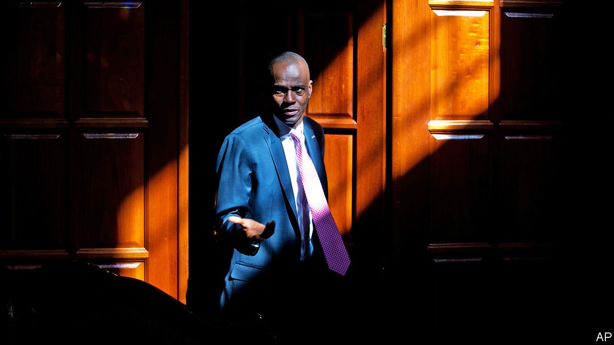
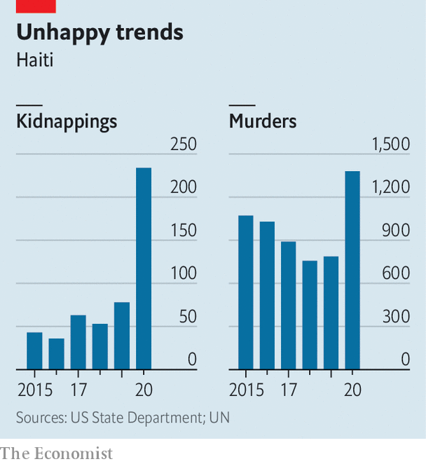

###### A presidential assassination

# The murder of Haiti’s president will worsen the country’s chaos 

##### Jovenel Moïse was unloved. But his death leaves the country with a power vacuum 

 

> Jul 7th 2021 

OPPONENTS OF Jovenel Moïse, Haiti’s president since 2017, have long wanted him to leave office. Now he has—but not in the way they were expecting. A group of unknown attackers shot and killed Mr Moïse in the bedroom of his private residence in a gated community on the outskirts of Port-au-Prince, the capital, in the early hours of July 7th. They also injured his wife. Claude Joseph, whom the president appointed as interim prime minister in April, announced the killing in a statement and said he had taken charge of the Caribbean country. Haiti was already in turmoil—much of it due to Mr Moïse’s rule. His murder has added fuel to the flames.

On the morning after the murder Port-au-Prince’s streets were unusually quiet, without the usual roar of motorcycles and bustle of market stalls, as Haitians tried to guess what might happen next. The city’s airport was shut, as was the land border with the Dominican Republic.


The assassination has shocked a country which, for all its history of misrule and criminal violence, last witnessed the killing of a president in 1915. Rumours swirl about who was behind it. By the evening of July 7th the police chief announced that four suspects had been killed, and two more arrested. The assassins were probably mercenaries. The question is: who hired them? “It was obviously somebody with a lot of money and a lot of power,” says Monique Clesca, a former UN official.

Many pointed the finger at opposition politicians or Haitian elites. Other Haitians, who given the country’s history are suspicious of foreign interference, suspect the attack came from outside, possibly from Venezuela or the United States. Mr Joseph said some of the attackers spoke Spanish (Haitians speak Creole and French). Another video suggested they spoke English and claimed to be agents of the US Drug Enforcement Administration. This is certainly not the case, but the whispers add to the volatile situation.


It was not the first attempt on Mr Moïse’s life—at least, according to him. In February his government arrested at least 23 people, including a top judge and a senior police officer, who were accused of plotting an assassination and coup. Mr Moïse, a former plantation manager who referred to himself as “Banana Man”, had no shortage of enemies. Critics accused him of involvement in the pilfering of millions of dollars from PetroCaribe, an aid fund from Venezuela. Opponents said his term ended in February, five years after his predecessor left office. He claimed his term started when he took power, a year later—a position backed by the United States, although Joe Biden’s administration urged new elections this year. Protests regularly broke out against his rule.

As the political crisis deepened, Mr Moïse became more authoritarian. Since January 2020, when he dismissed all but ten senators in the two-chamber legislature, the president had been ruling by decree. He used his powers to create an intelligence agency and broadened the definition of terrorism to include acts of dissent. Protesters were attacked by gangsters. Mr Moïse denied asking them to intimidate and kill his opponents.

Previous Haitian presidents have fostered violence and corruption, too. But under Mr Moïse the situation grew worse. Critics accused him of using gangs to a greater extent to do his bidding, while having far less control over them, than previous presidents. In recent weeks fighting in Port-au-Prince has intensified; thousands of people had to flee their homes in June alone. By some estimates, kidnappings in Haiti tripled last year compared with 2019.

 


Although Mr Moïse has been the focus of much discontent, his death is unlikely to simplify things. “He was a complicated and flawed person, but the people who made him the single focus of all that is wrong in the system of Haiti miss the larger failures of that system,” says Michael Deibert, an American expert on Haiti.

Mr Joseph has little legitimacy. Mr Moïse had nominated Ariel Henry, a doctor, as permanent prime minister; he was due to take office on the day of the assassination. The constitution does not provide for the lack of both a president and a National Assembly, and the chief justice of the Supreme Court, who could arbitrate, died two weeks ago of covid-19. The killing could also make it harder to hold elections for a new president and legislature, which are due in September.

In many ways Haiti already looks like a failed state. Men with guns have long terrorised its people. Only last month Jimmy Chérisier, alias Barbecue, a former policeman and leader of an alliance of gangs, announced a “revolution” against the status quo (though many think he meant the opposition). The police are weaker than the gangs, who may now feel they have a free hand. Now that lawlessness has reached the country’s highest office, many Haitians fear the worst.■

A version of this article was published online on July 7th 2021

